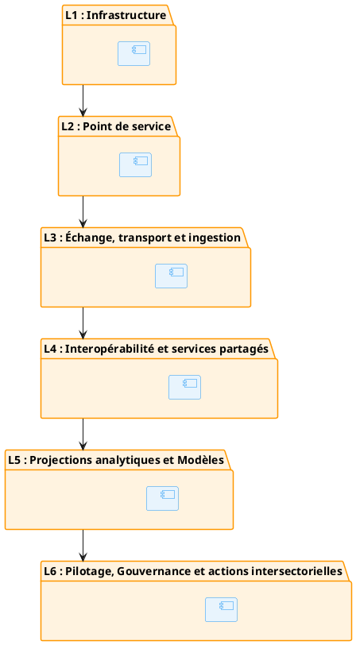

---

title: Paysage applicatif cible
id: application-target-layers
domain: 05_application
version: "1.0.0"
status: draft
last_reviewed: 2026-07-03
owner: Direction des Systèmes d'Information
tags: ["applications", "couches", "paysage", "cible"]
---

# Paysage applicatif cible

## Pour qui lire ce document

**Niveau :** niveau 1 : Cadre d'Architecture d'Entreprise de la Santé Numérique.

| Profil | Lecture |
|--------|---------|
| Décideurs institutionnels | ○ |
| Directions métier / programmes | ◐ |
| DEPSI / équipes techniques | ● |
| SIS / données / suivi-évaluation | ● |
| Partenaires techniques et financiers | ◐ |

Légende : ● prioritaire · ◐ complémentaire · ○ ponctuelle. Vue d'ensemble : matrice de lecture.

Le paysage applicatif national est organisé en six couches complémentaires, alignées sur les couches de l'ARTSN :

## L6 : Pilotage, Gouvernance et actions intersectorielles

Vitrine décisionnelle unique de l'État. Tableaux de bord de performance sanitaire nationale, portail de suivi de la CSU, centre de commande des alertes épidémiques, plateforme de gestion des crises intersectorielles. Couche rattachée à VS-04 et ART-0. Ne supporte aucune écriture opérationnelle : lecture exclusive sur les projections analytiques.

## L5 : Projections analytiques et Modèles

Sépare structurellement les flux analytiques du stockage transactionnel. Pipeline d'ingestion ETL, moteur d'IA prédictive, routeur d'escalade et d'alertes, entrepôt Lakehouse, moteur de graphes, référentiel spatio-temporel, réconciliation analytique. Applique le pattern CQRS (ART-6). Couche rattachée à ART-5, ART-6, ART-8B, ART-4D, ART-9.

## L4 : Interopérabilité et services partagés

Cœur applicatif de la santé au présent. Centralise les registres nationaux et assure la persistance clinique temps réel. Orchestre les parcours et assure la médiation sémantique universelle. Moteur d'intégration, orchestrateur de parcours, répertoires cliniques, registres des terminologies, INP, couverture, personnels, produits. Couche rattachée à ART-2, ART-3, ART-4, ART-8A, ART-4A, ART-4C.

## L3 : Échange, transport et ingestion

Infrastructure d'ingestion réseau, dépourvue de logique métier. Intercepte les requêtes à la périphérie, bloque les messages non conformes, assure la persistance tampon et exécute les compensations par lots. API Gateway, registre de schémas, message broker asynchrone, compensateur. Couche rattachée à ART-1, F.3, ART-8C.

## L2 : Point de service

Ligne de front logicielle. Applications capables de capturer les soins, dispensations et mouvements logistiques en l'absence totale de réseau Internet. Écritures locales sous forme de journaux d'événements inaltérables. Dossiers de santé, pharmacies, santé communautaire, espace patient, chaîne logistique, surveillance animale, capteurs terrain. Couche rattachée à F.1, ENF-1.

## L1 : Infrastructure

Socle matériel de la Nation. Hébergement souverain des données cliniques sur le territoire national, topologie distribuée en cascade, basculement automatique en cas de sinistre. Nœud central (datacenters certifiés HDS), nœuds régionaux (Fog), nœuds locaux (Edge), liaisons dédiées, VPN, MPLS, APN sécurisés. Couche rattachée à ART-7.

## Références

- **matrice de lecture** : Matrice de lecture du CAESN (niveau 1) (`00_caesn/reading-matrix.md`)
- **couches ARTSN** : Cartographie conceptuelle cible, 6 couches + 2 axes (`02_artsn/05_cartographie/index.md`)
- **services partagés** : Services numériques partagés prioritaires (`00_caesn/05_application/shared-services.md`)
- **entrepôt** : Gouvernance, qualité et protection des données (`00_caesn/04_data/governance.md`)
- **Architecture applicative** : Architecture applicative et systèmes numériques (`00_caesn/05_application/index.md`)
- **Référentiels** : Référentiels nationaux (`00_caesn/04_data/referentials.md`)
