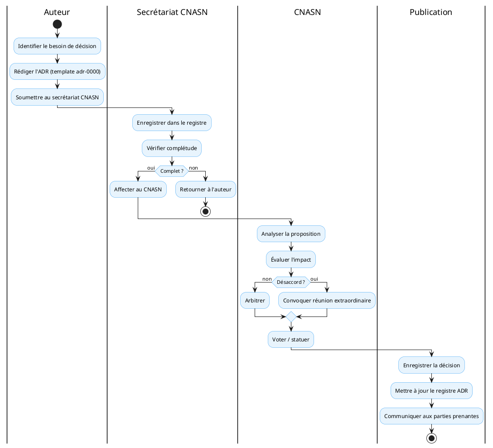
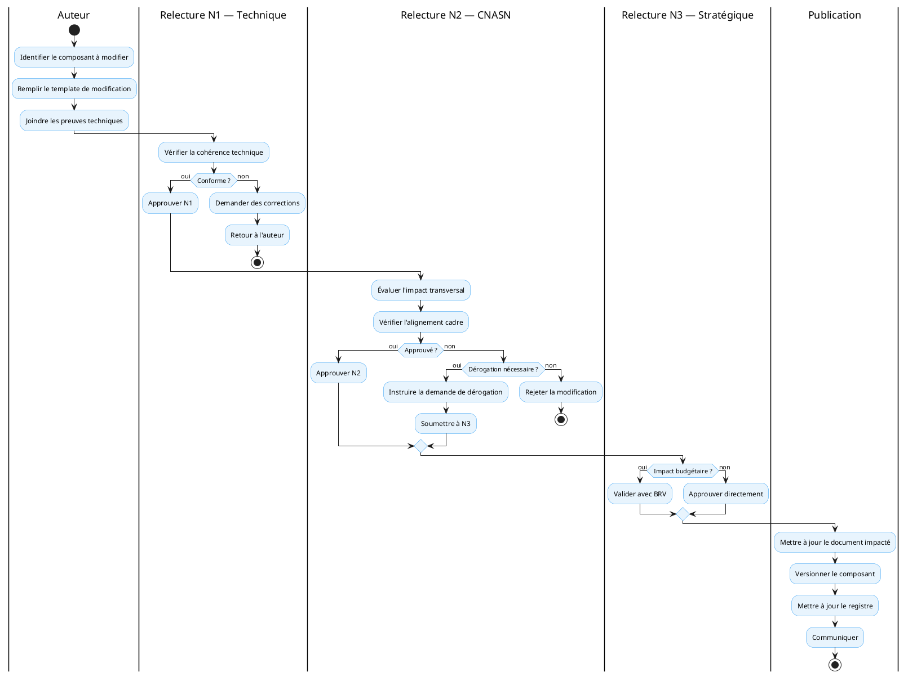

# Guide du processus de gouvernance

## Pour qui lire ce document

**Niveau :** niveau 1 — Cadre d'Architecture d'Entreprise de la Santé Numérique.

| Profil | Lecture |
|--------|---------|
| Décideurs institutionnels | ● |
| Directions métier / programmes | ● |
| DEPSI / équipes techniques | ● |
| SIS / données / suivi-évaluation | ◐ |
| Partenaires techniques et financiers | ◐ |

Légende : ● prioritaire · ◐ complémentaire · ○ ponctuelle.

---

## Objet

Ce document décrit les processus opérationnels de la gouvernance de l'architecture. Il transforme le cadre institutionnel (instances, rôles, responsabilités) en **workflow concrets** avec des étapes, des délais et des livrables.

---

## 1. Types de décisions

### 1.1 Classification

| Type | Description | Instance décisionnaire | Délai cible |
|------|-------------|------------------------|-------------|
| **Décision d'architecture (ADR)** | Choix technique structurant (standard, technologie, pattern) | CNASN | 2 semaines |
| **Modification architecturale** | Changement sur un composant CAESN/ARTSN/CNISN/PTISN | CNASN | 4 semaines |
| **Homologation initiative** | Validation de la conformité d'une initiative aux standards | CNASN + BRV | 6 semaines |
| **Dérogation** | Écart temporaire ou permanent aux standards | CNASN + Secrétaire Général | 4 semaines |
| **Dépréciation** | Retrait d'un composant ou standard | CNASN | 8 semaines (préavis) |

### 1.2 Niveaux de validation

| Niveau | Qui valide | Quoi |
|--------|-----------|------|
| **N1 — Technique** | Équipe projet + relecteur | Conformité technique, cohérence avec les standards |
| **N2 — Architecturale** | CNASN | Alignement cadre, impact transversal, dérogations |
| **N3 — Stratégique** | Secrétaire Général + BRV | Impact politique, budget, soutenabilité |

---

## 2. Processus de décision d'architecture (ADR)

### 2.1 Workflow



### 2.2 Délais et escalade

| Étape | Délai max | Escalade si dépassement |
|-------|-----------|------------------------|
| Rédaction ADR | 5 jours ouvrés | → Responsable architecture |
| Enregistrement | 1 jour ouvré | → Secrétariat CNASN |
| Analyse CNASN | 10 jours ouvrés | → Président CNASN |
| Décision | 5 jours ouvrés | → Secrétaire Général |
| Publication | 2 jours ouvrés | → DEPSI |

---

## 3. Processus de modification architecturale

### 3.1 Workflow



### 3.2 Types de modification

| Type | Description | Validation requise |
|------|-------------|-------------------|
| **Correctif** | Correction de coquilles, typos, liens cassés | N1 seule |
| **Mineure** | Ajout de détails, reformulation, exemples | N1 + N2 |
| **Majeure** | Changement de sens, ajout de contraintes, nouveau chapitre | N1 + N2 + N3 |
| **Structurelle** | Réorganisation, fusion/séparation de chapitres | N1 + N2 + N3 + communication |

---

## 4. Processus d'homologation d'initiative

### 4.1 Checklist d'homologation

| # | Critère | Vérification | Statut |
|---|---------|--------------|--------|
| 1 | Alignement flux de valeur | L'initiative contribue à un flux VS-01 à VS-04 identifié | ☐ |
| 2 | Renforcement capabilité | L'initiative renforce au moins une capabilité CAESN/CNISN | ☐ |
| 3 | Conformité standards | Utilisation des standards approuvés (FHIR, mADX, etc.) | ☐ |
| 4 | Interopérabilité | Échanges via X-Road, formats normalisés | ☐ |
| 5 | Sécurité et consentement | RBAC, chiffrement, consentement patient | ☐ |
| 6 | Souveraineté données | Hébergement national, contrôle territorial | ☐ |
| 7 | Identité nationale | Utilisation de l'INP (pas d'ID parallèle) | ☐ |
| 8 | Traçabilité | Audit trail, journalisation | ☐ |
| 9 | Coût total de possession | Budget réaliste, soutenabilité financière | ☐ |
| 10 | Plan de migration | Stratégie de transition depuis l'existant | ☐ |
| 11 | Mesure de valeur | Indicateurs de performance définis | ☐ |
| 12 | Gouvernance initiative | Responsables identifiés, comité de pilotage | ☐ |

### 4.2 Matrice de décision homologation

| Conformité | Impact faible | Impact moyen | Impact élevé |
|------------|---------------|--------------|--------------|
| **12/12 critères** | Validation directe | Validation N2 | Validation N3 |
| **10-11/12** | Validation N1 | Validation N2 + plan corrective | Validation N3 + plan corrective |
| **8-9/12** | Plan corrective + validation N2 | Rejet, nouvelle soumission | Rejet, refonte |
| **< 8/12** | Rejet | Rejet | Rejet |

---

## 5. Processus de dérogation

### 5.1 Quand demander une dérogation ?

Une dérogation est nécessaire lorsqu'une initiative ne peut pas respecter un standard ou un principe du cadre pour des raisons légitimes (contrainte technique, juridique, temporelle).

### 5.2 Template de dérogation

| Champ | Valeur |
|-------|--------|
| **Initiative** | [Nom de l'initiative] |
| **Standard concerné** | [Référence du standard ou principe] |
| **Raison de la dérogation** | [Justification détaillée] |
| **Durée** | [Temporaire (durée) / Permanent] |
| **Plan de conformité** | [Actions pour revenir à la conformité] |
| **Risque résiduel** | [Impact si la dérogation est accordée] |

### 5.3 Workflow

```
1. L'initiative soumet la demande de dérogation
2. Le CNASN instruit le dossier (5 jours)
3. Si dérogation temporaire ≤ 6 mois : décision CNASN
4. Si dérogation > 6 mois ou permanente : décision Secrétaire Général
5. Enregistrement dans le registre des dérogations
6. Suivi trimestriel de la conformité
```

---

## 6. Processus de dépréciation

### 6.1 Signaux de dépréciation

| Signal | Source | Action |
|--------|--------|--------|
| Standard abandonné par l'auteur | Veille HL7/IHE | Plan de migration |
| Technologie en fin de vie | Veille technique | Plan de remplacement |
| Non-utilisation (> 12 mois) | Registre des composants | Enquête d'abandon |
| Remplacement par un standard supérieur | CNASN | Plan de migration |

### 6.2 Timeline de dépréciation

```
Mois 0  : Annonce de dépréciation + préavis
Mois 3  : Première alerte aux initiatives concernées
Mois 6  : Deuxième alerte + plan de migration obligatoire
Mois 9  : Dernière alerte
Mois 12 : Retiré du référentiel (statut « déprécié »)
```

---

## 7. Rôles dans les processus

| Rôle | Processus ADR | Processus Modification | Processus Homologation |
|------|---------------|----------------------|----------------------|
| **Auteur** | Rédige | Remplit le template | Soumet le dossier |
| **Relecteur technique** | — | Vérifie N1 | Vérifie critères techniques |
| **Secrétariat CNASN** | Enregistre, route | Enregistre, route | Coordonne l'instruction |
| **CNASN** | Décide | Valide N2 | Valide conformité |
| **BRV** | — | — | Valide impact business |
| **Secrétaire Général** | Arbitre | Valide N3 (majeur) | Valide (si N3) |
| **DEPSI** | Publie | Met à jour docs | Publie le rapport |

---

## 8. Outils de suivi

| Outil | Contenu | Mise à jour |
|-------|---------|-------------|
| Registre des décisions | Toutes les ADRs | À chaque décision |
| Template modification | Structure des demandes | Statique |
| Table de maturité | Statut des chapitres | À chaque revue |
| Feuille de route | Planification | Mensuelle |

---

## Liens

- Gouvernance — Instances et rôles
- Registre des décisions
- RACI de gouvernance
- Bureau de Réalisation de la Valeur

## Références

- **Registre des décisions** — Registre des décisions d'architecture (ADR) (`01_cnisn/06_decisions/registre-decisions.md`)
- **Template modification** — Template — Demande de modification architecturale (`01_cnisn/06_decisions/template-modification.md`)
- **Table de maturité** — Annexe A — Table de maturité par chapitre (`02_artsn/07_annexes/a-table-de-maturite.md`)
- **Feuille de route** — Feuille de route de déploiement progressif de l'ARTSN (`02_artsn/09_feuille-route/index.md`)
- **Gouvernance — Instances et rôles** — Gouvernance du cadre d'architecture (`00_caesn/07_governance/index.md`)
- **RACI de gouvernance** — RACI de gouvernance et responsabilités (`00_caesn/07_governance/raci.md`)
- **Bureau de Réalisation de la Valeur** — Bureau de Réalisation de la Valeur (`00_caesn/07_governance/value-realization-office.md`)
