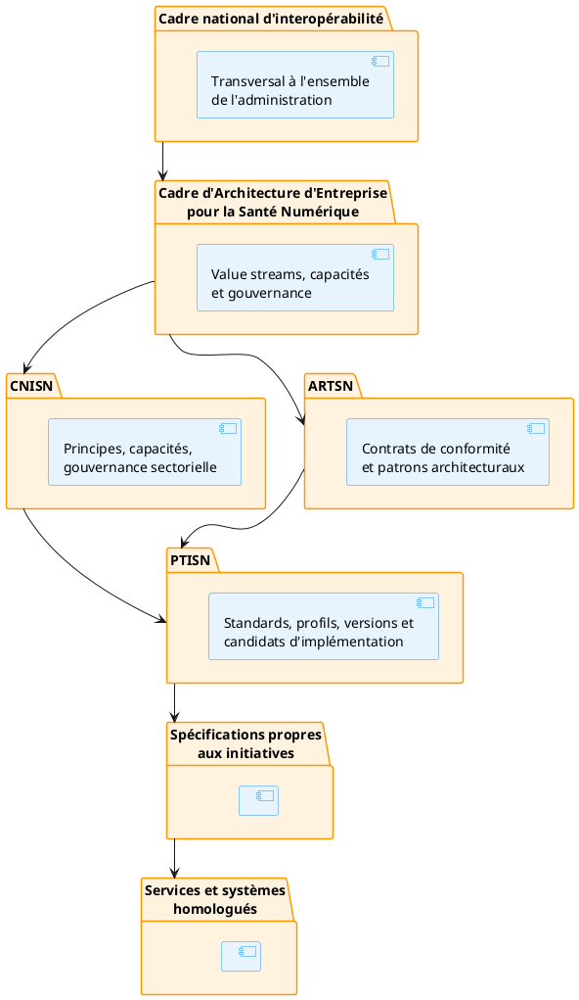

# Préambule du CNISN

## 1. Nature du cadre

Le Cadre National d’Interopérabilité de Santé Numérique définit les principes, capacités et règles de gouvernance applicables aux échanges de données et de services impliquant le secteur santé.

Il constitue la déclinaison sectorielle du cadre national d’interopérabilité pour les besoins spécifiques de la santé numérique.

Le CNISN fixe :

- les principes opposables ;
- les responsabilités institutionnelles ;
- les capacités nationales nécessaires ;
- les règles applicables aux données et services partagés ;
- les mécanismes de conformité ;
- les conditions de dérogation ;
- les responsabilités d’arbitrage.

Le CNISN ne sélectionne :

- aucun produit ;
- aucun fournisseur ;
- aucune technologie ;
- aucun langage ;
- aucune plateforme particulière.

Les contrats architecturaux et patrons sont définis dans l’ARTSN.

Les standards, profils d’échange, versions et candidats d’implémentation sont définis dans le PTISN.

------------------------------------------------------------------------

## 2. Position dans la hiérarchie architecturale

Le CNISN répond principalement à la question :

> Quelles garanties institutionnelles, fonctionnelles et de gouvernance doivent être respectées pour qu’un échange de données de santé soit reconnu comme conforme ?

L’ARTSN répond à la question :

> Quels contrats de conformité et patrons architecturaux permettent de satisfaire ces garanties ?

Le PTISN répond à la question :

> Quels standards, profils et candidats d’implémentation peuvent être utilisés pour réaliser ces contrats ?

------------------------------------------------------------------------

## 3. Articulation avec le cadre national d’interopérabilité

Le CNISN ne se substitue pas au cadre national d’interopérabilité.

Il en précise l’application au secteur santé et complète ses principes généraux par des exigences propres aux données et services sanitaires, notamment :

- la confidentialité des données de santé ;
- les bases d’autorisation ;
- la continuité des soins ;
- la traçabilité clinique et sanitaire ;
- les référentiels sectoriels ;
- l’identité fonctionnelle santé ;
- les responsabilités de santé publique ;
- les échanges intersectoriels ;
- les contraintes de résidence et de minimisation.

Toute divergence entre le CNISN et le cadre national d’interopérabilité doit faire l’objet :

1.  d’une identification formelle ;
2.  d’une analyse conjointe ;
3.  d’une décision de l’instance sectorielle compétente ;
4.  d’une validation par l’instance nationale compétente ;
5.  d’une dérogation enregistrée lorsque la divergence subsiste.

------------------------------------------------------------------------

## 4. Portée

Le CNISN s’applique à tout échange de données, de commandes ou de services impliquant au moins un acteur ou système du secteur santé.

Il couvre notamment :

- les échanges entre systèmes du Ministère de la Santé ;
- les échanges avec les établissements sanitaires ;
- les échanges avec les professionnels de santé ;
- les échanges avec les collectivités territoriales ;
- les échanges avec d’autres ministères ;
- les échanges avec des organismes de protection sociale ;
- les échanges avec les registres nationaux ;
- les échanges avec des partenaires autorisés ;
- les échanges entre plateformes publiques et privées ;
- les services de consultation, notification, synchronisation et publication ;
- les données opérationnelles, analytiques et de référence ;
- les échanges transfrontaliers via le GDHCN et les accords bilatéraux ;
- les flux de surveillance épidémique avec les organisations régionales (OMS AFRO, CDC Africa).

Il s’applique aux échanges :

- synchrones ;
- asynchrones ;
- centralisés ;
- fédérés ;
- en ligne ;
- hors ligne avec synchronisation différée ;
- internes au secteur ;
- interinstitutionnels ;
- intersectoriels ;
- transfrontaliers (via le GDHCN et les accords bilatéraux).

------------------------------------------------------------------------
