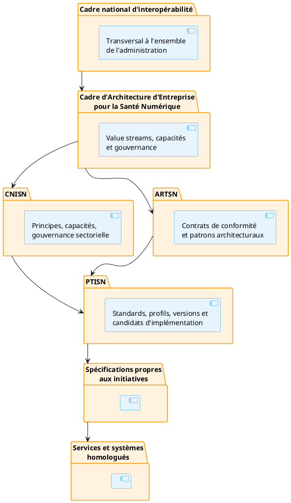

# Préambule du CNISN

## 1. Nature du cadre

Le Cadre National d'Interopérabilité de Santé Numérique (CNISN) constitue la déclinaison sectorielle du cadre national d'interopérabilité pour les besoins spécifiques de la santé numérique. Il définit l'ensemble des principes, capacités et règles de gouvernance qui s'appliquent aux échanges de données et de services impliquant le secteur santé à Madagascar.

Le CNISN fixe les principes opposables auxquels toute initiative de santé numérique doit se conformer. Il établit les responsabilités institutionnelles de chaque acteur impliqué dans les échanges, identifie les capacités nationales indispensables à la mise en œuvre de l'interopérabilité, et précise les règles applicables aux données et services partagés. Il organise par ailleurs les mécanismes de conformité permettant de vérifier le respect de ces règles, encadre les conditions dans lesquelles des dérogations peuvent être accordées, et attribue les responsabilités d'arbitrage en cas de conflit entre institutions.

Le CNISN reste volontairement neutre sur le plan technologique : il ne sélectionne aucun produit, aucun fournisseur, aucune technologie, aucun langage de programmation ni aucune plateforme particulière. Les contrats architecturaux et les patrons de conception sont délégués à l'Architecture de Référence Technique de la Santé Numérique (ARTSN), tandis que les standards, profils d'échange, versions et candidats d'implémentation relèvent des Profils Techniques d'Implémentation par Initiative (PTISN).

## 2. Position dans la hiérarchie architecturale

Le CNISN occupe le deuxième niveau de la hiérarchie architecturale du secteur santé. Il prend en charge la question fondamentale des garanties institutionnelles, fonctionnelles et de gouvernance qui doivent être satisfaites pour qu'un échange de données de santé soit reconnu comme conforme. Cette question constitue le fil conducteur de l'ensemble du cadre.

L'ARTSN, qui occupe le troisième niveau, répond à la question complémentaire des contrats de conformité et des patrons architecturaux permettant de satisfaire ces garanties. Le PTISN, quatrième et dernier niveau du cadre, précise pour chaque initiative les standards, profils et candidats d'implémentation susceptibles de réaliser ces contrats. Cette progression de l'abstrait au concret — du « pourquoi » au « comment » — structure l'ensemble de l'architecture et assure la cohérence entre les décisions stratégiques et leurs traductions opérationnelles.

## 3. Articulation avec le cadre national d'interopérabilité

Le CNISN ne se substitue pas au cadre national d'interopérabilité défini au niveau transversal de l'administration. Il en précise l'application au secteur santé et complète ses principes généraux par des exigences propres aux données et services sanitaires. Ces exigences portent notamment sur la confidentialité des données de santé, les bases d'autorisation régissant leur accès, la continuité des soins entre établissements, la traçabilité clinique et sanitaire des échanges, les référentiels sectoriels de professionnels et de structures, l'identité fonctionnelle santé distincte de l'identité civile, les responsabilités de santé publique qui justifient certains partages, les échanges intersectoriels avec les autres ministères, et les contraintes de résidence et de minimisation des données personnelles.

Lorsqu'une divergence est identifiée entre le CNISN et le cadre national d'interopérabilité, elle doit faire l'objet d'une procédure formalisée. Cette procédure comprend d'abord une identification formelle de la divergence, suivie d'une analyse conjointe menée par les instances compétentes. Une décision est ensuite prise par l'instance sectorielle, puis validée par l'instance nationale. Enfin, si la divergence subsiste après ces étapes, une dérogation enregistrée est émise, documentant les raisons, les mesures compensatoires et les conditions de sortie.

## 4. Portée

Le CNISN s'applique à tout échange de données, de commandes ou de services dans lequel intervient au moins un acteur ou un système relevant du secteur santé. Sa portée couvre l'ensemble des interactions entre les systèmes du Ministère de la Santé, les établissements sanitaires publics et privés, les professionnels de santé exerçant sur le territoire national, les collectivités territoriales responsables de la santé publique locale, les autres ministères participant aux approches intersectorielles comme l'approche One Health, les organismes de protection sociale intervenant dans le financement des soins, les registres nationaux auxquels le secteur santé contribue ou dont il dépend, les partenaires autorisés intervenant dans le cadre de programmes nationaux ou internationaux, ainsi que les plateformes publiques et privées offrant des services de santé numérique.

Le CNISN couvre également les différents modes opératoires des échanges. Il s'applique aux échanges synchrones et asynchrones, aux architectures centralisées et fédérées, aux fonctionnements en ligne comme hors ligne avec synchronisation différée. Il englobe les échanges internes au secteur santé, les échanges interinstitutionnels entre ministères et administrations, les échanges intersectoriels avec les secteurs de l'élevage, de l'environnement et de l'intérieur dans le cadre de l'approche One Health, et les échanges transfrontaliers réalisés via le GDHCN et les accords bilatéraux avec les pays partenaires. Les services concernés incluent la consultation, la notification, la synchronisation et la publication de données opérationnelles, analytiques et de référence.

## 5. Articulation avec l'UGD

Le CNISN s'inscrit dans le cadre national d'interopérabilité défini par l'Unité de Gouvernance Digitale (UGD). Il en décline les principes généraux pour le secteur santé, en y ajoutant les exigences spécifiques aux données de santé, les standards d'interopérabilité sectoriels et les profils d'implémentation par initiative. Le CNISN ne remplace pas le cadre UGD ; il le complète pour répondre aux besoins propres de la santé numérique, tout en restant compatible avec ses principes fondateurs. Le PTISN, qui constitue le quatrième niveau de la hiérarchie, découle directement du cadre UGD et définit pour chaque initiative les configurations, API et contrats d'interfaces spécifiques.

## 6. Les quatre types d'interopérabilité

L'interopérabilité en santé numérique recouvre quatre dimensions complémentaires que le CNISN prend toutes en compte. La matrice de correspondance complète entre ces types et les composants du CNISN (capacités, principes, standards, gouvernance) figure en annexe G.

L'interopérabilité technique désigne la capacité des systèmes à échanger des données au niveau des protocoles, des formats et des mécanismes de communication. Elle repose sur des capacités comme l'échange et la médiation inter-systèmes, le catalogue des services et l'accès aux données analytiques, et s'appuie sur des principes tels que le contrat explicite, le versionnement et la prise en compte de la connectivité contrainte. Les standards HL7 FHIR R4, X-Road et mADX en constituent les fondements techniques.

L'interopérabilité sémantique renvoie à la capacité des systèmes à échanger et à comprendre la signification des données partagées, grâce à des vocabulaires, des terminologies et des codifications communs. Elle mobilise les capacités de référentiel des structures de santé, de terminologie et de codification, ainsi que de qualité et de réconciliation. Les principes d'autorité désignée, de résolution contre l'autorité et d'historisation des références garantissent la cohérence sémantique dans le temps. Les standards mADX, PIXm/PDQm et la norme CIM-10 avec LOINC assurent cette cohérence au niveau opérationnel.

L'interopérabilité organisationnelle décrit la capacité des organisations à travailler ensemble via des accords de gouvernance, des processus métier partagés et des structures de responsabilité clairement définies. Elle couvre un large spectre de capacités, depuis la résolution d'identité des bénéficiaires et des professionnels de santé jusqu'à la conformité et aux échanges transfrontaliers et intersectoriels. Les principes de responsabilité de la donnée, d'accord préalable, d'arbitrage des conflits et de dérogation encadrent cette dimension. La gouvernance du CNASN et les Architecture Decision Records associés en constituent le cadre opérationnel.

L'interopérabilité juridique concerne la capacité des systèmes et des organisations à respecter les bases légales, les obligations de consentement, les contraintes de résidence des données et les cadres réglementaires applicables. Elle s'appuie sur les capacités de gestion des consentements, d'interopérabilité transfrontalière et d'échanges intersectoriels, et repose sur les principes de base d'autorisation explicite, de limitation à la finalité, de résidence et de minimisation. Les ADR relatifs au GDHCN et à la journalisation ATNA traduisent ces exigences en règles techniques contraignantes.

## Références

- **annexe G** — Annexe G — Matrice des types d'interopérabilité (`01_cnisn/08_annexes/g-matrice-interop-types.md`)
