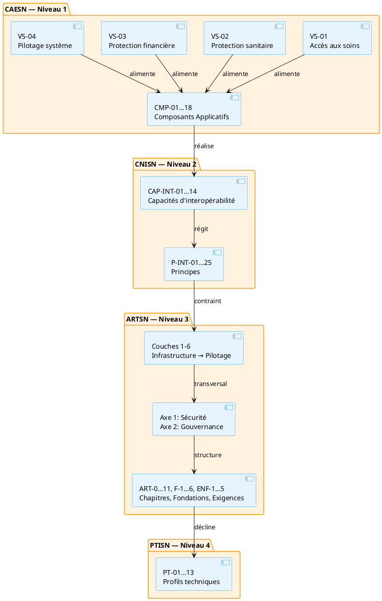

# Annexe F — Articulation complète CAESN → CNISN → ARTSN → PTISN

Cette annexe documente le flux complet depuis les **capabilités métier** (CAESN, niveau 1) jusqu'aux **composants techniques** (PTISN, niveau 4), en passant par les **capacités d'interopérabilité** (CNISN, niveau 2) et l'**architecture de référence** (ARTSN, niveau 3).

## 1. Vue d'ensemble des niveaux

| Niveau | Cadre | Contenu | Objets principaux |
|--------|-------|---------|-------------------|
| **1** | CAESN | Capabilités métier du système de santé | 16 capabilités (`cap-01…16`), 4 flux de valeur (`vs-01…04`), 28 étapes (`ev-01…28`), 12 processus (`prc-01…12`) |
| **2** | CNISN | Capacités d'interopérabilité et principes | 14 capacités (`cap-int-01…14`), 25 principes (`p-int-01…25`) |
| **3** | ARTSN | Architecture technique de référence | 18 chapitres (`art-0…11`), 6 fondations (`f-1…6`), 5 exigences (`enf-1…5`) |
| **4** | PTISN | Profils techniques d'implémentation | 15 profils (`pt-01…15`) |

**Couche de liaison :** 18 composants applicatifs (`cmp-01…18`) bridgent les capabilités métier (CAESN) et les capacités d'interopérabilité (CNISN) via l'architecture technique (ARTSN).

## 2. Flux de la chaîne de valeur

## 3. Matrice d'articulation par famille

### 3.1 Famille 1 — Référentiels et identités

| Capacité CNISN | Composants applicatifs | Chapitres ARTSN | Profils PTISN |
|----------------|------------------------|-----------------|---------------|
| **CAP-INT-01** Résolution d'identité bénéficiaire | [CMP-11](../../referentiel/composants/cmp-11.md) Registre des clients / INP | [ART-4](../../referentiel/chapitres/art-4.md), [ART-4a](../../referentiel/chapitres/art-4a.md) | [PT-04](../../referentiel/profils/pt-04.md) |
| **CAP-INT-02** Registre des professionnels | [CMP-13](../../referentiel/composants/cmp-13.md) Registre des personnels | [ART-4](../../referentiel/chapitres/art-4.md), [ART-4a](../../referentiel/chapitres/art-4a.md) | [PT-05](../../referentiel/profils/pt-05.md) |
| **CAP-INT-04** Référentiel des structures | [CMP-08](../../referentiel/composants/cmp-08.md) Répertoire de données cliniques | [ART-4](../../referentiel/chapitres/art-4.md) | [PT-06](../../referentiel/profils/pt-06.md) |
| **CAP-INT-05** Terminologie et codification | [CMP-10](../../referentiel/composants/cmp-10.md) Registre des terminologies | [ART-4](../../referentiel/chapitres/art-4.md) | [PT-07](../../referentiel/profils/pt-07.md) |

### 3.2 Famille 2 — Échange, médiation et contractualisation

| Capacité CNISN | Composants applicatifs | Chapitres ARTSN | Profils PTISN |
|----------------|------------------------|-----------------|---------------|
| **CAP-INT-03** Échange et médiation inter-systèmes | [CMP-06](../../referentiel/composants/cmp-06.md) Intégration, Médiation, API Gateway | [ART-1](../../referentiel/chapitres/art-1.md), [ART-2](../../referentiel/chapitres/art-2.md), [ART-8a](../../referentiel/chapitres/art-8a.md), [ART-8c](../../referentiel/chapitres/art-8c.md) | [PT-01](../../referentiel/profils/pt-01.md), [PT-02](../../referentiel/profils/pt-02.md) |
| **CAP-INT-06** Catalogue des services | [CMP-16](../../referentiel/composants/cmp-16.md) Registre de schémas | [ART-1](../../referentiel/chapitres/art-1.md), [ART-2](../../referentiel/chapitres/art-2.md) | [PT-03](../../referentiel/profils/pt-03.md) |

### 3.3 Famille 3 — Données analytiques et exposition

| Capacité CNISN | Composants applicatifs | Chapitres ARTSN | Profils PTISN |
|----------------|------------------------|-----------------|---------------|
| **CAP-INT-07** Accès et exposition des données analytiques | [CMP-03](../../referentiel/composants/cmp-03.md) Entrepôt Lakehouse, [CMP-04](../../referentiel/composants/cmp-04.md) Moteur analytique & IA, [CMP-01](../../referentiel/composants/cmp-01.md) Tableaux de bord | [ART-6](../../referentiel/chapitres/art-6.md), [ART-5](../../referentiel/chapitres/art-5.md), [ART-8b](../../referentiel/chapitres/art-8b.md), [ART-9](../../referentiel/chapitres/art-9.md) | [PT-08](../../referentiel/profils/pt-08.md), [PT-09](../../referentiel/profils/pt-09.md) |

### 3.4 Famille 4 — Confiance, sécurité et autorisation

| Capacité CNISN | Composants applicatifs | Chapitres ARTSN | Profils PTISN |
|----------------|------------------------|-----------------|---------------|
| **CAP-INT-08** Confiance, sécurité et autorisation | [CMP-15](../../referentiel/composants/cmp-15.md) API Gateway | [ART-7](../../referentiel/chapitres/art-7.md), [ART-4b](../../referentiel/chapitres/art-4b.md) | [PT-10](../../referentiel/profils/pt-10.md) |
| **CAP-INT-09** Consentements et bases d'autorisation | [CMP-12](../../referentiel/composants/cmp-12.md) Registre d'éligibilité et de couverture | [ART-7](../../referentiel/chapitres/art-7.md), [ART-4b](../../referentiel/chapitres/art-4b.md) | [PT-11](../../referentiel/profils/pt-11.md) |
| **CAP-INT-10** Provenance, audit et traçabilité | [CMP-17](../../referentiel/composants/cmp-17.md) Message broker asynchrone | [ART-7](../../referentiel/chapitres/art-7.md), [ART-3](../../referentiel/chapitres/art-3.md) | [PT-12](../../referentiel/profils/pt-12.md) |

### 3.5 Famille 5 — Qualité et conformité

| Capacité CNISN | Composants applicatifs | Chapitres ARTSN | Profils PTISN |
|----------------|------------------------|-----------------|---------------|
| **CAP-INT-11** Qualité et réconciliation | [CMP-05](../../referentiel/composants/cmp-05.md) Moteur de graphes & Référentiel spatio-temporel | [ART-5](../../referentiel/chapitres/art-5.md), [ART-4d](../../referentiel/chapitres/art-4d.md) | [PT-13](../../referentiel/profils/pt-13.md) |
| **CAP-INT-12** Conformité et tests d'interopérabilité | — | — | — |

### 3.6 Famille 6 — Interopérabilité transfrontalière

| Capacité CNISN | Composants applicatifs | Chapitres ARTSN | Profils PTISN |
|----------------|------------------------|-----------------|---------------|
| **CAP-INT-13** Interopérabilité transfrontalière et confiance internationale | [CMP-06](../../referentiel/composants/cmp-06.md) Intégration/Médiation, [CMP-15](../../referentiel/composants/cmp-15.md) API Gateway (confiance GDHCN) | [ART-7](../../referentiel/chapitres/art-7.md) Sécurité, [ART-0](../../referentiel/chapitres/art-0.md) Accords inter-institutionnels, [ART-1](../../referentiel/chapitres/art-1.md) Intégration | [PT-14](../../referentiel/profils/pt-14.md) Interopérabilité transfrontalière |

### 3.7 Famille 7 — Échanges intersectoriels One Health

| Capacité CNISN | Composants applicatifs | Chapitres ARTSN | Profils PTISN |
|----------------|------------------------|-----------------|---------------|
| **CAP-INT-14** Échanges intersectoriels One Health | [CMP-02](../../referentiel/composants/cmp-02.md) Centre de commande, [CMP-04](../../referentiel/composants/cmp-04.md) Moteur analytique, [CMP-06](../../referentiel/composants/cmp-06.md) Intégration/Médiation | [ART-11](../../referentiel/chapitres/art-11.md) Coordination intersectorielle, [ART-0](../../referentiel/chapitres/art-0.md) Accords de partage, [ART-4d](../../referentiel/chapitres/art-4d.md) Géospatial, [ART-8b](../../referentiel/chapitres/art-8b.md) Graphe | [PT-15](../../referentiel/profils/pt-15.md) Surveillance One Health |

## 4. Matrice des composants applicatifs par couche ARTSN

| Couche ARTSN | Composants applicatifs |
|--------------|------------------------|
| **Couche 6** — Pilotage | [CMP-01](../../referentiel/composants/cmp-01.md) Tableaux de bord, [CMP-02](../../referentiel/composants/cmp-02.md) Centre de commande |
| **Couche 5** — Projections analytiques | [CMP-03](../../referentiel/composants/cmp-03.md) Entrepôt Lakehouse, [CMP-04](../../referentiel/composants/cmp-04.md) Moteur analytique & IA, [CMP-05](../../referentiel/composants/cmp-05.md) Moteur de graphes |
| **Couche 4** — Interopérabilité | [CMP-06](../../referentiel/composants/cmp-06.md) Intégration/Médiation, [CMP-07](../../referentiel/composants/cmp-07.md) Orchestrateur de parcours, [CMP-08](../../referentiel/composants/cmp-08.md) Répertoire clinique, [CMP-09](../../referentiel/composants/cmp-09.md) Métadonnées, [CMP-10](../../referentiel/composants/cmp-10.md) Terminologies, [CMP-11](../../referentiel/composants/cmp-11.md) INP, [CMP-12](../../referentiel/composants/cmp-12.md) Éligibilité/CSU, [CMP-13](../../referentiel/composants/cmp-13.md) Personnels, [CMP-14](../../referentiel/composants/cmp-14.md) Produits/Intrants |
| **Couche 3** — Échange | [CMP-15](../../referentiel/composants/cmp-15.md) API Gateway, [CMP-16](../../referentiel/composants/cmp-16.md) Registre schémas, [CMP-17](../../referentiel/composants/cmp-17.md) Message broker, [CMP-18](../../referentiel/composants/cmp-18.md) Compensateur |
| **Axe 1** — Sécurité | Transversal (s'applique à toutes les couches) |
| **Axe 2** — Gouvernance | Transversal (s'applique à toutes les couches) |

## 5. Matrice des processus métier par flux de valeur

| Flux de valeur | Processus | Composants soutenus |
|----------------|-----------|---------------------|
| **VS-01** Accès aux soins | [PRC-01](../../referentiel/processus/prc-01.md) Développement du SIS, [PRC-02](../../referentiel/processus/prc-02.md) Offre de soins, [PRC-03](../../referentiel/processus/prc-03.md) Qualité et performance | — |
| **VS-02** Protection sanitaire | [PRC-04](../../referentiel/processus/prc-04.md) Veille sanitaire, [PRC-05](../../referentiel/processus/prc-05.md) Alerte et riposte, [PRC-06](../../referentiel/processus/prc-06.md) Logistique | [CMP-02](../../referentiel/composants/cmp-02.md), [CMP-04](../../referentiel/composants/cmp-04.md), [CMP-06](../../referentiel/composants/cmp-06.md), [CMP-07](../../referentiel/composants/cmp-07.md), [CMP-08](../../referentiel/composants/cmp-08.md), [CMP-11](../../referentiel/composants/cmp-11.md), [CMP-13](../../referentiel/composants/cmp-13.md), [CMP-14](../../referentiel/composants/cmp-14.md), [CMP-15](../../referentiel/composants/cmp-15.md), [CMP-17](../../referentiel/composants/cmp-17.md), [CMP-18](../../referentiel/composants/cmp-18.md) |
| **VS-03** Protection financière | [PRC-07](../../referentiel/processus/prc-07.md) Production des données, [PRC-08](../../referentiel/processus/prc-08.md) Qualité des données, [PRC-09](../../referentiel/processus/prc-09.md) Remboursement | [CMP-03](../../referentiel/composants/cmp-03.md), [CMP-05](../../referentiel/composants/cmp-05.md), [CMP-09](../../referentiel/composants/cmp-09.md), [CMP-10](../../referentiel/composants/cmp-10.md), [CMP-12](../../referentiel/composants/cmp-12.md), [CMP-16](../../referentiel/composants/cmp-16.md) |
| **VS-04** Pilotage du système | [PRC-10](../../referentiel/processus/prc-10.md) Planification, [PRC-11](../../referentiel/processus/prc-11.md) Pilotage performance, [PRC-12](../../referentiel/processus/prc-12.md) Redevabilité | [CMP-01](../../referentiel/composants/cmp-01.md), [CMP-12](../../referentiel/composants/cmp-12.md) |

## 6. Matrice des profils PTISN par composant

| Profil PTISN | Composant(s) soutenu(s) | Capacité CNISN |
|--------------|-------------------------|----------------|
| [PT-01](../../referentiel/profils/pt-01.md) Échange interinstitutionnel | [CMP-06](../../referentiel/composants/cmp-06.md) | CAP-INT-03 |
| [PT-02](../../referentiel/profils/pt-02.md) Médiation intra-secteur | [CMP-06](../../referentiel/composants/cmp-06.md) | CAP-INT-03 |
| [PT-03](../../referentiel/profils/pt-03.md) Catalogue services | [CMP-16](../../referentiel/composants/cmp-16.md) | CAP-INT-06 |
| [PT-04](../../referentiel/profils/pt-04.md) Résolution identité bénéficiaire | [CMP-11](../../referentiel/composants/cmp-11.md) | CAP-INT-01 |
| [PT-05](../../referentiel/profils/pt-05.md) Registre professionnels | [CMP-13](../../referentiel/composants/cmp-13.md) | CAP-INT-02 |
| [PT-06](../../referentiel/profils/pt-06.md) Référentiel structures | [CMP-08](../../referentiel/composants/cmp-08.md) | CAP-INT-04 |
| [PT-07](../../referentiel/profils/pt-07.md) Terminologie codification | [CMP-10](../../referentiel/composants/cmp-10.md) | CAP-INT-05 |
| [PT-08](../../referentiel/profils/pt-08.md) Échange données agrégées | [CMP-03](../../referentiel/composants/cmp-03.md), [CMP-06](../../referentiel/composants/cmp-06.md) | CAP-INT-03, CAP-INT-07 |
| [PT-09](../../referentiel/profils/pt-09.md) Analytique exposition données | [CMP-03](../../referentiel/composants/cmp-03.md), [CMP-04](../../referentiel/composants/cmp-04.md) | CAP-INT-07 |
| [PT-10](../../referentiel/profils/pt-10.md) Confiance et autorisation | [CMP-15](../../referentiel/composants/cmp-15.md) | CAP-INT-08 |
| [PT-11](../../referentiel/profils/pt-11.md) Consentement et autorisation | [CMP-12](../../referentiel/composants/cmp-12.md) | CAP-INT-09 |
| [PT-12](../../referentiel/profils/pt-12.md) Audit et traçabilité | [CMP-17](../../referentiel/composants/cmp-17.md) | CAP-INT-10 |
| [PT-13](../../referentiel/profils/pt-13.md) Qualité et réconciliation | [CMP-05](../../referentiel/composants/cmp-05.md) | CAP-INT-11 |
| [PT-14](../../referentiel/profils/pt-14.md) Interopérabilité transfrontalière | [CMP-06](../../referentiel/composants/cmp-06.md), [CMP-15](../../referentiel/composants/cmp-15.md) | CAP-INT-13 |
| [PT-15](../../referentiel/profils/pt-15.md) Surveillance One Health | [CMP-02](../../referentiel/composants/cmp-02.md), [CMP-04](../../referentiel/composants/cmp-04.md), [CMP-06](../../referentiel/composants/cmp-06.md) | CAP-INT-14 |

## 7. Correspondance CAESN → CNISN → CMP

| Capabilité CAESN | Capacité(s) CNISN | Composant(s) applicatif(s) |
|------------------|-------------------|----------------------------|
| CAP-01 Offre de soins | — | — |
| CAP-02 Parcours patient | CAP-INT-01 | [CMP-11](../../referentiel/composants/cmp-11.md) |
| CAP-03 Qualité des soins | — | — |
| CAP-04 Santé communautaire | — | — |
| CAP-05 Surveillance épidémiologique | CAP-INT-07 | [CMP-03](../../referentiel/composants/cmp-03.md), [CMP-04](../../referentiel/composants/cmp-04.md) |
| CAP-06 Vaccination | — | — |
| CAP-07 Protection financière | — | — |
| CAP-08 Gouvernance | — | — |
| CAP-09 RH en santé | CAP-INT-02 | [CMP-13](../../referentiel/composants/cmp-13.md) |
| CAP-10 Logistique | — | — |
| CAP-11 Infrastructures | CAP-INT-04 | [CMP-08](../../referentiel/composants/cmp-08.md) |
| CAP-12 Finances publiques | — | — |
| CAP-13 SIS et données | CAP-INT-03, 04, 05, 07, 10, 11 | [CMP-03](../../referentiel/composants/cmp-03.md), [CMP-04](../../referentiel/composants/cmp-04.md), [CMP-05](../../referentiel/composants/cmp-05.md), [CMP-06](../../referentiel/composants/cmp-06.md), [CMP-08](../../referentiel/composants/cmp-08.md), [CMP-10](../../referentiel/composants/cmp-10.md), [CMP-17](../../referentiel/composants/cmp-17.md) |
| CAP-14 Interopérabilité | CAP-INT-01, 02, 03, 04, 05, 06, 11, 12 | [CMP-06](../../referentiel/composants/cmp-06.md), [CMP-08](../../referentiel/composants/cmp-08.md), [CMP-10](../../referentiel/composants/cmp-10.md), [CMP-11](../../referentiel/composants/cmp-11.md), [CMP-13](../../referentiel/composants/cmp-13.md), [CMP-16](../../referentiel/composants/cmp-16.md) |
| CAP-15 Cybersécurité | CAP-INT-08, 09, 10 | [CMP-12](../../referentiel/composants/cmp-12.md), [CMP-15](../../referentiel/composants/cmp-15.md), [CMP-17](../../referentiel/composants/cmp-17.md) |
| CAP-16 Portefeuille d'initiatives | CAP-INT-06, 12 | [CMP-16](../../referentiel/composants/cmp-16.md) |
| CAP-17 Engagement patient et identité numérique | CAP-INT-01, CAP-INT-13 | [CMP-11](../../referentiel/composants/cmp-11.md) |
| CAP-18 Coordination intersectorielle (One Health) | CAP-INT-13, CAP-INT-14 | [CMP-02](../../referentiel/composants/cmp-02.md), [CMP-06](../../referentiel/composants/cmp-06.md) |

---

*Rattachée au niveau 2 (CNISN) : [01_cnisn/02_capacites.md](../02_capacites/index.md), [01_cnisn/01_principes.md](../01_principes/index.md).*
*Composants applicatifs : [referentiel/composants/](../../referentiel/composants/).*
*Profils PTISN : [03_ptisn/03_profils/](../../03_ptisn/03_profils/).*