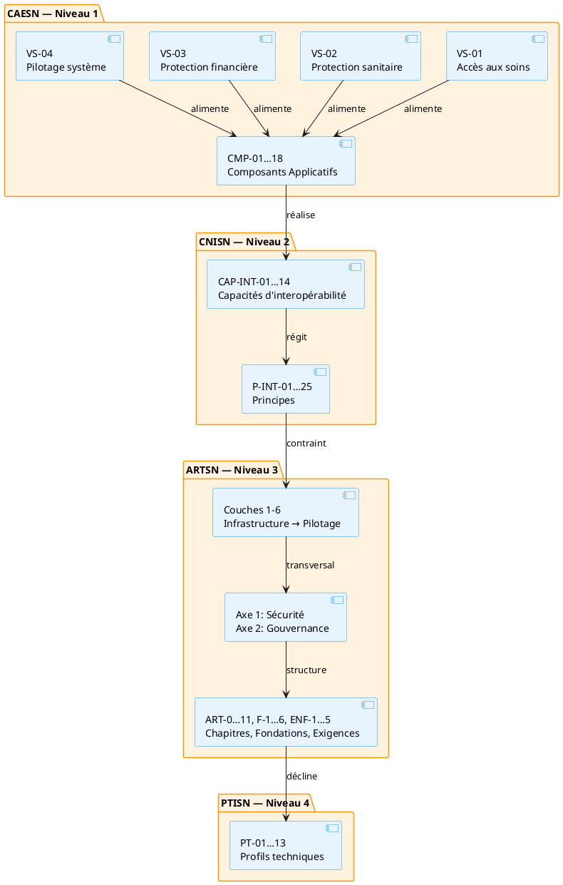

# Annexe F — Articulation complète CAESN → CNISN → ARTSN → PTISN

Cette annexe documente le flux complet depuis les **capabilités métier** (CAESN, niveau 1) jusqu'aux **composants techniques** (PTISN, niveau 4), en passant par les **capacités d'interopérabilité** (CNISN, niveau 2) et l'**architecture de référence** (ARTSN, niveau 3).

## 1. Vue d'ensemble des niveaux

| Niveau | Cadre | Contenu | Objets principaux |
|--------|-------|---------|-------------------|
| **1** | CAESN | Capabilités métier du système de santé | 16 capabilités (`cap-01…16`), 4 flux de valeur (`vs-01…04`), 28 étapes (`ev-01…28`), 12 processus (`prc-01…12`) |
| **2** | CNISN | Capacités d'interopérabilité et principes | 14 capacités (`cap-int-01…14`), 25 principes (`p-int-01…25`) |
| **3** | ARTSN | Architecture technique de référence | 18 chapitres (`art-0…11`), 6 fondations (`f-1…6`), 5 exigences (`enf-1…5`) |
| **4** | PTISN | Profils techniques d'implémentation | 15 profils (`pt-01…15`) |

**Couche de liaison :** 18 composants applicatifs (`cmp-01…18`) bridgent les capabilités métier (CAESN) et les capacités d'interopérabilité (CNISN) via l'architecture technique (ARTSN).

## 2. Flux de la chaîne de valeur

## 3. Matrice d'articulation par famille

### 3.1 Famille 1 — Référentiels et identités

| Capacité CNISN | Composants applicatifs | Chapitres ARTSN | Profils PTISN |
|----------------|------------------------|-----------------|---------------|
| **CAP-INT-01** Résolution d'identité bénéficiaire | CMP-11 Registre des clients / INP | ART-4, ART-4a | PT-04 |
| **CAP-INT-02** Registre des professionnels | CMP-13 Registre des personnels | ART-4, ART-4a | PT-05 |
| **CAP-INT-04** Référentiel des structures | CMP-08 Répertoire de données cliniques | ART-4 | PT-06 |
| **CAP-INT-05** Terminologie et codification | CMP-10 Registre des terminologies | ART-4 | PT-07 |

### 3.2 Famille 2 — Échange, médiation et contractualisation

| Capacité CNISN | Composants applicatifs | Chapitres ARTSN | Profils PTISN |
|----------------|------------------------|-----------------|---------------|
| **CAP-INT-03** Échange et médiation inter-systèmes | CMP-06 Intégration, Médiation, API Gateway | ART-1, ART-2, ART-8a, ART-8c | PT-01, PT-02 |
| **CAP-INT-06** Catalogue des services | CMP-16 Registre de schémas | ART-1, ART-2 | PT-03 |

### 3.3 Famille 3 — Données analytiques et exposition

| Capacité CNISN | Composants applicatifs | Chapitres ARTSN | Profils PTISN |
|----------------|------------------------|-----------------|---------------|
| **CAP-INT-07** Accès et exposition des données analytiques | CMP-03 Entrepôt Lakehouse, CMP-04 Moteur analytique & IA, CMP-01 Tableaux de bord | ART-6, ART-5, ART-8b, ART-9 | PT-08, PT-09 |

### 3.4 Famille 4 — Confiance, sécurité et autorisation

| Capacité CNISN | Composants applicatifs | Chapitres ARTSN | Profils PTISN |
|----------------|------------------------|-----------------|---------------|
| **CAP-INT-08** Confiance, sécurité et autorisation | CMP-15 API Gateway | ART-7, ART-4b | PT-10 |
| **CAP-INT-09** Consentements et bases d'autorisation | CMP-12 Registre d'éligibilité et de couverture | ART-7, ART-4b | PT-11 |
| **CAP-INT-10** Provenance, audit et traçabilité | CMP-17 Message broker asynchrone | ART-7, ART-3 | PT-12 |

### 3.5 Famille 5 — Qualité et conformité

| Capacité CNISN | Composants applicatifs | Chapitres ARTSN | Profils PTISN |
|----------------|------------------------|-----------------|---------------|
| **CAP-INT-11** Qualité et réconciliation | CMP-05 Moteur de graphes & Référentiel spatio-temporel | ART-5, ART-4d | PT-13 |
| **CAP-INT-12** Conformité et tests d'interopérabilité | — | — | — |

### 3.6 Famille 6 — Interopérabilité transfrontalière

| Capacité CNISN | Composants applicatifs | Chapitres ARTSN | Profils PTISN |
|----------------|------------------------|-----------------|---------------|
| **CAP-INT-13** Interopérabilité transfrontalière et confiance internationale | CMP-06 Intégration/Médiation, CMP-15 API Gateway (confiance GDHCN) | ART-7 Sécurité, ART-0 Accords inter-institutionnels, ART-1 Intégration | PT-14 Interopérabilité transfrontalière |

### 3.7 Famille 7 — Échanges intersectoriels One Health

| Capacité CNISN | Composants applicatifs | Chapitres ARTSN | Profils PTISN |
|----------------|------------------------|-----------------|---------------|
| **CAP-INT-14** Échanges intersectoriels One Health | CMP-02 Centre de commande, CMP-04 Moteur analytique, CMP-06 Intégration/Médiation | ART-11 Coordination intersectorielle, ART-0 Accords de partage, ART-4d Géospatial, ART-8b Graphe | PT-15 Surveillance One Health |

## 4. Matrice des composants applicatifs par couche ARTSN

| Couche ARTSN | Composants applicatifs |
|--------------|------------------------|
| **Couche 6** — Pilotage | CMP-01 Tableaux de bord, CMP-02 Centre de commande |
| **Couche 5** — Projections analytiques | CMP-03 Entrepôt Lakehouse, CMP-04 Moteur analytique & IA, CMP-05 Moteur de graphes |
| **Couche 4** — Interopérabilité | CMP-06 Intégration/Médiation, CMP-07 Orchestrateur de parcours, CMP-08 Répertoire clinique, CMP-09 Métadonnées, CMP-10 Terminologies, CMP-11 INP, CMP-12 Éligibilité/CSU, CMP-13 Personnels, CMP-14 Produits/Intrants |
| **Couche 3** — Échange | CMP-15 API Gateway, CMP-16 Registre schémas, CMP-17 Message broker, CMP-18 Compensateur |
| **Axe 1** — Sécurité | Transversal (s'applique à toutes les couches) |
| **Axe 2** — Gouvernance | Transversal (s'applique à toutes les couches) |

## 5. Matrice des processus métier par flux de valeur

| Flux de valeur | Processus | Composants soutenus |
|----------------|-----------|---------------------|
| **VS-01** Accès aux soins | PRC-01 Développement du SIS, PRC-02 Offre de soins, PRC-03 Qualité et performance | — |
| **VS-02** Protection sanitaire | PRC-04 Veille sanitaire, PRC-05 Alerte et riposte, PRC-06 Logistique | CMP-02, CMP-04, CMP-06, CMP-07, CMP-08, CMP-11, CMP-13, CMP-14, CMP-15, CMP-17, CMP-18 |
| **VS-03** Protection financière | PRC-07 Production des données, PRC-08 Qualité des données, PRC-09 Remboursement | CMP-03, CMP-05, CMP-09, CMP-10, CMP-12, CMP-16 |
| **VS-04** Pilotage du système | PRC-10 Planification, PRC-11 Pilotage performance, PRC-12 Redevabilité | CMP-01, CMP-12 |

## 6. Matrice des profils PTISN par composant

| Profil PTISN | Composant(s) soutenu(s) | Capacité CNISN |
|--------------|-------------------------|----------------|
| PT-01 Échange interinstitutionnel | CMP-06 | CAP-INT-03 |
| PT-02 Médiation intra-secteur | CMP-06 | CAP-INT-03 |
| PT-03 Catalogue services | CMP-16 | CAP-INT-06 |
| PT-04 Résolution identité bénéficiaire | CMP-11 | CAP-INT-01 |
| PT-05 Registre professionnels | CMP-13 | CAP-INT-02 |
| PT-06 Référentiel structures | CMP-08 | CAP-INT-04 |
| PT-07 Terminologie codification | CMP-10 | CAP-INT-05 |
| PT-08 Échange données agrégées | CMP-03, CMP-06 | CAP-INT-03, CAP-INT-07 |
| PT-09 Analytique exposition données | CMP-03, CMP-04 | CAP-INT-07 |
| PT-10 Confiance et autorisation | CMP-15 | CAP-INT-08 |
| PT-11 Consentement et autorisation | CMP-12 | CAP-INT-09 |
| PT-12 Audit et traçabilité | CMP-17 | CAP-INT-10 |
| PT-13 Qualité et réconciliation | CMP-05 | CAP-INT-11 |
| PT-14 Interopérabilité transfrontalière | CMP-06, CMP-15 | CAP-INT-13 |
| PT-15 Surveillance One Health | CMP-02, CMP-04, CMP-06 | CAP-INT-14 |

## 7. Correspondance CAESN → CNISN → CMP

| Capabilité CAESN | Capacité(s) CNISN | Composant(s) applicatif(s) |
|------------------|-------------------|----------------------------|
| CAP-01 Offre de soins | — | — |
| CAP-02 Parcours patient | CAP-INT-01 | CMP-11 |
| CAP-03 Qualité des soins | — | — |
| CAP-04 Santé communautaire | — | — |
| CAP-05 Surveillance épidémiologique | CAP-INT-07 | CMP-03, CMP-04 |
| CAP-06 Vaccination | — | — |
| CAP-07 Protection financière | — | — |
| CAP-08 Gouvernance | — | — |
| CAP-09 RH en santé | CAP-INT-02 | CMP-13 |
| CAP-10 Logistique | — | — |
| CAP-11 Infrastructures | CAP-INT-04 | CMP-08 |
| CAP-12 Finances publiques | — | — |
| CAP-13 SIS et données | CAP-INT-03, 04, 05, 07, 10, 11 | CMP-03, CMP-04, CMP-05, CMP-06, CMP-08, CMP-10, CMP-17 |
| CAP-14 Interopérabilité | CAP-INT-01, 02, 03, 04, 05, 06, 11, 12 | CMP-06, CMP-08, CMP-10, CMP-11, CMP-13, CMP-16 |
| CAP-15 Cybersécurité | CAP-INT-08, 09, 10 | CMP-12, CMP-15, CMP-17 |
| CAP-16 Portefeuille d'initiatives | CAP-INT-06, 12 | CMP-16 |
| CAP-17 Engagement patient et identité numérique | CAP-INT-01, CAP-INT-13 | CMP-11 |
| CAP-18 Coordination intersectorielle (One Health) | CAP-INT-13, CAP-INT-14 | CMP-02, CMP-06 |

---

*Rattachée au niveau 2 (CNISN) : 01_cnisn/02_capacites.md, 01_cnisn/01_principes.md.*
*Composants applicatifs : referentiel/composants/.*
*Profils PTISN : 03_ptisn/03_profils/.*

## Références

- **CMP-11** — Registre des clients / Index National des Patients (INP — ART-4a) (`referentiel/composants/cmp-11.md`)
- **ART-4** — Référentiels de métadonnées de gestion (`referentiel/chapitres/art-4.md`)
- **ART-4a** — Résolution d'identité (`referentiel/chapitres/art-4a.md`)
- **PT-04** — Profil technique national (`referentiel/profils/pt-04.md`)
- **CMP-13** — Registre des personnels (`referentiel/composants/cmp-13.md`)
- **PT-05** — Profil technique national (`referentiel/profils/pt-05.md`)
- **CMP-08** — Répertoire de données cliniques opérationnelles (`referentiel/composants/cmp-08.md`)
- **PT-06** — Profil technique national (`referentiel/profils/pt-06.md`)
- **CMP-10** — Registre des terminologies (`referentiel/composants/cmp-10.md`)
- **PT-07** — Profil technique national (`referentiel/profils/pt-07.md`)
- **CMP-06** — Intégration, Médiation, API Gateway, Broker & Registre schémas (`referentiel/composants/cmp-06.md`)
- **ART-1** — Intégration et ingestion (`referentiel/chapitres/art-1.md`)
- **ART-2** — Médiation et normalisation (`referentiel/chapitres/art-2.md`)
- **ART-8a** — Orchestration de processus borné (`referentiel/chapitres/art-8a.md`)
- **ART-8c** — Agrégation par lot (`referentiel/chapitres/art-8c.md`)
- **PT-01** — Profil technique national (`referentiel/profils/pt-01.md`)
- **PT-02** — Profil technique national (`referentiel/profils/pt-02.md`)
- **CMP-16** — Registre de schémas (F.3) (`referentiel/composants/cmp-16.md`)
- **PT-03** — Profil technique national (`referentiel/profils/pt-03.md`)
- **CMP-03** — Entrepôt Lakehouse & Projections analytiques (pipeline ETL, Lakehouse, projections) (`referentiel/composants/cmp-03.md`)
- **CMP-04** — Moteur analytique & IA (IA prédictive, routeur alertes, Grand Livre) (`referentiel/composants/cmp-04.md`)
- **CMP-01** — Tableaux de bord & Portails nationaux (performance, CSU, ressources, veille) (`referentiel/composants/cmp-01.md`)
- **ART-6** — Analytique et restitution (`referentiel/chapitres/art-6.md`)
- **ART-5** — Cohérence et qualité des données (`referentiel/chapitres/art-5.md`)
- **ART-8b** — Modélisation de relations en graphe (`referentiel/chapitres/art-8b.md`)
- **ART-9** — Garanties transactionnelles fortes (`referentiel/chapitres/art-9.md`)
- **PT-08** — Profil technique national (`referentiel/profils/pt-08.md`)
- **PT-09** — Profil technique national (`referentiel/profils/pt-09.md`)
- **CMP-15** — API Gateway (`referentiel/composants/cmp-15.md`)
- **ART-7** — Sécurité, contrôle d'accès et résidence de la donnée (`referentiel/chapitres/art-7.md`)
- **ART-4b** — Bases d'autorisation (`referentiel/chapitres/art-4b.md`)
- **PT-10** — Profil technique national (`referentiel/profils/pt-10.md`)
- **CMP-12** — Registre d'éligibilité et de couverture (CSU — ART-4c) (`referentiel/composants/cmp-12.md`)
- **PT-11** — Profil technique national (`referentiel/profils/pt-11.md`)
- **CMP-17** — Message broker asynchrone (`referentiel/composants/cmp-17.md`)
- **ART-3** — Historisation événementielle et profils de déploiement (`referentiel/chapitres/art-3.md`)
- **PT-12** — Profil technique national (`referentiel/profils/pt-12.md`)
- **CMP-05** — Moteur de graphes & Référentiel spatio-temporel (Graph Store, Spatio ART-4d) (`referentiel/composants/cmp-05.md`)
- **ART-4d** — Référentiel géospatial et d'exploitation partagé (`referentiel/chapitres/art-4d.md`)
- **PT-13** — Profil technique national (`referentiel/profils/pt-13.md`)
- **ART-0** — Accords de partage inter-institutionnels (`referentiel/chapitres/art-0.md`)
- **PT-14** — Interopérabilité transfrontalière (`referentiel/profils/pt-14.md`)
- **CMP-02** — Centre de commande & Crises intersectorielles (alertes, crises, veille) (`referentiel/composants/cmp-02.md`)
- **ART-11** — Coordination intersectorielle (`referentiel/chapitres/art-11.md`)
- **PT-15** — Surveillance One Health (`referentiel/profils/pt-15.md`)
- **CMP-07** — Orchestrateur de parcours & Gestionnaire de Sagas (ART-8a) (`referentiel/composants/cmp-07.md`)
- **CMP-09** — Référentiel des métadonnées d'exploitation (ART-4) (`referentiel/composants/cmp-09.md`)
- **CMP-14** — Registre des produits, intrants et indicateurs (`referentiel/composants/cmp-14.md`)
- **CMP-18** — Compensateur / Regroupeur de flux (Netting — ART-8c) (`referentiel/composants/cmp-18.md`)
- **PRC-01** — Accès, orientation et admission du patient (`referentiel/processus/prc-01.md`)
- **PRC-02** — Prestation des soins cliniques (`referentiel/processus/prc-02.md`)
- **PRC-03** — Continuité, suivi et qualité des soins (`referentiel/processus/prc-03.md`)
- **PRC-04** — Veille, prévention et surveillance sanitaire (`referentiel/processus/prc-04.md`)
- **PRC-05** — Alerte, investigation et riposte (`referentiel/processus/prc-05.md`)
- **PRC-06** — Clôture et capitalisation des épisodes (`referentiel/processus/prc-06.md`)
- **PRC-07** — Identification et droits des bénéficiaires (`referentiel/processus/prc-07.md`)
- **PRC-08** — Financement et exemption au point de service (`referentiel/processus/prc-08.md`)
- **PRC-09** — Remboursement et régulation des mécanismes (`referentiel/processus/prc-09.md`)
- **PRC-10** — Planification et allocation des ressources (`referentiel/processus/prc-10.md`)
- **PRC-11** — Suivi et pilotage de la performance (`referentiel/processus/prc-11.md`)
- **PRC-12** — Redevabilité et amélioration continue (`referentiel/processus/prc-12.md`)
- **01_cnisn/02_capacites.md** — Partie II — Capacités nationales requises (`01_cnisn/02_capacites/index.md`)
- **01_cnisn/01_principes.md** — Partie I — Principes nationaux d'interopérabilité de santé (`01_cnisn/01_principes/index.md`)
