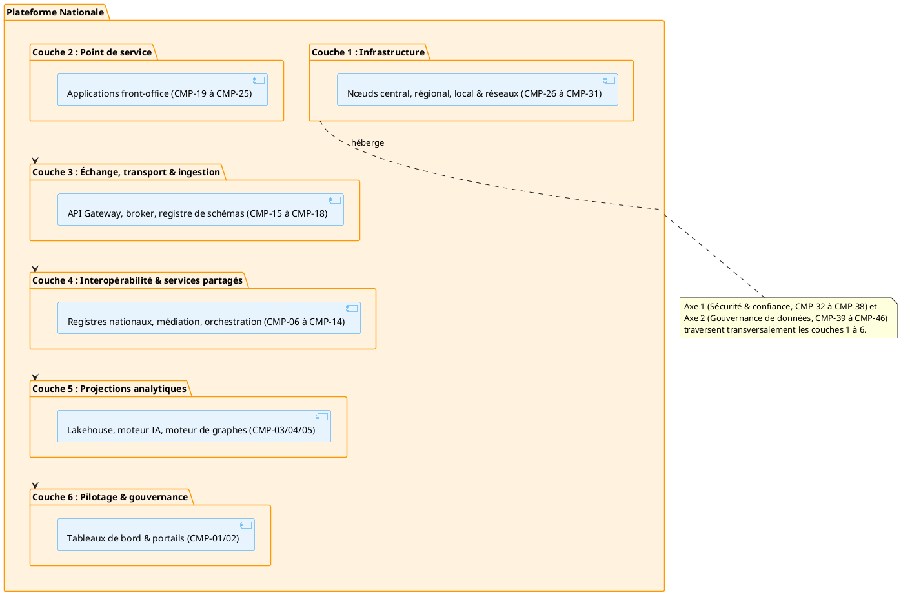
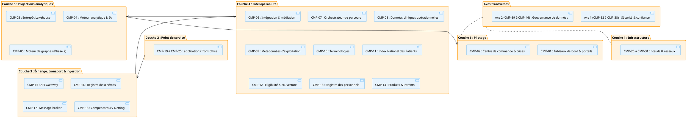

---

title: Cartographie conceptuelle cible
id: artsn-cartographie-cible
domain: 04_cartographie-cible
version: "1.0.0"
status: draft
last_reviewed: 2026-08-08
owner: DEPSI
tags: ["artsn", "cartographie", "couches", "axes", "niveau-3"]
---

# Cartographie conceptuelle cible

## Pour qui lire ce document

**Niveau :** niveau 3 : Architecture de Référence Technique de la Santé Numérique.

Les décideurs institutionnels, les directions métier et programmes, ainsi que les partenaires techniques et financiers trouveront une lecture complémentaire de ce document, tandis que les équipes DEPSI et les équipes techniques, de même que les équipes SIS, données et suivi-évaluation, y trouveront une lecture prioritaire. Légende : ● prioritaire · ◐ complémentaire · ○ ponctuelle. Vue d'ensemble : matrice de lecture.

L'architecture conceptuelle présentée dans cette section est l'incarnation visuelle et l'application physique stricte des contraintes et des patterns définis dans les chapitres. Chaque bloc horizontal et vertical exécute techniquement un ou plusieurs chapitres normatifs de l'ARTSN.

La cartographie est structurée en **six couches horizontales** (de l'infrastructure à la gouvernance) traversées par **deux axes verticaux** transversaux. Elle s'articule avec les six couches applicatives du CAESN.

| Couche | Intitulé | Chapitres ARTSN associés |
|--------|----------|--------------------------|
| [6](#couche-6--pilotage-gouvernance-et-actions-intersectorielles) | Pilotage, Gouvernance et actions intersectorielles | VS-04, ART-0 |
| [5](#couche-5--projections-analytiques-et-modèles) | Projections analytiques et Modèles | ART-6, ART-5, ART-8b, ART-4d, ART-9 |
| [4](#couche-4--interopérabilité-et-services-partagés) | Interopérabilité et services partagés | ART-3, ART-4, ART-2, ART-8a, ART-4a, ART-4c |
| [3](#couche-3--échange-transport-et-ingestion) | Échange, transport et ingestion | ART-1, F.3, ART-8c |
| [2](#couche-2--point-de-service) | Point de service | F.1, ENF-1 |
| [1](#couche-1--infrastructure) | Infrastructure | ART-7 |
| Axe 1 | Sécurité et confiance numérique | ART-7 |
| Axe 2 | Gouvernance de données | F.4, ART-0 |

## Note de rationalisation (sur-spécification)

Par rapport aux pairs africains (Kenya, Ouganda : 7–10 composants ; Tanzanie : 5–7 profils), l'état cible comporte **46 composants** et **16 profils**. Cette granularité est justifiée par la séparation CQRS et transport/logique, mais certains composants sont des patterns sans précédent en santé africaine et doivent être **phasés** pour caler l'architecture sur les capacités d'implémentation réelles :

- **CMP-05 (Moteur de graphes / Graph Store)** et **CMP-18 (Compensateur / Netting)** sont repoussés en **Phase 2**, conditionnés à une initiative validante (aucun pair ne les déploie aujourd'hui).
- **CMP-15 / CMP-16 / CMP-17 / CMP-18** (Couche 3) sont candidats à une **fusion en *Pattern d'échange unifié*** (API Gateway + registre de schémas + broker + compensation) pour réduire le nombre de composants à posséder et à financer.
- **CMP-07 (Gestionnaire de Sagas)** fait l'objet d'une étude « Saga vs orchestration simple » (alternative pragmatic : Tanzanie HIM) avant généralisation.

Ces composants, marqués *Phase 2, candidat*, sont décrits dans le référentiel des composants (`referentiel/composants/`).

## Couche 6 : Pilotage, Gouvernance et actions intersectorielles

**Contenu normatif.** Cette couche constitue la **vitrine décisionnelle unique de l'État**. Elle possède un droit exclusif de lecture sur les projections analytiques et n'exécute aucune écriture opérationnelle. Elle a l'obligation de fournir des espaces de visualisation cloisonnés et partagés entre les ministères partenaires pour évaluer la performance sanitaire et guider l'action publique.

**Discipline existentielle.** Dès lors qu'une source échappe à la gouvernance directe de l'initiative (cellules de crise multi-ministérielles, directions stratégiques) : elle seule permet de garantir que les décisions politiques s'appuient sur une vision macro-sanitaire unifiée, épurée de toute altération, sans rompre le pipeline.

Cette couche est rattachée au flux de valeur 4 (VS-04) et associe les composants CMP-01 tableaux de bord de performance sanitaire nationale, portail de suivi de la CSU, portail de gestion des ressources du système, ainsi que CMP-02 centre de commande des alertes épidémiques, plateforme de gestion des crises intersectorielles, portail de veille environnementale et sanitaire. Son statut est Stable.

### Composants associés

- [CMP-01 : Tableaux de bord & Portails nationaux (performance, CSU, ressources, veille)](../../referentiel/composants/cmp-01.md)
- [CMP-02 : Centre de commande & Crises intersectorielles (alertes, crises, veille)](../../referentiel/composants/cmp-02.md)

## Couche 5 : Projections analytiques et Modèles

**Contenu normatif.** Cette couche sépare structurellement les flux analytiques du stockage transactionnel. Elle a l'obligation d'**extraire, nettoyer et masquer de façon irréversible** les données opérationnelles et les flux des secteurs externes afin de les organiser selon les modèles de projections analytiques exigés par le pays.

**Discipline existentielle.** Dès lors qu'une source échappe à la gouvernance directe de l'initiative (modèles prédictifs d'IA, requêtes lourdes des chercheurs, algorithmes de transmission) : elle seule permet d'exécuter des analyses de masse longitudinales transversales sans jamais ralentir les serveurs de soins et sans exposer l'identité des citoyens, sans rompre le pipeline.

Cette couche applique physiquement et directement le pattern CQRS (ART-6). Elle associe le pipeline d'ingestion ETL, le moteur d'IA prédictive, le routeur d'escalade et d'alertes (ART-5), CMP-03 entrepôt Lakehouse / projections tabulaires, CMP-04 moteur d'IA prédictive, CMP-05 moteur de graphes (Graph Store : ART-8b), le référentiel spatio-temporel (ART-4d) et la réconciliation analytique (Grand Livre : ART-9). Son statut est Stable.

### Composants associés

- [CMP-03 : Entrepôt Lakehouse & Projections analytiques (pipeline ETL, Lakehouse, projections)](../../referentiel/composants/cmp-03.md)
- [CMP-04 : Moteur analytique & IA (IA prédictive, routeur alertes, Grand Livre)](../../referentiel/composants/cmp-04.md)
- [CMP-05 : Moteur de graphes & Référentiel spatio-temporel (Graph Store, Spatio ART-4d)](../../referentiel/composants/cmp-05.md)

## Couche 4 : Interopérabilité et services partagés

**Contenu normatif.** Cette couche est le **cœur applicatif de la santé au présent**. Elle a l'obligation de centraliser les registres nationaux et d'assurer la persistance clinique temps réel. Elle doit orchestrer les parcours et assurer la médiation sémantique universelle face aux ontologies de référence.

**Discipline existentielle.** Dès lors qu'une source échappe à la gouvernance directe de l'initiative (échanges cliniques immédiats, consultations, identitovigilance probabiliste) : elle seule permet de recevoir et de valider la conformité des données médicales à la milliseconde et de fournir un dossier patient unique partagé sécurisé, sans rompre le pipeline.

Cette couche exécute la source de vérité au présent (Profil B d'ART-3) et les Référentiels Nationaux (ART-4). Elle associe CMP-06 moteur d'intégration & médiation (ART-2), CMP-07 orchestrateur de parcours / gestionnaire de Sagas (ART-8a), CMP-08 répertoire de données cliniques opérationnelles, CMP-09 référentiel des métadonnées d'exploitation (ART-4), CMP-10 registre des terminologies, CMP-11 registre des clients / Index National des Patients (INP : ART-4a), CMP-12 registre d'éligibilité et de couverture (CSU : ART-4c), CMP-13 registre des personnels, et CMP-14 registre des produits, intrants et indicateurs. Son statut est Stable.

### Composants associés

- [CMP-06 : Intégration, Médiation, API Gateway, Broker & Registre schémas](../../referentiel/composants/cmp-06.md)
- [CMP-07 : Orchestrateur de parcours & Gestionnaire de Sagas (ART-8a)](../../referentiel/composants/cmp-07.md)
- [CMP-08 : Répertoire de données cliniques opérationnelles](../../referentiel/composants/cmp-08.md)
- [CMP-09 : Référentiel des métadonnées d'exploitation (ART-4)](../../referentiel/composants/cmp-09.md)
- [CMP-10 : Registre des terminologies](../../referentiel/composants/cmp-10.md)
- [CMP-11 : Registre des clients / Index National des Patients (INP, ART-4a)](../../referentiel/composants/cmp-11.md)
- [CMP-12 : Registre d'éligibilité et de couverture (CSU, ART-4c)](../../referentiel/composants/cmp-12.md)
- [CMP-13 : Registre des personnels](../../referentiel/composants/cmp-13.md)
- [CMP-14 : Registre des produits, intrants et indicateurs](../../referentiel/composants/cmp-14.md)

## Couche 3 : Échange, transport et ingestion

**Contenu normatif.** Cette couche gère l'infrastructure d'ingestion réseau. Elle est structurellement **dépourvue de toute logique ou intelligence métier**. Elle a l'obligation d'intercepter les requêtes à la périphérie, de bloquer les messages non conformes aux contrats, d'assurer la persistance tampon en file d'attente et d'exécuter les compensations par lots.

**Discipline existentielle.** Dès lors qu'une source échappe à la gouvernance directe de l'initiative (connexions simultanées de milliers d'applications de terrain, micro-coupures télécoms) : elle seule permet d'encaisser la charge et de garantir la livraison des messages sans perte vers les couches supérieures, sans rompre le pipeline.

Cette couche assure l'exécution technique du transport asynchrone (ART-1 et F.3). Elle associe CMP-15 API Gateway, CMP-16 registre de schémas (F.3), CMP-17 message broker asynchrone, et CMP-18 compensateur / regroupeur de flux (Netting : ART-8c). Son statut est Stable.

### Composants associés

- [CMP-15 : API Gateway](../../referentiel/composants/cmp-15.md)
- [CMP-16 : Registre de schémas (F.3)](../../referentiel/composants/cmp-16.md)
- [CMP-17 : Message broker asynchrone](../../referentiel/composants/cmp-17.md)
- [CMP-18 : Compensateur / Regroupeur de flux (Netting, ART-8c)](../../referentiel/composants/cmp-18.md)

## Couche 2 : Point de service

**Contenu normatif.** Cette couche constitue la **ligne de front logicielle**. Elle a l'obligation d'exécuter des applications capables de capturer les soins, les dispensations et les mouvements logistiques en l'absence totale de réseau Internet. Elle doit ordonner ses écritures locales sous forme de **journaux d'événements inaltérables**.

**Discipline existentielle.** Dès lors qu'une source échappe à la gouvernance directe de l'initiative (prise en charge des patients dans les CSB isolés, saisie de stocks en entrepôts de brousse) : elle seule permet aux acteurs du terrain de travailler en toute autonomie sans dépendre d'une connexion centrale permanente, sans rompre le pipeline.

Cette couche applique le principe d'autonomie locale (ENF-1) et l'historisation à la source (F.1). Elle associe les dossiers & statistiques de santé (hôpitaux), la gestion des pharmacies (PMIS), la santé communautaire mobile (offline), l'espace santé patient, la chaîne logistique (LMIS), la surveillance de la santé animale (zoonoses), ainsi que les enquêtes & capteurs terrain. Son statut est Stable.

### Composants associés

Cette couche est composée des applications de front-office suivantes :

- [CMP-19 : Dossiers & statistiques de santé (hôpitaux)](../../referentiel/composants/cmp-19.md)
- [CMP-20 : Gestion des pharmacies (PMIS)](../../referentiel/composants/cmp-20.md)
- [CMP-21 : Santé communautaire mobile (offline)](../../referentiel/composants/cmp-21.md)
- [CMP-22 : Espace santé patient](../../referentiel/composants/cmp-22.md)
- [CMP-23 : Chaîne logistique (LMIS)](../../referentiel/composants/cmp-23.md)
- [CMP-24 : Surveillance de la santé animale (zoonoses)](../../referentiel/composants/cmp-24.md)
- [CMP-25 : Enquêtes & capteurs terrain](../../referentiel/composants/cmp-25.md)

Références normatives : [ENF-1](../../referentiel/exigences/enf-1.md), [F.1](../../referentiel/fondations/f-1.md).

## Couche 1 : Infrastructure

**Contenu normatif.** Cette couche est le **socle matériel de la Nation**. Elle a l'obligation d'héberger les données cliniques sur des infrastructures physiques situées sur le territoire national et d'organiser la topologie distribuée en cascade pour garantir le basculement automatique en cas de sinistre.

**Discipline existentielle.** Dès lors qu'une source échappe à la gouvernance directe de l'initiative (datacenters nationaux, serveurs de districts, tunnels VPN gouvernementaux) : elle seule garantit la souveraineté numérique de l'État et la sécurité physique des données contre les pannes massives et les ingérences extérieures, sans rompre le pipeline.

Cette couche est le support matériel de la clause de résidence et de sécurité (ART-7). Elle associe le nœud central (datacenters nationaux certifiés HDS), les nœuds régionaux (clusters de district : Fog), les nœuds locaux (équipements chiffrés : Edge), les liaisons dédiées & VPN, le réseau privé MPLS, et les réseaux mobiles privés (APN sécurisés). Son statut est Stable.

### Composants associés

Cette couche est composée des infrastructures physiques suivantes :

- [CMP-26 : Nœud central (datacenters nationaux HDS)](../../referentiel/composants/cmp-26.md)
- [CMP-27 : Nœuds régionaux (clusters de district : Fog)](../../referentiel/composants/cmp-27.md)
- [CMP-28 : Nœuds locaux (équipements chiffrés : Edge)](../../referentiel/composants/cmp-28.md)
- [CMP-29 : Liaisons dédiées & VPN](../../referentiel/composants/cmp-29.md)
- [CMP-30 : Réseau privé MPLS](../../referentiel/composants/cmp-30.md)
- [CMP-31 : Réseaux mobiles privés (APN sécurisés)](../../referentiel/composants/cmp-31.md)

Référence normative : [ART-7](../../referentiel/chapitres/art-7.md).

## Axes verticaux transversaux

Les deux axes traversent l'ensemble des six couches et exécutent des obligations transversales.

### Axe vertical 1 : Sécurité et confiance numérique

**Contenu normatif.** Cet axe est le **bras armé technologique de la sécurité**. Il a l'obligation d'intercepter transversalement l'ensemble des six couches pour forcer le modèle de confiance, authentifier les acteurs, valider les consentements, chiffrer les données au repos et générer des journaux d'audit inaltérables.

**Discipline existentielle.** Dès lors qu'une source échappe à la gouvernance directe de l'initiative (tentatives de cyberattaques, connexions illégitimes, vol de tablettes sur le terrain) : elle seule permet de garantir le respect absolu du secret médical et de bloquer les intrusions à la périphérie, sans rompre le pipeline.

Cet axe applique transversalement le cadre de cybersécurité (ART-7). Il associe la gestion des identités, le contrôle d'accès fin (RBAC/ABAC), la gestion des consentements, l'infrastructure de clés publiques (PKI), la passerelle de confiance mondiale OMS (GDHCN), le journal d'audit immuable, et le moteur de chiffrement. Son statut est Stable.

### Composants associés

- [CMP-32 : Gestion des identités](../../referentiel/composants/cmp-32.md)
- [CMP-33 : Contrôle d'accès fin (RBAC/ABAC)](../../referentiel/composants/cmp-33.md)
- [CMP-34 : Gestion des consentements](../../referentiel/composants/cmp-34.md)
- [CMP-35 : Infrastructure de clés publiques (PKI)](../../referentiel/composants/cmp-35.md)
- [CMP-36 : Passerelle de confiance mondiale OMS (GDHCN)](../../referentiel/composants/cmp-36.md)
- [CMP-37 : Journal d'audit immuable](../../referentiel/composants/cmp-37.md)
- [CMP-38 : Moteur de chiffrement](../../referentiel/composants/cmp-38.md)

### Axe vertical 2 : Gouvernance de données

**Contenu normatif.** Cet axe constitue l'**autorité politique, morale et éthique** de la plateforme. Il a l'obligation de fixer le cadre réglementaire humain, d'instruire et de valider l'homologation des projets de santé numérique, et de trancher les litiges de qualité ou de sécurité.

**Discipline existentielle.** Dès lors qu'une source échappe à la gouvernance directe de l'initiative (comités humains, signatures de conventions, chartes juridiques de protection) : elle seule permet d'asseoir la légitimité politique de la plateforme et de garantir le respect des accords interministériels de partage de données, sans rompre le pipeline.

Cet axe applique le cadre d'obligation du processus d'homologation (F.4) et d'ART-0. Il associe le registre des accords inter-institutions, la charte nationale de protection, les conventions internationales, le comité national d'homologation, le registre des initiatives, le comité d'éthique, la cellule d'audit, ainsi que l'arbitrage et les risques. Son statut est Stable.

### Composants associés

- [CMP-39 : Registre des accords inter-institutions](../../referentiel/composants/cmp-39.md)
- [CMP-40 : Charte nationale de protection](../../referentiel/composants/cmp-40.md)
- [CMP-41 : Conventions internationales](../../referentiel/composants/cmp-41.md)
- [CMP-42 : Comité national d'homologation](../../referentiel/composants/cmp-42.md)
- [CMP-43 : Registre des initiatives](../../referentiel/composants/cmp-43.md)
- [CMP-44 : Comité d'éthique](../../referentiel/composants/cmp-44.md)
- [CMP-45 : Cellule d'audit](../../referentiel/composants/cmp-45.md)
- [CMP-46 : Arbitrage et risques](../../referentiel/composants/cmp-46.md)

## Diagrammes C4

### Diagramme de contexte (Level 1)

```plantuml
@startuml
skinparam component {
  BackgroundColor #E8F4FD
  BorderColor #2196F3
}
skinparam package {
  BackgroundColor #FFF3E0
  BorderColor #FF9800
}

actor "Acteurs terrain\n(formations sanitaires,\npersonnels de santé)" as FS
package "Secteur Santé" as SANTE {
  component "Applications front-office\n(Couche 2 : dossiers, pharmacie,\nsanté communautaire, LMIS, ...)" as APPS
}
system "Plateforme Nationale\nde Santé Numérique\n(Couche 1 à 6)" as PLAT

package "Secteurs externes" as EXTERNE {
  component "État civil" as EC
  component "Protection sociale" as PSOC
  component "Finances publiques" as FP
  component "Éducation" as EDU
}
component "X-Road\n(échange interinstitutionnel)" as XROAD

FS --> APPS : capture & consultation
APPS --> PLAT : flux normalisés
PLAT --> XROAD
XROAD --> EC
XROAD --> PSOC
XROAD --> FP
XROAD --> EDU

note right of PLAT
  L'interne de la plateforme (couches 1 à 6
  et axes sécurité & gouvernance) est détaillé
  dans les diagrammes de conteneurs et de composants.
end note
@enduml
```

### Diagramme de conteneurs (Level 2)



### Diagramme de composants (Level 3)



## Liens

Les chapitres et patterns de référence constituent le socle normatif de cette cartographie, tandis que les couches applicatives du CAESN définissent son positionnement dans l'architecture d'entreprise, et le document VS-04 : Pilotage encadre la gouvernance et le pilotage de la performance du système de santé.

## Références

- **matrice de lecture** : Matrice de lecture de l'ARTSN (niveau 3) (`02_artsn/reading-matrix.md`)
- **chapitres** : Chapitres et patterns de référence (`02_artsn/03_chapitres/index.md`)
- **six couches applicatives du CAESN** : Paysage applicatif cible (`00_caesn/05_application/layers.md`)
- **ART-0** : Accords de partage inter-institutionnels (`referentiel/chapitres/art-0.md`)
- **ART-6** : Analytique et restitution (`referentiel/chapitres/art-6.md`)
- **ART-5** : Cohérence et qualité des données (`referentiel/chapitres/art-5.md`)
- **ART-8b** : Modélisation de relations en graphe (`referentiel/chapitres/art-8b.md`)
- **ART-4d** : Référentiel géospatial et d'exploitation partagé (`referentiel/chapitres/art-4d.md`)
- **ART-9** : Garanties transactionnelles fortes (`referentiel/chapitres/art-9.md`)
- **ART-3** : Historisation événementielle et profils de déploiement (`referentiel/chapitres/art-3.md`)
- **ART-4** : Référentiels de métadonnées de gestion (`referentiel/chapitres/art-4.md`)
- **ART-2** : Médiation et normalisation (`referentiel/chapitres/art-2.md`)
- **ART-8a** : Orchestration de processus borné (`referentiel/chapitres/art-8a.md`)
- **ART-4a** : Résolution d'identité (`referentiel/chapitres/art-4a.md`)
- **ART-4c** : Éligibilité et couverture (`referentiel/chapitres/art-4c.md`)
- **ART-1** : Intégration et ingestion (`referentiel/chapitres/art-1.md`)
- **ART-8c** : Agrégation par lot (`referentiel/chapitres/art-8c.md`)
- **ART-7** : Sécurité, contrôle d'accès et résidence de la donnée (`referentiel/chapitres/art-7.md`)
- **CMP-01** : Tableaux de bord & Portails nationaux (performance, CSU, ressources, veille) (`referentiel/composants/cmp-01.md`)
- **CMP-02** : Centre de commande & Crises intersectorielles (alertes, crises, veille) (`referentiel/composants/cmp-02.md`)
- **CMP-03** : Entrepôt Lakehouse & Projections analytiques (pipeline ETL, Lakehouse, projections) (`referentiel/composants/cmp-03.md`)
- **CMP-04** : Moteur analytique & IA (IA prédictive, routeur alertes, Grand Livre) (`referentiel/composants/cmp-04.md`)
- **CMP-05** : Moteur de graphes & Référentiel spatio-temporel (Graph Store, Spatio ART-4d) (`referentiel/composants/cmp-05.md`)
- **CMP-06** : Intégration, Médiation, API Gateway, Broker & Registre schémas (`referentiel/composants/cmp-06.md`)
- **CMP-07** : Orchestrateur de parcours & Gestionnaire de Sagas (ART-8a) (`referentiel/composants/cmp-07.md`)
- **CMP-08** : Répertoire de données cliniques opérationnelles (`referentiel/composants/cmp-08.md`)
- **CMP-09** : Référentiel des métadonnées d'exploitation (ART-4) (`referentiel/composants/cmp-09.md`)
- **CMP-10** : Registre des terminologies (`referentiel/composants/cmp-10.md`)
- **CMP-11** : Registre des clients / Index National des Patients (INP : ART-4a) (`referentiel/composants/cmp-11.md`)
- **CMP-12** : Registre d'éligibilité et de couverture (CSU : ART-4c) (`referentiel/composants/cmp-12.md`)
- **CMP-13** : Registre des personnels (`referentiel/composants/cmp-13.md`)
- **CMP-14** : Registre des produits, intrants et indicateurs (`referentiel/composants/cmp-14.md`)
- **F.3** : F.3 : Éradication des silos technologiques (`referentiel/fondations/f-3.md`)
- **CMP-15** : API Gateway (`referentiel/composants/cmp-15.md`)
- **CMP-16** : Registre de schémas (F.3) (`referentiel/composants/cmp-16.md`)
- **CMP-17** : Message broker asynchrone (`referentiel/composants/cmp-17.md`)
- **CMP-18** : Compensateur / Regroupeur de flux (Netting : ART-8c) (`referentiel/composants/cmp-18.md`)
- **CMP-19** : Dossiers & statistiques de sante (hopitaux) (`referentiel/composants/cmp-19.md`)
- **CMP-20** : Gestion des pharmacies (PMIS) (`referentiel/composants/cmp-20.md`)
- **CMP-21** : Sante communautaire mobile (offline) (`referentiel/composants/cmp-21.md`)
- **CMP-22** : Espace sante patient (`referentiel/composants/cmp-22.md`)
- **CMP-23** : Chaine logistique (LMIS) (`referentiel/composants/cmp-23.md`)
- **CMP-24** : Surveillance de la sante animale (zoonoses) (`referentiel/composants/cmp-24.md`)
- **CMP-25** : Enquetes & capteurs terrain (`referentiel/composants/cmp-25.md`)
- **CMP-26** : Noeud central (datacenters nationaux HDS) (`referentiel/composants/cmp-26.md`)
- **CMP-27** : Noeuds regionaux (clusters de district : Fog) (`referentiel/composants/cmp-27.md`)
- **CMP-28** : Noeuds locaux (equipements chiffres : Edge) (`referentiel/composants/cmp-28.md`)
- **CMP-29** : Liaisons dediees & VPN (`referentiel/composants/cmp-29.md`)
- **CMP-30** : Reseau prive MPLS (`referentiel/composants/cmp-30.md`)
- **CMP-31** : Reseaux mobiles prives (APN securises) (`referentiel/composants/cmp-31.md`)
- **CMP-32** : Gestion des identites (`referentiel/composants/cmp-32.md`)
- **CMP-33** : Controle d'acces fin (RBAC/ABAC) (`referentiel/composants/cmp-33.md`)
- **CMP-34** : Gestion des consentements (`referentiel/composants/cmp-34.md`)
- **CMP-35** : Infrastructure de cles publiques (PKI) (`referentiel/composants/cmp-35.md`)
- **CMP-36** : Passerelle de confiance mondiale OMS (GDHCN) (`referentiel/composants/cmp-36.md`)
- **CMP-37** : Journal d'audit immuable (`referentiel/composants/cmp-37.md`)
- **CMP-38** : Moteur de chiffrement (`referentiel/composants/cmp-38.md`)
- **CMP-39** : Registre des accords inter-institutions (`referentiel/composants/cmp-39.md`)
- **CMP-40** : Charte nationale de protection (`referentiel/composants/cmp-40.md`)
- **CMP-41** : Conventions internationales (`referentiel/composants/cmp-41.md`)
- **CMP-42** : Comite national d'homologation (`referentiel/composants/cmp-42.md`)
- **CMP-43** : Registre des initiatives (`referentiel/composants/cmp-43.md`)
- **CMP-44** : Comite d'ethique (`referentiel/composants/cmp-44.md`)
- **CMP-45** : Cellule d'audit (`referentiel/composants/cmp-45.md`)
- **CMP-46** : Arbitrage et risques (`referentiel/composants/cmp-46.md`)
- **F.1** : F.1 : Résilience face à la réalité géographique du pays (`referentiel/fondations/f-1.md`)
- **F.4** : F.4 : Homologation obligatoire (`referentiel/fondations/f-4.md`)
- **chapitres et patterns de référence** : Chapitres et patterns de référence (`02_artsn/03_chapitres/index.md`)
- **couches applicatives du CAESN** : Paysage applicatif cible (`00_caesn/05_application/layers.md`)
- **VS-04 : Pilotage** : Flux de valeur (`02_artsn/01_flux-de-valeur/index.md`)
