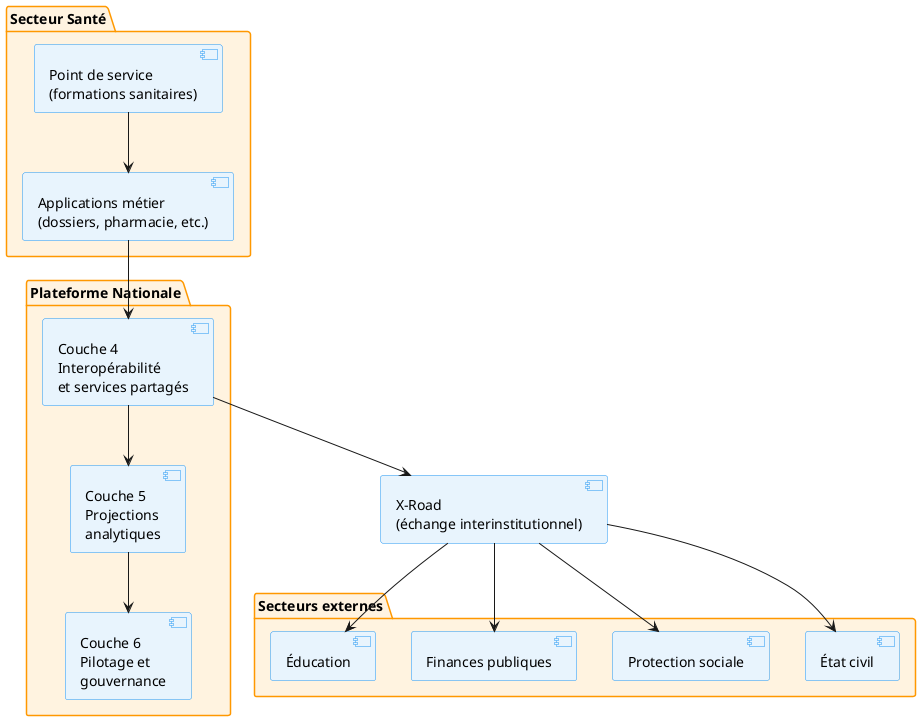
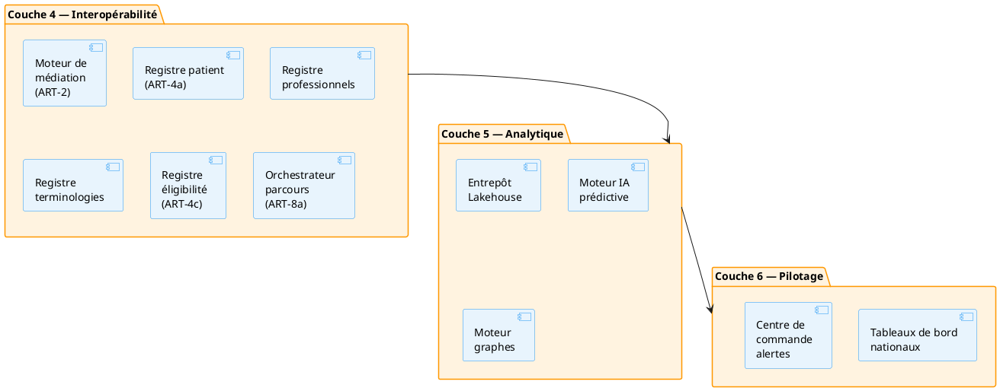
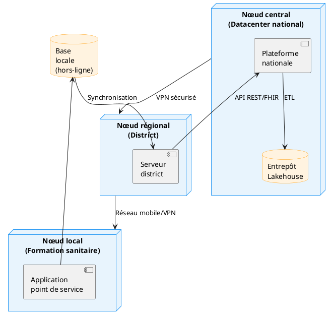

# Cartographie conceptuelle cible

## Pour qui lire ce document

**Niveau :** niveau 3 — Architecture de Référence Technique de la Santé Numérique.

| Profil | Lecture |
|--------|---------|
| Décideurs institutionnels | ◐ |
| Directions métier / programmes | ◐ |
| DEPSI / équipes techniques | ● |
| SIS / données / suivi-évaluation | ● |
| Partenaires techniques et financiers | ◐ |

Légende : ● prioritaire · ◐ complémentaire · ○ ponctuelle. Vue d'ensemble : [matrice de lecture](../reading-matrix.md).

L'architecture conceptuelle présentée dans cette section est l'incarnation visuelle et l'application physique stricte des contraintes et des patterns définis dans les [chapitres](../03_chapitres/index.md). Chaque bloc horizontal et vertical exécute techniquement un ou plusieurs chapitres normatifs de l'ARTSN.

La cartographie est structurée en **six couches horizontales** (de l'infrastructure à la gouvernance) traversées par **deux axes verticaux** transversaux. Elle s'articule avec les [six couches applicatives du CAESN](../../00_caesn/05_application/layers.md).

| Couche | Intitulé | Chapitres ARTSN associés |
|--------|----------|--------------------------|
| [6](#couche-6--pilotage-gouvernance-et-actions-intersectorielles) | Pilotage, Gouvernance et actions intersectorielles | VS-04, [ART-0](../../referentiel/chapitres/art-0.md) |
| [5](#couche-5--projections-analytiques-et-modèles) | Projections analytiques et Modèles | [ART-6](../../referentiel/chapitres/art-6.md), [ART-5](../../referentiel/chapitres/art-5.md), [ART-8b](../../referentiel/chapitres/art-8b.md), [ART-4d](../../referentiel/chapitres/art-4d.md), [ART-9](../../referentiel/chapitres/art-9.md) |
| [4](#couche-4--interopérabilité-et-services-partagés) | Interopérabilité et services partagés | [ART-3](../../referentiel/chapitres/art-3.md), [ART-4](../../referentiel/chapitres/art-4.md), [ART-2](../../referentiel/chapitres/art-2.md), [ART-8a](../../referentiel/chapitres/art-8a.md), [ART-4a](../../referentiel/chapitres/art-4a.md), [ART-4c](../../referentiel/chapitres/art-4c.md) |
| [3](#couche-3--échange-transport-et-ingestion) | Échange, transport et ingestion | [ART-1](../../referentiel/chapitres/art-1.md), F.3, [ART-8c](../../referentiel/chapitres/art-8c.md) |
| [2](#couche-2--point-de-service) | Point de service | F.1, ENF-1 |
| [1](#couche-1--infrastructure) | Infrastructure | [ART-7](../../referentiel/chapitres/art-7.md) |
| Axe 1 | Sécurité et confiance numérique | [ART-7](../../referentiel/chapitres/art-7.md) |
| Axe 2 | Gouvernance de données | F.4, [ART-0](../../referentiel/chapitres/art-0.md) |

## Couche 6 — Pilotage, Gouvernance et actions intersectorielles

**Contenu normatif.** Cette couche constitue la **vitrine décisionnelle unique de l'État**. Elle possède un droit exclusif de lecture sur les projections analytiques et n'exécute aucune écriture opérationnelle. Elle a l'obligation de fournir des espaces de visualisation cloisonnés et partagés entre les ministères partenaires pour évaluer la performance sanitaire et guider l'action publique.

**Discipline existentielle.** Dès lors qu'une source échappe à la gouvernance directe de l'initiative (cellules de crise multi-ministérielles, directions stratégiques) : elle seule permet de garantir que les décisions politiques s'appuient sur une vision macro-sanitaire unifiée, épurée de toute altération, sans rompre le pipeline.

- **Rattachement** : support du flux de valeur 4 ([VS-04](../01_flux-de-valeur/index.md#vs-04--piloter-coordonner-et-améliorer-la-performance-du-système-de-santé)).
- **Composants associés** : [CMP-01](../../referentiel/composants/cmp-01.md) tableaux de bord de performance sanitaire nationale, portail de suivi de la CSU, portail de gestion des ressources du système, [CMP-02](../../referentiel/composants/cmp-02.md) centre de commande des alertes épidémiques, plateforme de gestion des crises intersectorielles, portail de veille environnementale et sanitaire.
- **Statut : Stable.**

## Couche 5 — Projections analytiques et Modèles

**Contenu normatif.** Cette couche sépare structurellement les flux analytiques du stockage transactionnel. Elle a l'obligation d'**extraire, nettoyer et masquer de façon irréversible** les données opérationnelles et les flux des secteurs externes afin de les organiser selon les modèles de projections analytiques exigés par le pays.

**Discipline existentielle.** Dès lors qu'une source échappe à la gouvernance directe de l'initiative (modèles prédictifs d'IA, requêtes lourdes des chercheurs, algorithmes de transmission) : elle seule permet d'exécuter des analyses de masse longitudinales transversales sans jamais ralentir les serveurs de soins et sans exposer l'identité des citoyens, sans rompre le pipeline.

- **Rattachement** : application physique directe du pattern CQRS ([ART-6](../../referentiel/chapitres/art-6.md)).
- **Composants associés** : pipeline d'ingestion ETL, moteur d'IA prédictive, routeur d'escalade et d'alertes (ART-5), [CMP-03](../../referentiel/composants/cmp-03.md) entrepôt Lakehouse / projections tabulaires, [CMP-04](../../referentiel/composants/cmp-04.md) moteur d'IA prédictive, [CMP-05](../../referentiel/composants/cmp-05.md) moteur de graphes (Graph Store — ART-8b), référentiel spatio-temporel (ART-4d), réconciliation analytique (Grand Livre — ART-9).
- **Statut : Stable.**

## Couche 4 — Interopérabilité et services partagés

**Contenu normatif.** Cette couche est le **cœur applicatif de la santé au présent**. Elle a l'obligation de centraliser les registres nationaux et d'assurer la persistance clinique temps réel. Elle doit orchestrer les parcours et assurer la médiation sémantique universelle face aux ontologies de référence.

**Discipline existentielle.** Dès lors qu'une source échappe à la gouvernance directe de l'initiative (échanges cliniques immédiats, consultations, identitovigilance probabiliste) : elle seule permet de recevoir et de valider la conformité des données médicales à la milliseconde et de fournir un dossier patient unique partagé sécurisé, sans rompre le pipeline.

- **Rattachement** : exécution de la source de vérité au présent (Profil B d'[ART-3](../../referentiel/chapitres/art-3.md)) et des Référentiels Nationaux ([ART-4](../../referentiel/chapitres/art-4.md)).
- **Composants associés** : [CMP-06](../../referentiel/composants/cmp-06.md) moteur d'intégration & médiation (ART-2), [CMP-07](../../referentiel/composants/cmp-07.md) orchestrateur de parcours / gestionnaire de Sagas (ART-8a), [CMP-08](../../referentiel/composants/cmp-08.md) répertoire de données cliniques opérationnelles, [CMP-09](../../referentiel/composants/cmp-09.md) référentiel des métadonnées d'exploitation (ART-4), [CMP-10](../../referentiel/composants/cmp-10.md) registre des terminologies, [CMP-11](../../referentiel/composants/cmp-11.md) registre des clients / Index National des Patients (INP — ART-4a), [CMP-12](../../referentiel/composants/cmp-12.md) registre d'éligibilité et de couverture (CSU — ART-4c), [CMP-13](../../referentiel/composants/cmp-13.md) registre des personnels, [CMP-14](../../referentiel/composants/cmp-14.md) registre des produits, intrants et indicateurs.
- **Statut : Stable.**

## Couche 3 — Échange, transport et ingestion

**Contenu normatif.** Cette couche gère l'infrastructure d'ingestion réseau. Elle est structurellement **dépourvue de toute logique ou intelligence métier**. Elle a l'obligation d'intercepter les requêtes à la périphérie, de bloquer les messages non conformes aux contrats, d'assurer la persistance tampon en file d'attente et d'exécuter les compensations par lots.

**Discipline existentielle.** Dès lors qu'une source échappe à la gouvernance directe de l'initiative (connexions simultanées de milliers d'applications de terrain, micro-coupures télécoms) : elle seule permet d'encaisser la charge et de garantir la livraison des messages sans perte vers les couches supérieures, sans rompre le pipeline.

- **Rattachement** : exécution technique du transport asynchrone ([ART-1](../../referentiel/chapitres/art-1.md) et [F.3](../../referentiel/fondations/f-3.md)).
- **Composants associés** : [CMP-15](../../referentiel/composants/cmp-15.md) API Gateway, [CMP-16](../../referentiel/composants/cmp-16.md) registre de schémas (F.3), [CMP-17](../../referentiel/composants/cmp-17.md) message broker asynchrone, [CMP-18](../../referentiel/composants/cmp-18.md) compensateur / regroupeur de flux (Netting — ART-8c).
- **Statut : Stable.**

## Couche 2 — Point de service

**Contenu normatif.** Cette couche constitue la **ligne de front logicielle**. Elle a l'obligation d'exécuter des applications capables de capturer les soins, les dispensations et les mouvements logistiques en l'absence totale de réseau Internet. Elle doit ordonner ses écritures locales sous forme de **journaux d'événements inaltérables**.

**Discipline existentielle.** Dès lors qu'une source échappe à la gouvernance directe de l'initiative (prise en charge des patients dans les CSB isolés, saisie de stocks en entrepôts de brousse) : elle seule permet aux acteurs du terrain de travailler en toute autonomie sans dépendre d'une connexion centrale permanente, sans rompre le pipeline.

- **Rattachement** : application du principe d'autonomie locale ([ENF-1](../02_exigences-contextuelles/index.md#enf-1--résilience-à-l-instabilité-réseau)) et de l'historisation à la source ([F.1](../../referentiel/fondations/f-1.md)).
- **Composants associés** : dossiers & statistiques de santé (hôpitaux), gestion des pharmacies (PMIS), santé communautaire mobile (offline), espace santé patient, chaîne logistique (LMIS), surveillance de la santé animale (zoonoses), enquêtes & capteurs terrain.
- **Statut : Stable.**

## Couche 1 — Infrastructure

**Contenu normatif.** Cette couche est le **socle matériel de la Nation**. Elle a l'obligation d'héberger les données cliniques sur des infrastructures physiques situées sur le territoire national et d'organiser la topologie distribuée en cascade pour garantir le basculement automatique en cas de sinistre.

**Discipline existentielle.** Dès lors qu'une source échappe à la gouvernance directe de l'initiative (datacenters nationaux, serveurs de districts, tunnels VPN gouvernementaux) : elle seule garantit la souveraineté numérique de l'État et la sécurité physique des données contre les pannes massives et les ingérences extérieures, sans rompre le pipeline.

- **Rattachement** : support matériel de la clause de résidence et de sécurité ([ART-7](../../referentiel/chapitres/art-7.md)).
- **Composants associés** : nœud central (datacenters nationaux certifiés HDS), nœuds régionaux (clusters de district — Fog), nœuds locaux (équipements chiffrés — Edge), liaisons dédiées & VPN, réseau privé MPLS, réseaux mobiles privés (APN sécurisés).
- **Statut : Stable.**

## Axes verticaux transversaux

Les deux axes traversent l'ensemble des six couches et exécutent des obligations transversales.

### Axe vertical 1 — Sécurité et confiance numérique

**Contenu normatif.** Cet axe est le **bras armé technologique de la sécurité**. Il a l'obligation d'intercepter transversalement l'ensemble des six couches pour forcer le modèle de confiance, authentifier les acteurs, valider les consentements, chiffrer les données au repos et générer des journaux d'audit inaltérables.

**Discipline existentielle.** Dès lors qu'une source échappe à la gouvernance directe de l'initiative (tentatives de cyberattaques, connexions illégitimes, vol de tablettes sur le terrain) : elle seule permet de garantir le respect absolu du secret médical et de bloquer les intrusions à la périphérie, sans rompre le pipeline.

- **Rattachement** : application transversale du cadre de cybersécurité ([ART-7](../../referentiel/chapitres/art-7.md)).
- **Composants associés** : gestion des identités, contrôle d'accès fin (RBAC/ABAC), gestion des consentements, infrastructure de clés publiques (PKI), passerelle de confiance mondiale OMS (GDHCN), journal d'audit immuable, moteur de chiffrement.
- **Statut : Stable.**

### Axe vertical 2 — Gouvernance de données

**Contenu normatif.** Cet axe constitue l'**autorité politique, morale et éthique** de la plateforme. Il a l'obligation de fixer le cadre réglementaire humain, d'instruire et de valider l'homologation des projets de santé numérique, et de trancher les litiges de qualité ou de sécurité.

**Discipline existentielle.** Dès lors qu'une source échappe à la gouvernance directe de l'initiative (comités humains, signatures de conventions, chartes juridiques de protection) : elle seule permet d'asseoir la légitimité politique de la plateforme et de garantir le respect des accords interministériels de partage de données, sans rompre le pipeline.

- **Rattachement** : cadre d'application du processus d'homologation obligatoire ([F.4](../../referentiel/fondations/f-4.md)) et d'[ART-0](../../referentiel/chapitres/art-0.md).
- **Composants associés** : registre des accords inter-institutions, charte nationale de protection, conventions internationales, comité national d'homologation, registre des initiatives, comité d'éthique, cellule d'audit, arbitrage et risques.
- **Statut : Stable.**

## Liens

- [Chapitres et patterns de référence](../03_chapitres/index.md)
- [CAESN — couches applicatives](../../00_caesn/05_application/layers.md)
- [VS-04 — Pilotage](../01_flux-de-valeur/index.md)

<!-- BEGIN:GENERATED -->
<!-- Généré par scripts/build_wrappers.py — ne pas éditer à la main -->

### CMP-01 — Tableaux de bord & Portails nationaux

**Contenu normatif.** Agrège les projections analytiques (Couche 5) et expose des tableaux de bord unifiés pour le pilotage national : performance sanitaire, suivi CSU, gestion des ressources, veille environnementale. Accès cloisonné par profil (décideurs, SIS, partenaires). Interopère avec l'entrepôt Lakehouse (CMP-03) et le moteur analytique (CMP-04).

**Discipline existentielle.** Seule source de vérité décisionnelle pour l'État ; tout indicateur officiel transite par ce composant. Garantit l'unicité des métriques et la traçabilité des calculs.

- **Rattachement** : [ART-6](../../referentiel/chapitres/art-6.md) (projections analytiques), [CAP-INT-07](../../referentiel/capacites/cap-int-07.md), [CAP-INT-11](../../referentiel/capacites/cap-int-11.md).
- **Processus soutenus** : [PRC-10](../../referentiel/processus/prc-10.md) (planification), [PRC-11](../../referentiel/processus/prc-11.md) (pilotage performance), [PRC-12](../../referentiel/processus/prc-12.md) (redevabilité).
- **Statut : Stable.**

*Rattachement : [PRC-10](../../referentiel/processus/prc-10.md), [PRC-11](../../referentiel/processus/prc-11.md), [PRC-12](../../referentiel/processus/prc-12.md), [CAP-INT-07](../../referentiel/capacites/cap-int-07.md), [CAP-INT-11](../../referentiel/capacites/cap-int-11.md), [ART-6](../../referentiel/chapitres/art-6.md) · [fiche](../../referentiel/composants/cmp-01.md)*

### CMP-02 — Centre de commande & Crises intersectorielles

**Contenu normatif.** Centre unique de supervision des alertes épidémiques et de coordination des crises intersectorielles (santé, élevage, environnement). Agrège les signaux de la surveillance (CMP-14), du moteur d'alertes (CMP-04) et des registres de gouvernance (CMP-17). Fournit une vue temps réel pour la prise de décision multi-ministérielle.

**Discipline existentielle.** Point de convergence obligatoire pour toute riposte coordonnée ; sans lui, les secteurs agissent en silos et la riposte est fragmentée.

- **Rattachement** : [ART-5](../../referentiel/chapitres/art-5.md) (routeur alertes), [ART-0](../../referentiel/chapitres/art-0.md) (accords partage), [CAP-INT-07](../../referentiel/capacites/cap-int-07.md).
- **Processus soutenus** : [PRC-05](../../referentiel/processus/prc-05.md) (alerte/investigation/riposte), [PRC-11](../../referentiel/processus/prc-11.md) (pilotage performance).
- **Statut : Stable.**

*Rattachement : [PRC-05](../../referentiel/processus/prc-05.md), [PRC-11](../../referentiel/processus/prc-11.md), [CAP-INT-07](../../referentiel/capacites/cap-int-07.md), [ART-5](../../referentiel/chapitres/art-5.md), [ART-0](../../referentiel/chapitres/art-0.md) · [fiche](../../referentiel/composants/cmp-02.md)*

### CMP-03 — Entrepôt Lakehouse & Projections analytiques

**Contenu normatif.** Stockage analytique central (Lakehouse) recevant les flux ETL depuis la Couche 4. Exécute les projections tabulaires, la réconciliation du Grand Livre (ART-9) et alimente les tableaux de bord (CMP-01). Séparation stricte CQRS (ART-6) : aucun traitement transactionnel.

**Discipline existentielle.** Garantit l'intégrité analytique (ENF-5) et l'irréversibilité du masquage des identités. Toute analyse officielle passe par cet entrepôt.

- **Rattachement** : [ART-6](../../referentiel/chapitres/art-6.md) (CQRS), [ART-9](../../referentiel/chapitres/art-9.md) (Grand Livre), [CAP-INT-07](../../referentiel/capacites/cap-int-07.md), [CAP-INT-11](../../referentiel/capacites/cap-int-11.md).
- **Processus soutenus** : [PRC-09](../../referentiel/processus/prc-09.md) (remboursement), [PRC-11](../../referentiel/processus/prc-11.md) (pilotage).
- **Statut : Stable.**

*Rattachement : [PRC-09](../../referentiel/processus/prc-09.md), [PRC-11](../../referentiel/processus/prc-11.md), [CAP-INT-07](../../referentiel/capacites/cap-int-07.md), [CAP-INT-11](../../referentiel/capacites/cap-int-11.md), [ART-6](../../referentiel/chapitres/art-6.md), [ART-9](../../referentiel/chapitres/art-9.md) · [fiche](../../referentiel/composants/cmp-03.md)*

### CMP-04 — Moteur analytique & IA

**Contenu normatif.** Exécute les modèles prédictifs (IA), le routeur d'escalade/d'alertes (ART-5) et la réconciliation analytique du Grand Livre (ART-9). Consomme l'entrepôt Lakehouse (CMP-03) et alimente le centre de commande (CMP-02) et la facturation (CMP-10).

**Discipline existentielle.** Sépare l'inférence analytique du stockage ; garantit la traçabilité des modèles (versionnage, données d'entraînement) et l'audit des décisions automatisées (ENF-2, ENF-5).

- **Rattachement** : [ART-5](../../referentiel/chapitres/art-5.md) (alertes), [ART-9](../../referentiel/chapitres/art-9.md) (Grand Livre), [CAP-INT-07](../../referentiel/capacites/cap-int-07.md), [CAP-INT-10](../../referentiel/capacites/cap-int-10.md).
- **Processus soutenus** : [PRC-09](../../referentiel/processus/prc-09.md) (remboursement), [PRC-05](../../referentiel/processus/prc-05.md) (alerte/riposte).
- **Statut : Stable.**

*Rattachement : [PRC-09](../../referentiel/processus/prc-09.md), [PRC-05](../../referentiel/processus/prc-05.md), [CAP-INT-07](../../referentiel/capacites/cap-int-07.md), [CAP-INT-10](../../referentiel/capacites/cap-int-10.md), [ART-5](../../referentiel/chapitres/art-5.md), [ART-9](../../referentiel/chapitres/art-9.md) · [fiche](../../referentiel/composants/cmp-04.md)*

### CMP-05 — Moteur de graphes & Référentiel spatio-temporel

**Contenu normatif.** Gère le graphe de relations entre entités (patients, structures, personnels, produits) et le référentiel spatio-temporel unifié (ART-4d). Sert les requêtes de parcours, la détection de clusters épidémiques et l'analyse de réseaux.

**Discipline existentielle.** Garantit la cohérence topologique du graphe national et la résilience spatiale (ENF-4). Toute requête de navigation relationnelle passe par ce composant.

- **Rattachement** : [ART-8b](../../referentiel/chapitres/art-8b.md) (graphe), [ART-4d](../../referentiel/chapitres/art-4d.md) (spatio-temporel), [CAP-INT-03](../../referentiel/capacites/cap-int-03.md), [CAP-INT-12](../../referentiel/capacites/cap-int-12.md).
- **Statut : Stable.**

*Rattachement : [CAP-INT-03](../../referentiel/capacites/cap-int-03.md), [CAP-INT-12](../../referentiel/capacites/cap-int-12.md), [ART-8B](../../referentiel/chapitres/art-8b.md), [ART-4D](../../referentiel/chapitres/art-4d.md) · [fiche](../../referentiel/composants/cmp-05.md)*

### CMP-06 — Intégration, Médiation, API Gateway, Broker & Registre schémas

**Contenu normatif.** Point d'entrée unique de la plateforme : API Gateway (contrats, throttling, authentification), message broker asynchrone (files d'attente, durabilité), registre de schémas (F.3 — versioning, compatibilité ascendante/descendante), moteur de médiation sémantique (ART-2 — transformation, normalisation, enrichissement).

**Discipline existentielle.** Bordure de la plateforme ; tout flux entrant/sortant traverse ce composant. Garantit l'éradication des silos (F.3) et la conformité aux contrats (ENF-1, ENF-3).

- **Rattachement** : [ART-1](../../referentiel/chapitres/art-1.md) (ingestion), [ART-2](../../referentiel/chapitres/art-2.md) (médiation), [F.3](../../referentiel/fondations/f-3.md) (schémas), [CAP-INT-01](../../referentiel/capacites/cap-int-01.md), [CAP-INT-03](../../referentiel/capacites/cap-int-03.md).
- **Statut : Stable.**

*Rattachement : [CAP-INT-01](../../referentiel/capacites/cap-int-01.md), [CAP-INT-03](../../referentiel/capacites/cap-int-03.md), [ART-1](../../referentiel/chapitres/art-1.md), [ART-2](../../referentiel/chapitres/art-2.md), [F-3](../../referentiel/fondations/f-3.md) · [fiche](../../referentiel/composants/cmp-06.md)*

### CMP-07 — Orchestrateur de parcours & Gestionnaire de Sagas (ART-8a)

**Contenu normatif.** Orchestre les flux inter-systèmes en gérant les transactions distribuées (Sagas) et les compensations. Garantit la cohérence des parcours patient跨机构跨系统跨部门. Assure la résilience des workflows cliniques critiques.

**Discipline existentielle.** Point de coordination central pour tous les flux transactionnels : toute opération multi-systèmes transite par cet orchestrateur. Garantit l'atomicité logique des parcours complexes.

- **Rattachement** : [ART-8a](../../referentiel/chapitres/art-8a.md) (orchestrateur de parcours), [CAP-INT-08](../../referentiel/capacites/cap-int-08.md).
- **Processus soutenus** : [PRC-04](../../referentiel/processus/prc-04.md) (soins), [PRC-05](../../referentiel/processus/prc-05.md) (pharmacie), [PRC-06](../../referentiel/processus/prc-06.md) (logistique).
- **Statut : Stable.**

*Rattachement : [PRC-04](../../referentiel/processus/prc-04.md), [PRC-05](../../referentiel/processus/prc-05.md), [PRC-06](../../referentiel/processus/prc-06.md), [CAP-INT-08](../../referentiel/capacites/cap-int-08.md), [ART-8A](../../referentiel/chapitres/art-8a.md) · [fiche](../../referentiel/composants/cmp-07.md)*

### CMP-08 — Répertoire de données cliniques opérationnelles

**Contenu normatif.** Centralise les données cliniques opérationnelles (dossiers patients, épisodes de soins, actes médicaux). Assure la persistance et la cohérence des données cliniques temps réel. Fournit les APIs de lecture/écriture pour les applications métier.

**Discipline existentielle.** Source de vérité clinique pour les applications opérationnelles. Toute donnée clinique créée ou modifiée dans les applications de point de service est persistée ici.

- **Rattachement** : [ART-4](../../referentiel/chapitres/art-4.md) (référentiel des métadonnées), [CAP-INT-09](../../referentiel/capacites/cap-int-09.md).
- **Processus soutenus** : [PRC-04](../../referentiel/processus/prc-04.md) (soins), [PRC-05](../../referentiel/processus/prc-05.md) (pharmacie).
- **Statut : Stable.**

*Rattachement : [PRC-04](../../referentiel/processus/prc-04.md), [PRC-05](../../referentiel/processus/prc-05.md), [CAP-INT-09](../../referentiel/capacites/cap-int-09.md), [ART-4](../../referentiel/chapitres/art-4.md) · [fiche](../../referentiel/composants/cmp-08.md)*

### CMP-09 — Référentiel des métadonnées d'exploitation (ART-4)

**Contenu normatif.** Définit et gère les métadonnées d'exploitation : nomenclatures, codifications, standards de données. Assure l'interopérabilité sémantique entre les systèmes. Garantit l'utilisation cohérente des terminologies et classifications.

**Discipline existentielle.** Autorité sémantique de la plateforme. Toute définition de donnée clinique ou administrative passe par ce référentiel. Garantit l'unicité des définitions à l'échelle nationale.

- **Rattachement** : [ART-4](../../referentiel/chapitres/art-4.md) (référentiel des métadonnées), [CAP-INT-09](../../referentiel/capacites/cap-int-09.md).
- **Processus soutenus** : [PRC-07](../../referentiel/processus/prc-07.md) (production données), [PRC-08](../../referentiel/processus/prc-08.md) (qualité).
- **Statut : Stable.**

*Rattachement : [PRC-07](../../referentiel/processus/prc-07.md), [PRC-08](../../referentiel/processus/prc-08.md), [CAP-INT-09](../../referentiel/capacites/cap-int-09.md), [ART-4](../../referentiel/chapitres/art-4.md) · [fiche](../../referentiel/composants/cmp-09.md)*

### CMP-10 — Registre des terminologies

**Contenu normatif.** Gère les terminologies médicales et de référence (CIM-10, SNOMED CT, LOINC, ATC, etc.). Assure la mapping sémantique entre les systèmes. Fournit les services de traduction et de validation des codages.

**Discipline existentielle.** Pont sémantique entre les systèmes hétérogènes. Garantit que les données codées dans un système sont interprétables et exploitables par un autre.

- **Rattachement** : [ART-4](../../referentiel/chapitres/art-4.md) (référentiel des métadonnées), [CAP-INT-09](../../referentiel/capacites/cap-int-09.md).
- **Processus soutenus** : [PRC-07](../../referentiel/processus/prc-07.md) (production données), [PRC-08](../../referentiel/processus/prc-08.md) (qualité).
- **Statut : Stable.**

*Rattachement : [PRC-07](../../referentiel/processus/prc-07.md), [PRC-08](../../referentiel/processus/prc-08.md), [CAP-INT-09](../../referentiel/capacites/cap-int-09.md), [ART-4](../../referentiel/chapitres/art-4.md) · [fiche](../../referentiel/composants/cmp-10.md)*

### CMP-11 — Registre des clients / Index National des Patients (INP — ART-4a)

**Contenu normatif.** Gère l'identité unique des patients à l'échelle nationale. Assure la déduplication et le matching des identités. Fournit les services de recherche et d'identification des patients.

**Discipline existentielle.** Identité nationale de référence pour tous les systèmes de santé. Toute identification patient transite par cet index. Garantit l'unicité et la cohérence des identités.

- **Rattachement** : [ART-4a](../../referentiel/chapitres/art-4a.md) (INP), [CAP-INT-09](../../referentiel/capacites/cap-int-09.md).
- **Processus soutenus** : [PRC-04](../../referentiel/processus/prc-04.md) (soins), [PRC-05](../../referentiel/processus/prc-05.md) (pharmacie), [PRC-06](../../referentiel/processus/prc-06.md) (logistique).
- **Statut : Stable.**

*Rattachement : [PRC-04](../../referentiel/processus/prc-04.md), [PRC-05](../../referentiel/processus/prc-05.md), [PRC-06](../../referentiel/processus/prc-06.md), [CAP-INT-09](../../referentiel/capacites/cap-int-09.md), [ART-4A](../../referentiel/chapitres/art-4a.md) · [fiche](../../referentiel/composants/cmp-11.md)*

### CMP-12 — Registre d'éligibilité et de couverture (CSU — ART-4c)

**Contenu normatif.** Gère les données d'éligibilité et de couverture santé (CSU). Assure la vérification en temps réel des droits des patients. Fournit les services de contrôle d'éligibilité pour les applications métier.

**Discipline existentielle.** Autorité de vérification des droits. Toute opération de soins nécessitant une vérification de couverture transite par ce registre. Garantit la conformité financière.

- **Rattachement** : [ART-4c](../../referentiel/chapitres/art-4c.md) (éligibilité/couverture), [CAP-INT-09](../../referentiel/capacites/cap-int-09.md).
- **Processus soutenus** : [PRC-09](../../referentiel/processus/prc-09.md) (finance), [PRC-10](../../referentiel/processus/prc-10.md) (planification).
- **Statut : Stable.**

*Rattachement : [PRC-09](../../referentiel/processus/prc-09.md), [PRC-10](../../referentiel/processus/prc-10.md), [CAP-INT-09](../../referentiel/capacites/cap-int-09.md), [ART-4C](../../referentiel/chapitres/art-4c.md) · [fiche](../../referentiel/composants/cmp-12.md)*

### CMP-13 — Registre des personnels

**Contenu normatif.** Gère les données des personnels de santé (identités, qualifications, affectations). Assure la traçabilité des interventions et des responsabilités. Fournit les services de recherche et d'identification des personnels.

**Discipline existentielle.** Référentiel de référence pour l'identification des intervenants. Toute intervention médicale enregistre l'identité du personnel via ce registre. Garantit la traçabilité et la responsabilité.

- **Rattachement** : [ART-4](../../referentiel/chapitres/art-4.md) (référentiel des métadonnées), [CAP-INT-09](../../referentiel/capacites/cap-int-09.md).
- **Processus soutenus** : [PRC-04](../../referentiel/processus/prc-04.md) (soins), [PRC-05](../../referentiel/processus/prc-05.md) (pharmacie).
- **Statut : Stable.**

*Rattachement : [PRC-04](../../referentiel/processus/prc-04.md), [PRC-05](../../referentiel/processus/prc-05.md), [CAP-INT-09](../../referentiel/capacites/cap-int-09.md), [ART-4](../../referentiel/chapitres/art-4.md) · [fiche](../../referentiel/composants/cmp-13.md)*

### CMP-14 — Registre des produits, intrants et indicateurs

**Contenu normatif.** Gère les référentiels de produits, d'intrants et d'indicateurs. Assure la cohérence des nomenclatures de produits et la standardisation des indicateurs. Fournit les services de recherche et de validation.

**Discipline existentielle.** Autorité de référence pour les produits et indicateurs. Toute définition de produit ou d'indicateur passe par ce registre. Garantit l'unicité et la cohérence des référentiels.

- **Rattachement** : [ART-4](../../referentiel/chapitres/art-4.md) (référentiel des métadonnées), [CAP-INT-09](../../referentiel/capacites/cap-int-09.md).
- **Processus soutenus** : [PRC-05](../../referentiel/processus/prc-05.md) (pharmacie), [PRC-06](../../referentiel/processus/prc-06.md) (logistique).
- **Statut : Stable.**

*Rattachement : [PRC-05](../../referentiel/processus/prc-05.md), [PRC-06](../../referentiel/processus/prc-06.md), [CAP-INT-09](../../referentiel/capacites/cap-int-09.md), [ART-4](../../referentiel/chapitres/art-4.md) · [fiche](../../referentiel/composants/cmp-14.md)*

### CMP-15 — API Gateway

**Contenu normatif.** Point d'entrée unique pour toutes les requêtes API. Assure la gestion des flux, l'authentification, la limitation de débit et la routage. Garantit la sécurité et la performance des échanges inter-systèmes.

**Discipline existentielle.** Gardien de la plateforme. Toute requête externe ou inter-systèmes transite par cet point. Garantit la sécurité, la disponibilité et la conformité des échanges.

- **Rattachement** : [ART-5](../../referentiel/chapitres/art-5.md) (routeur d'escalade), [CAP-INT-10](../../referentiel/capacites/cap-int-10.md).
- **Processus soutenus** : [PRC-04](../../referentiel/processus/prc-04.md) (soins), [PRC-05](../../referentiel/processus/prc-05.md) (pharmacie), [PRC-06](../../referentiel/processus/prc-06.md) (logistique).
- **Statut : Stable.**

*Rattachement : [PRC-04](../../referentiel/processus/prc-04.md), [PRC-05](../../referentiel/processus/prc-05.md), [PRC-06](../../referentiel/processus/prc-06.md), [CAP-INT-10](../../referentiel/capacites/cap-int-10.md), [ART-5](../../referentiel/chapitres/art-5.md) · [fiche](../../referentiel/composants/cmp-15.md)*

### CMP-16 — Registre de schémas (F.3)

**Contenu normatif.** Gère les schémas de données et les contrats d'API. Assure la validation des messages et la conformité des échanges. Fournit les services de découverte et de versioning des schémas.

**Discipline existentielle.** Autorité de validation des échanges. Toute donnée échangée doit être conforme aux schémas définis ici. Garantit l'intégrité et la cohérence des données.

- **Rattachement** : [ART-5](../../referentiel/chapitres/art-5.md) (routeur d'escalade), [CAP-INT-10](../../referentiel/capacites/cap-int-10.md).
- **Processus soutenus** : [PRC-07](../../referentiel/processus/prc-07.md) (production données), [PRC-08](../../referentiel/processus/prc-08.md) (qualité).
- **Statut : Stable.**

*Rattachement : [PRC-07](../../referentiel/processus/prc-07.md), [PRC-08](../../referentiel/processus/prc-08.md), [CAP-INT-10](../../referentiel/capacites/cap-int-10.md), [ART-5](../../referentiel/chapitres/art-5.md) · [fiche](../../referentiel/composants/cmp-16.md)*

### CMP-17 — Message broker asynchrone

**Contenu normatif.** Gère les échanges asynchrones entre les systèmes. Assure la persistance tampon et la distribution des messages. Garantit la résilience et la fiabilité des communications inter-systèmes.

**Discipline existentielle.** Mécanisme de déconnexion des systèmes. Permet la communication même en cas de défaillance temporaire d'un composant. Garantit la continuité des échanges.

- **Rattachement** : [ART-5](../../referentiel/chapitres/art-5.md) (routeur d'escalade), [CAP-INT-10](../../referentiel/capacites/cap-int-10.md).
- **Processus soutenus** : [PRC-04](../../referentiel/processus/prc-04.md) (soins), [PRC-05](../../referentiel/processus/prc-05.md) (pharmacie), [PRC-06](../../referentiel/processus/prc-06.md) (logistique).
- **Statut : Stable.**

*Rattachement : [PRC-04](../../referentiel/processus/prc-04.md), [PRC-05](../../referentiel/processus/prc-05.md), [PRC-06](../../referentiel/processus/prc-06.md), [CAP-INT-10](../../referentiel/capacites/cap-int-10.md), [ART-5](../../referentiel/chapitres/art-5.md) · [fiche](../../referentiel/composants/cmp-17.md)*

### CMP-18 — Compensateur / Regroupeur de flux (Netting — ART-8c)

**Contenu normatif.** Gère les compensations et le regroupement des flux. Assure la cohérence des transactions distribuées et la résolution des anomalies. Garantit l'intégrité des échanges complexes.

**Discipline existentielle.** Mécanisme de résolution des anomalies. Permet la compensation automatique des erreurs et la cohérence des transactions. Garantit la fiabilité des échanges critiques.

- **Rattachement** : [ART-8c](../../referentiel/chapitres/art-8c.md) (Netting), [CAP-INT-10](../../referentiel/capacites/cap-int-10.md).
- **Processus soutenus** : [PRC-04](../../referentiel/processus/prc-04.md) (soins), [PRC-05](../../referentiel/processus/prc-05.md) (pharmacie), [PRC-06](../../referentiel/processus/prc-06.md) (logistique).
- **Statut : Stable.**

*Rattachement : [PRC-04](../../referentiel/processus/prc-04.md), [PRC-05](../../referentiel/processus/prc-05.md), [PRC-06](../../referentiel/processus/prc-06.md), [CAP-INT-10](../../referentiel/capacites/cap-int-10.md), [ART-8C](../../referentiel/chapitres/art-8c.md) · [fiche](../../referentiel/composants/cmp-18.md)*

<!-- END:GENERATED -->

## Diagrammes C4

### Diagramme de contexte (Level 1)

### Diagramme de conteneurs (Level 2)

### Diagramme de déploiement (Level 3)

## Liens

- [Chapitres et patterns de référence](../03_chapitres/index.md)
- [CAESN — couches applicatives](../../00_caesn/05_application/layers.md)
- [VS-04 — Pilotage](../01_flux-de-valeur/index.md)
