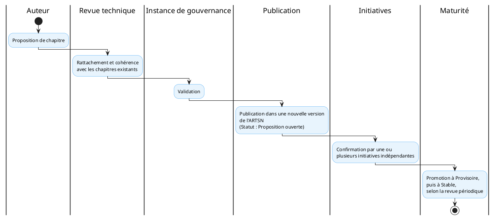

---

title: Gouvernance de l'ARTSN
id: artsn-gouvernance
domain: 06_gouvernance
version: "1.0.0"
status: draft
last_reviewed: 2026-08-08
owner: DEPSI
tags: ["artsn", "gouvernance", "versionnement", "cnasn", "niveau-3"]
---

# Gouvernance de l'ARTSN

## Pour qui lire ce document

**Niveau :** niveau 3 : Architecture de Référence Technique de la Santé Numérique.

Ce document s'adresse prioritairement aux décideurs institutionnels, aux directions métier et programmes, aux équipes DEPSI et techniques, aux partenaires techniques et financiers, ainsi qu'aux équipes SIS, données et suivi-évaluation. La lecture est complémentaire pour les directions métier et les équipes SIS, et prioritaire pour les décideurs, les équipes techniques et les partenaires.

L'ARTSN évolue selon le même mécanisme qu'elle impose aux contrats d'événements (F.3) : versions sémantiques, compatibilité ascendante et descendante documentée avant toute publication d'une nouvelle version, dépréciation explicite des chapitres retirés. Chaque spécification d'implémentation déclare la version d'ARTSN à laquelle elle se conforme.

## Cycle de vie et versionnement

L'ARTSN suit un cycle de vie structuré reposant sur des versions sémantiques de la forme majeure.mineure.correctif. La compatibilité ascendante et descendante est documentée avant toute publication d'une nouvelle version. Les chapitres retirés font l'objet d'une dépréciation explicite, et chaque spécification d'implémentation doit obligatoirement déclarer la version d'ARTSN à laquelle elle se conforme.

## Processus de dépréciation

Un processus structuré de dépréciation et de retrait des composants obsolètes est défini dans depreciation.md. Il couvre la détection des signaux, l'instruction, la décision, la notification, la migration et le retrait final.

## Veille architecturale

Un processus de veille continue est défini dans veille-architecturale.md. Il couvre les sources de veille, les fiches d'analyse et les revues trimestrielles du CNASN.

## Conformité architecturale

Un tableau de bord de conformité est défini dans conformite.md. Il suit les indicateurs par initiative, par standard et les alertes de non-conformité.

## Processus de revue du document

L'ARTSN fait l'objet d'une revue périodique par l'instance de gouvernance du CAESN, à une fréquence fixée par cette dernière, ainsi que d'une revue déclenchée par tout constat d'homologation qui révélerait qu'un composant ne peut être rattaché à aucun chapitre existant (F.4).

Chaque revue statue sur la promotion d'un chapitre d'un statut à un autre (Proposition ouverte → Provisoire → Stable), sur la base des critères de confirmation propres à chaque chapitre, sur l'ajout, la modification ou la dépréciation d'un chapitre, ainsi que sur la mise à jour de la table de maturité. Toute décision de revue est enregistrée et versionnée.

## Processus d'ajout d'un nouveau chapitre

Toute équipe d'initiative qui rencontre un composant applicatif ne pouvant être rattaché à un chapitre existant peut soumettre une proposition de nouveau chapitre à l'instance de gouvernance. Une proposition doit comporter le rattachement à une ou plusieurs capacités du CAESN et au référentiel normatif pertinent (ou la mention explicite qu'aucun rattachement n'a été trouvé, signal à traiter en priorité), le contenu normatif proposé (les contrats et garanties que le chapitre imposerait), et le statut initial proposé (par défaut « Proposition ouverte »).

Un chapitre à statut « Provisoire » ou « Proposition ouverte » ne doit pas être exigé avec la même rigueur qu'un chapitre « Stable » lors d'une homologation CNASN ; il oriente la conception sans constituer un contrat pleinement opposable.

## Rôle du CNASN

Une fois l'ARTSN publiée, les critères d'homologation déjà établis par le CNASN (ouverture, alignement normatif, interopérabilité, souveraineté des données, coût total de possession) cessent d'être purement qualitatifs : ils deviennent des **vérifications de conformité technique contre les chapitres au statut Stable**. Ces 5 portes architecturales se déclinent opérationnellement dans les 13 dimensions de conformité du CNISN (`01_cnisn/04_conformite/index.md` §3.1), qui font autorité pour l'instruction. Un écart doit être documenté comme une dérogation explicite et justifiée, plutôt que constaté silencieusement après déploiement.

## Familles de pattern plutôt que mandat unique

Lorsque l'ARTSN documente un pattern d'intégration applicable selon des contextes différents (connectivité, autonomie des acteurs territoriaux, sensibilité des données), elle documente des **familles de patterns validées avec critères de sélection explicites**, plutôt qu'un mandat technologique unique. C'est la spécification d'implémentation qui choisit, pour son contexte, laquelle des familles validées s'applique et justifie ce choix.

## Liens

Voir les documents suivants : Fondations : F.4 (homologation), Table de maturité par chapitre, et CAESN : gouvernance.

## Références

- **F.3** : F.3 : Éradication des silos technologiques (`referentiel/fondations/f-3.md`)
- **depreciation.md** : Processus de dépréciation des composants (`02_artsn/06_gouvernance/depreciation.md`)
- **veille-architecturale.md** : Veille architecturale (`02_artsn/06_gouvernance/veille-architecturale.md`)
- **conformite.md** : Tableau de bord de conformité architecturale (`02_artsn/06_gouvernance/conformite.md`)
- **CAESN** : Gouvernance du cadre d'architecture (`00_caesn/07_governance/index.md`)
- **F.4** : F.4 : Homologation obligatoire (`referentiel/fondations/f-4.md`)
- **table de maturité** : Annexe A : Table de maturité par chapitre (`02_artsn/08_annexes/a-table-de-maturite.md`)
- **Fondations : F.4 (homologation)** : F.4 : Homologation obligatoire (`referentiel/fondations/f-4.md`)
- **Table de maturité par chapitre** : Annexe A : Table de maturité par chapitre (`02_artsn/08_annexes/a-table-de-maturite.md`)
- **CAESN : gouvernance** : Gouvernance du cadre d'architecture (`00_caesn/07_governance/index.md`)

## Documents de la section

- [conformite: Tableau de bord de conformité architecturale](conformite.md)
- [depreciation: Processus de dépréciation des composants](depreciation.md)
- [veille-architecturale: Veille architecturale](veille-architecturale.md)

<!-- liens-section-auto -->
