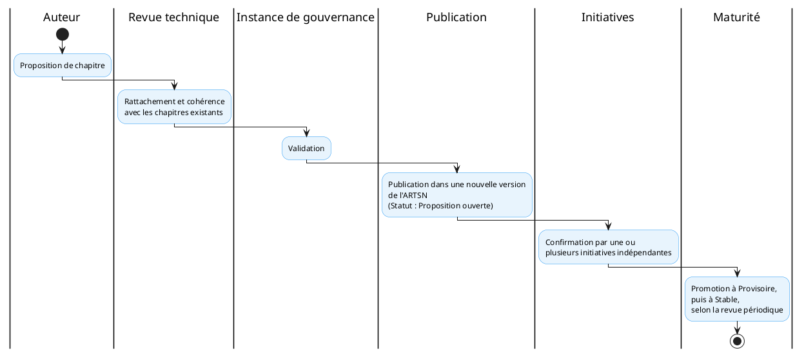

# Gouvernance de l'ARTSN

## Pour qui lire ce document

**Niveau :** niveau 3 — Architecture de Référence Technique de la Santé Numérique.

| Profil | Lecture |
|--------|---------|
| Décideurs institutionnels | ● |
| Directions métier / programmes | ◐ |
| DEPSI / équipes techniques | ● |
| SIS / données / suivi-évaluation | ◐ |
| Partenaires techniques et financiers | ● |

Légende : ● prioritaire · ◐ complémentaire · ○ ponctuelle. Vue d'ensemble : [matrice de lecture](../reading-matrix.md).

L'ARTSN évolue selon le même mécanisme qu'elle impose aux contrats d'événements ([F.3](../../referentiel/fondations/f-3.md)) : versions sémantiques, compatibilité ascendante et descendante documentée avant toute publication d'une nouvelle version, dépréciation explicite des chapitres retirés. Chaque spécification d'implémentation déclare la version d'ARTSN à laquelle elle se conforme.

## Cycle de vie et versionnement

- Versions sémantiques (majeure.mineure.correctif).
- Compatibilité ascendante et descendante documentée avant toute publication.
- Dépréciation explicite des chapitres retirés.
- Déclaration obligatoire de la version d'ARTSN par chaque spécification d'implémentation.

## Processus de dépréciation

Un processus structuré de dépréciation et de retrait des composants obsolètes est défini dans [depreciation.md](./depreciation.md). Il couvre la détection des signaux, l'instruction, la décision, la notification, la migration et le retrait final.

## Veille architecturale

Un processus de veille continue est défini dans [veille-architecturale.md](./veille-architecturale.md). Il couvre les sources de veille, les fiches d'analyse et les revues trimestrielles du CNASN.

## Conformité architecturale

Un tableau de bord de conformité est défini dans [conformite.md](./conformite.md). Il suit les indicateurs par initiative, par standard et les alertes de non-conformité.

## Processus de revue du document

L'ARTSN fait l'objet d'une revue périodique par l'instance de gouvernance du [CAESN](../../00_caesn/07_governance/index.md), à une fréquence fixée par cette dernière, ainsi que d'une revue déclenchée par tout constat d'homologation qui révélerait qu'un composant ne peut être rattaché à aucun chapitre existant ([F.4](../../referentiel/fondations/f-4.md)).

Chaque revue statue sur :

1. La promotion d'un chapitre d'un statut à un autre (Proposition ouverte → Provisoire → Stable), sur la base des critères de confirmation propres à chaque chapitre ;
2. L'ajout, la modification ou la dépréciation d'un chapitre ;
3. La mise à jour de la [table de maturité](../07_annexes/a-table-de-maturite.md).

Toute décision de revue est enregistrée et versionnée.

## Processus d'ajout d'un nouveau chapitre

Toute équipe d'initiative qui rencontre un composant applicatif ne pouvant être rattaché à un chapitre existant peut soumettre une proposition de nouveau chapitre à l'instance de gouvernance. Une proposition doit comporter :

1. Le rattachement à une ou plusieurs capacités du CAESN et au référentiel normatif pertinent, ou la mention explicite qu'aucun rattachement n'a été trouvé (signal à traiter en priorité) ;
2. Le contenu normatif proposé : les contrats et garanties que le chapitre imposerait ;
3. Le statut initial proposé, par défaut « Proposition ouverte ».

Un chapitre à statut « Provisoire » ou « Proposition ouverte » ne doit pas être exigé avec la même rigueur qu'un chapitre « Stable » lors d'une homologation CNASN ; il oriente la conception sans constituer un contrat pleinement opposable.

## Rôle du CNASN

Une fois l'ARTSN publiée, les critères d'homologation déjà établis par le CNASN (ouverture, alignement normatif, interopérabilité, souveraineté des données, coût total de possession) cessent d'être purement qualitatifs : ils deviennent des **vérifications de conformité technique contre les chapitres au statut Stable**. Un écart doit être documenté comme une dérogation explicite et justifiée, plutôt que constaté silencieusement après déploiement.

## Familles de pattern plutôt que mandat unique

Lorsque l'ARTSN documente un pattern d'intégration applicable selon des contextes différents (connectivité, autonomie des acteurs territoriaux, sensibilité des données), elle documente des **familles de patterns validées avec critères de sélection explicites**, plutôt qu'un mandat technologique unique. C'est la spécification d'implémentation qui choisit, pour son contexte, laquelle des familles validées s'applique et justifie ce choix.

## Liens

- [Fondations — F.4 (homologation)](../../referentiel/fondations/f-4.md)
- [Table de maturité par chapitre](../07_annexes/a-table-de-maturite.md)
- [CAESN — gouvernance](../../00_caesn/07_governance/index.md)
