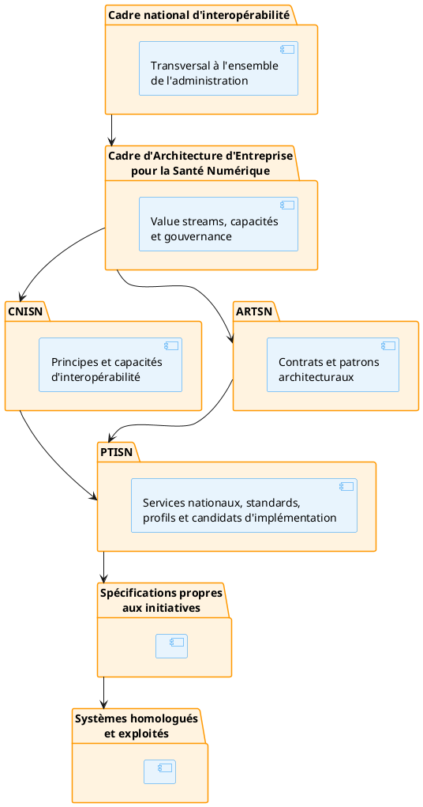

# Préambule du PTISN

## 1. Fonction du PTISN

Le PTISN (Profils techniques d'implémentation de la Santé Numérique) traduit les capacités et principes du CNISN en profils techniques utilisables par les initiatives numériques du secteur santé.

Le CNISN définit :

- les principes opposables ;
- les capacités requises ;
- les règles de gouvernance ;
- les responsabilités ;
- les mécanismes de dérogation.

L'ART définit :

- les contrats de conformité ;
- les propriétés architecturales attendues ;
- les patrons reconnus ;
- les preuves de conformité.

Le PTISN précise :

- les services nationaux attendus ;
- les standards à utiliser ;
- les profils d'échange à appliquer ;
- les versions de référence ;
- les produits ou implémentations candidats ;
- les décisions nationales déjà actées ;
- les exigences de conformité associées.

Le PTISN constitue donc le niveau auquel des standards, profils et produits peuvent être explicitement nommés.

------------------------------------------------------------------------

## 2. Position dans la hiérarchie architecturale

Une initiative ne doit pas recopier le PTISN dans son dossier d'architecture.

Elle doit produire un **profil technique d'initiative** indiquant :

- les services nationaux qu'elle consomme ou fournit ;
- les profils PTISN qu'elle applique ;
- les versions utilisées ;
- les produits retenus ;
- les écarts ;
- les preuves de conformité.

------------------------------------------------------------------------
