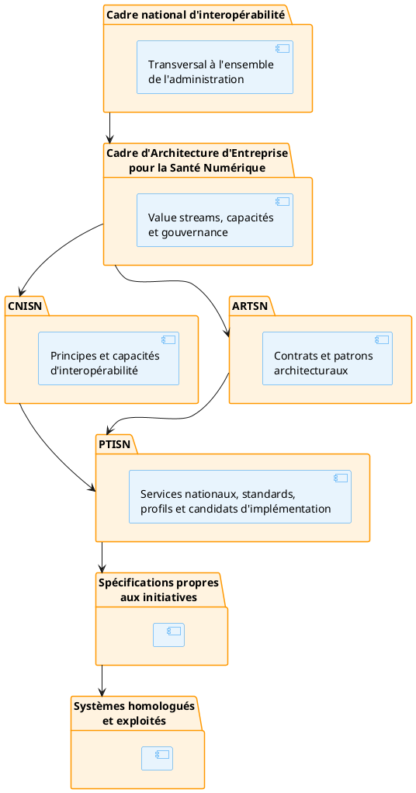

# Préambule du PTISN

## 1. Fonction du PTISN

Le PTISN (Profils techniques d'implémentation de la Santé Numérique) constitue le niveau d'abstraction où les capacités et principes définis par le CNISN sont traduits en profils techniques exploitables par les initiatives numériques du secteur santé. Il constitue le trait d'union opérationnel entre le cadre normatif et les implémentations concrètes.

Le CNISN, en tant que cadre national d'interopérabilité, définit les principes opposables, les capacités requises, les règles de gouvernance, les responsabilités des parties prenantes ainsi que les mécanismes de dérogation applicables. L'ARTSN, pour sa part, formalise les contrats de conformité, les propriétés architecturales attendues, les patrons reconnus et les preuves de conformité que toute initiative doit respecter.

Le PTISN prolonge ce cadre en précisant les services nationaux attendus, les standards à utiliser, les profils d'échange à appliquer, les versions de référence, les produits ou implémentation candidats, les décisions nationales déjà actées ainsi que les exigences de conformité associées. Il constitue ainsi le niveau auquel des standards, des profils et des produits peuvent être explicitement nommés et versionnés.

## 2. Position dans la hiérarchie architecturale

La hiérarchie architecturale décrite ci-dessus structure les niveaux d'abstraction du système national d'interopérabilité. Chaque niveau produit des livrables qui alimentent le niveau immédiatement inférieur, assurant ainsi une traçabilité complète de la stratégie jusqu'à l'exploitation.

Une initiative ne doit pas reproduire le contenu du PTISN dans son propre dossier d'architecture. Elle est tenue de produire un **profil technique d'initiative** qui précise les services nationaux qu'elle consomme ou fournit, les profils PTISN qu'elle applique, les versions utilisées, les produits retenus, les écarts éventuels par rapport aux prescriptions ainsi que les preuves de conformité associées.
