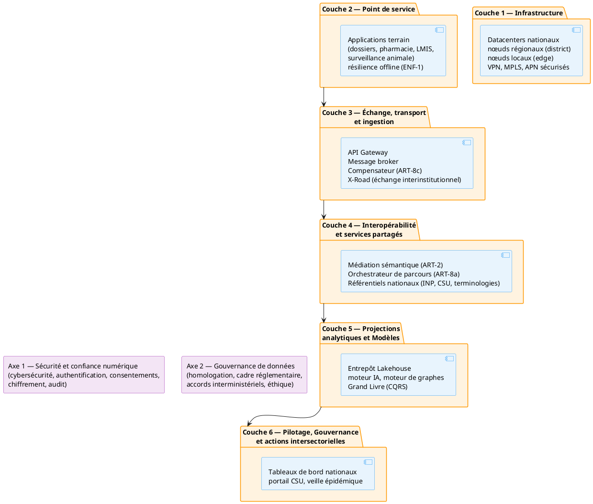

# Partie II — Topologie nationale cible

## 1. Principes de topologie

L'interopérabilité nationale du secteur santé repose sur une architecture structurée en **six couches horizontales** traversées par **deux axes transversaux**, conformément à la cartographie conceptuelle cible de l'ARTSN. Cette organisation physique traduit les patterns architecturaux de l'ARTSN au contexte opérationnel malgache.

Chaque couche exécute un ou plusieurs chapitres normatifs de l'ARTSN (référencés sous la forme ART-x) et s'appuie sur des fondations (F-x) et des exigences contextuelles (ENF-x). La correspondance détaillée entre les couches du PTISN et celles de l'ARTSN est présentée dans le tableau suivant.

| Couche PTISN | Couche ARTSN | Contenu PTISN |
|--------------|--------------|---------------|
| Couche 6 | Couche 6 — Pilotage | Tableaux de bord, portail CSU, centre de commande alertes (CMP-01, CMP-02) |
| Couche 5 | Couche 5 — Projections | Entrepôt Lakehouse, moteur IA, moteur de graphes (CMP-03, CMP-04, CMP-05) |
| Couche 4 | Couche 4 — Interopérabilité | Médiation (ART-2), orchestration (ART-8a), registres nationaux (CMP-06…14) |
| Couche 3 | Couche 3 — Échange | API Gateway, broker, compensateur (CMP-15…18) + **X-Road** (échange interinstitutionnel) |
| Couche 2 | Couche 2 — Point de service | Applications terrain, résilience offline (ENF-1, F.1) |
| Couche 1 | Couche 1 — Infrastructure | Datacenters nationaux, nœuds régionaux/locaux (ART-7) |
| Axe 1 transversal | Axe 1 — Sécurité | Cybersécurité, authentification, consentements, chiffrement, audit (ART-7) |
| Axe 2 transversal | Axe 2 — Gouvernance | Homologation, cadre réglementaire, accords interministériels (F.4, ART-0) |

Les deux axes transversaux traversent l'ensemble des six couches et imposent des obligations qui s'appliquent uniformément à chaque niveau de l'architecture. La couche 3 est structurellement **dépourvue de toute logique ou intelligence métier** (ART-1) : l'orchestration des parcours appartient exclusivement à la couche 4 (ART-8a).

Cette organisation ne signifie pas que tous les échanges internes au secteur santé doivent transiter par la plateforme interinstitutionnelle (X-Road). Celle-ci est utilisée uniquement lorsqu'un échange implique une institution extérieure au secteur, une autorité de données transversale, un service pangouvernemental ou une obligation prévue par le cadre national d'interopérabilité.

## 2. Séparation des responsabilités

### 2.1 Médiation sectorielle santé (Couche 4)

La médiation sectorielle, opérant en couche 4, assume la responsabilité de l'exposition d'un point d'entrée sectoriel unique, de la transformation des messages, de l'application des profils santé, de la normalisation des identifiants, du routage, de la corrélation, de l'observabilité et de l'intégration avec les registres de santé. Elle constitue le pivot sémantique et opérationnel du secteur.

### 2.1b Orchestration de parcours (Couche 4 — ART-8a)

L'orchestrateur de parcours, également situé en couche 4 conformément à l'ART-8a, est responsable de l'orchestration des flux inter-systèmes en transactions distribuées (Sagas), de la gestion des compensations en cas d'anomalie, de la cohérence des parcours patient à travers les institutions et les systèmes, ainsi que de la résilience des workflows cliniques critiques.

> **Note :** l'orchestration appartient à la couche 4 (ART-8a), et non à la couche 3. La couche 3 est dépourvue de toute logique métier (ART-1), conformément au principe de séparation des responsabilités.

### 2.2 Échange interinstitutionnel (Couche 3 — X-Road)

La plateforme nationale d'échange, opérant en couche 3 via X-Road, est responsable de l'identité des organisations participantes, de l'enregistrement des membres, de la confiance entre institutions, du routage sécurisé, de la preuve des échanges, de la signature et de l'horodatage lorsque applicables, ainsi que des politiques de communication entre organisations.

L'architecture officielle de X-Road repose sur des services centraux, des serveurs de sécurité, des systèmes d'information et des autorités de confiance. Le système d'information connecté conserve la responsabilité de l'authentification de l'utilisateur final et de son contrôle d'accès métier.

### 2.3 Applications terrain et résilience offline (Couche 2)

Les applications de point de service — dossiers cliniques, gestion des pharmacies PMIS, LMIS, santé communautaire mobile, surveillance animale — sont soumises à la **contrainte ENF-1** (résilience à l'instabilité réseau) et à la **fondation F.1** (historisation à la source). Ces contraintes imposent quatre exigences fondamentales.

La première exigence est la **capture 100 % locale** : toute transaction, qu'il s'agisse d'un acte clinique, d'une dispensation ou d'un mouvement de stock, est capturée, validée et persistée en base locale, sans dépendre d'une connexion réseau. La deuxième exigence porte sur les **journaux d'événements inaltérables** : les écritures locales prennent la forme de journaux horodatés et immuables, garantissant l'intégrité des données même en cas de coupure réseau. La troisième exigence concerne la **synchronisation asynchrone** : la transmission des données vers la couche 3 (API Gateway / broker) est différée au retour de la connectivité, avec gestion des conflits et compensation. Enfin, la **règle « pas de perte »** impose qu'aucune transaction terrain ne soit bloquée, ralentie ou altérée par l'absence de réseau.

> **Référence :** ENF-1, F.1, Couche 2 ARTSN.

### 2.4 Services métier sectoriels

Les services métier sectoriels demeurent responsables de la validation métier, de l'autorité sur les données, des droits fonctionnels, du consentement ou de la base d'autorisation, de la qualité, de la conservation et des décisions opérationnelles. La couche d'échange ne se substitue pas à ces responsabilités ; elle les facilite en assurant la connectivité et l'interopérabilité entre les systèmes qui les portent.

## Références

- **cartographie conceptuelle cible de l'ARTSN** — Cartographie conceptuelle cible (`02_artsn/04_cartographie-cible/index.md`)
- **F.1** — F.1 — Résilience face à la réalité géographique du pays (`referentiel/fondations/f-1.md`)
