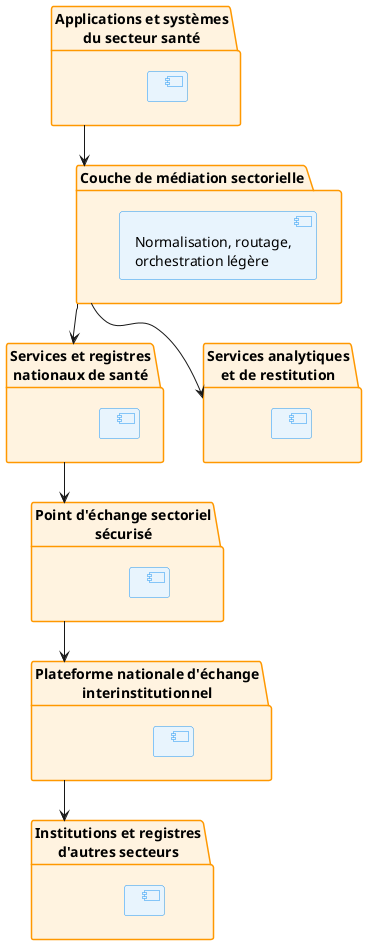

# Partie II — Topologie nationale cible

## 1. Principes de topologie

L’interopérabilité nationale repose sur plusieurs couches complémentaires.

Cette organisation ne signifie pas que tous les échanges internes au secteur santé doivent transiter par la plateforme interinstitutionnelle.

La plateforme interinstitutionnelle est utilisée lorsqu’un échange implique :

- une institution extérieure au secteur ;
- une autorité de données transversale ;
- un service pangouvernemental ;
- une obligation prévue par le cadre national d’interopérabilité.

------------------------------------------------------------------------

## 2. Séparation des responsabilités

### 2.1 Médiation sectorielle santé

La médiation sectorielle est responsable de :

- l’exposition d’un point d’entrée sectoriel ;
- la transformation des messages ;
- l’application des profils santé ;
- la normalisation des identifiants ;
- le routage ;
- la corrélation ;
- l’observabilité ;
- l’intégration avec les registres de santé.

### 2.2 Échange interinstitutionnel

La plateforme nationale d’échange est responsable de :

- l’identité des organisations participantes ;
- l’enregistrement des membres ;
- la confiance entre institutions ;
- le routage sécurisé ;
- la preuve des échanges ;
- la signature et l’horodatage lorsque applicables ;
- les politiques de communication entre organisations.

L’architecture officielle de X-Road repose notamment sur des services centraux, des serveurs de sécurité, des systèmes d’information et des autorités de confiance. Le système d’information connecté reste responsable de l’authentification de l’utilisateur final et de son contrôle d’accès métier.

### 2.3 Services métier sectoriels

Les services métier sectoriels restent responsables :

- de la validation métier ;
- de l’autorité sur les données ;
- des droits fonctionnels ;
- du consentement ou de la base d’autorisation ;
- de la qualité ;
- de la conservation ;
- des décisions opérationnelles.

La couche d’échange ne remplace pas ces responsabilités.

------------------------------------------------------------------------
