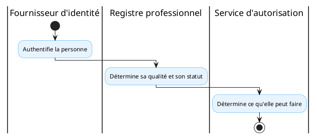

# Profil technique national

<!-- BEGIN:GENERATED -->
<!-- Généré par scripts/build_wrappers.py : ne pas éditer à la main -->

## 1. Objet et périmètre

Le **profil PT-05 — Registre des professionnels** définit le registre national des professionnels et travailleurs de santé. Il assure la résolution de l’identité professionnelle et la détermination du statut d’exercice.

Périmètre : identité, profession, qualification, spécialité, licence, ordre, employeur, affectation, établissement, période d’exercice, statut, habilitations métier. Hors périmètre : l’authentification (service distinct, voir PT-10).

## 2. Capacité CNISN

Déclinaison de [CAP-INT-02: Registre et résolution des professionnels de santé](../../referentiel/capacites/cap-int-02.md), complétée par les capacités relatives à la gouvernance des professionnels.

## 3. Chapitres ART applicables

- [ART-4: Référentiels de métadonnées de gestion](../../referentiel/chapitres/art-4.md)
- ART-4A — Résolution d’identité
- [ART-7: Sécurité, contrôle d’accès et résidence de la donnée](../../referentiel/chapitres/art-7.md)
- [ART-4C](../../referentiel/chapitres/art-4c.md)

## 4. Acteurs (Actors)

- **Source de services de santé (Care Services Source)** — système déclarant/mettant à jour les informations professionnelles et organisationnelles.
- **Registre HWR (Care Services Registry / Directory)** — tient le registre national découvrable.
- **Consommateur de services de santé (Care Services Consumer)** — système résolvant l’identité et le statut d’un professionnel.

*Référence — capacité CNISN mise en œuvre : [CAP-INT-02](../../referentiel/capacites/cap-int-02.md).
## 5. Transactions

| Transaction | Acteurs | R/O | Standard |
|----|----|----|----|
| T1 — Recherche de ressources (organisation, localisation, service, professionnel) | Consommateur → Registre | R | IHE mCSD (ITI-90) |
| T2 — Publication/mise à jour (mCSD) | Source → Registre | R | IHE mCSD (ITI-91..94) |
| T3 — Autorisation d’accès | Consommateur → PDP | O | IHE IUA |

R = requis ; O = optionnel.

*Référence — capacité CNISN mise en œuvre : [CAP-INT-02](../../referentiel/capacites/cap-int-02.md).
## 6. Content Modules

- **HL7 FHIR Practitioner** : identité et qualification du professionnel.
- **HL7 FHIR PractitionerRole** : profession, spécialité, licence, ordre, habilitation, période d’exercice.
- **HL7 FHIR Organization / Location** : employeur, établissement, affectation.

## 7. Options

- **O1 — Service national HWR** : requis ; exposition via mCSD recommandée pour les nouveaux services.
- **O2 — Produit de registre** : à sélectionner (mCSD uniquement pour l’exposition découvrable).
- **O3 — Lien avec l’identité fondationnelle** : à définir.

## 8. Service national

**Registre national des professionnels et travailleurs de santé** — décisions :

| Élément                             | Statut           |
|-------------------------------------|------------------|
| Service national HWR                | Requis           |
| Profil d’exposition mCSD            | Recommandé       |
| Produit de registre                 | À sélectionner   |
| Modèle métier national              | À définir        |
| Lien avec l’identité fondationnelle | À définir        |
| Authentification des professionnels | Service distinct |

## 9. Formats et standards recommandés

Le profil mCSD peut être utilisé pour exposer les informations de découverte relatives aux organisations, localisations, services et professionnels, selon le périmètre national retenu. mCSD fournit des interfaces REST adaptées à des environnements fédérés et permet la recherche de ressources liées aux services de santé.

*Référence — normes et standards CNISN : [01_cnisn/05_standards](../../01_cnisn/05_standards/index.md).
## 10. Exigences

Le service national HWR est requis. L’exposition via mCSD est recommandée pour les nouveaux services. Le produit de registre et le modèle métier national restent à sélectionner et à définir.

## 11. Déclaration de conformité (Integration Statement)

Conformité attestée par l’exposition découvrable (mCSD), la détermination du statut du professionnel, et la séparation nette avec le service d’authentification (§13).

## 12. Articulation avec les autres profils

- [PT-04: résolution d’identité bénéficiaire](../../referentiel/profils/pt-04.md)
- [PT-07: terminologie et codification](../../referentiel/profils/pt-07.md)
- [PT-10: confiance, authentification, autorisation](../../referentiel/profils/pt-10.md)

Le registre fournit la qualité professionnelle ; l’authentification et l’autorisation sont assurées par PT-10.

## 13. Limites et dépendances

Principe de séparation : le registre professionnel ne constitue pas le fournisseur d’authentification.

Un utilisateur authentifié ne doit pas être considéré comme professionnel habilité sans vérification de son statut dans le registre approprié. Dépendance : identité fondationnelle (à définir).

<!-- END:GENERATED -->

## Références au cadre

- **ARTSN — lots consommateurs** : [L3 — Médiation & registres](../../02_artsn/07_lots/index.md)
