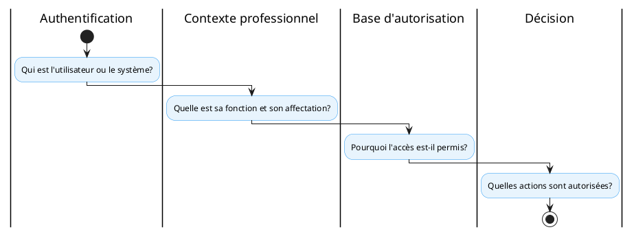

# Profil technique national

<!-- BEGIN:GENERATED -->
<!-- Généré par scripts/build_wrappers.py : ne pas éditer à la main -->

## 1. Objet et périmètre

Le **profil PT-10 — Confiance, authentification et autorisation** définit les services nationaux de confiance, d’authentification des utilisateurs et des systèmes, et d’autorisation. Il est transverse à tous les profils.

Périmètre : identité sectorielle/fédérée, authentification, identité des systèmes, service d’autorisation, gestion des politiques et comptes techniques, fédération avec les identités pangouvernementales, gestion des certificats et secrets. Hors périmètre : le contenu métier des registres (PT-04, PT-05).

## 2. Capacité CNISN

[CAP-INT-08: Confiance, sécurité et autorisation](../../referentiel/capacites/cap-int-08.md)

## 3. Chapitres ART applicables

- [ART-0: Accords de partage inter-institutionnels](../../referentiel/chapitres/art-0.md)
- ART-4B
- [ART-7: Sécurité, contrôle d’accès et résidence de la donnée](../../referentiel/chapitres/art-7.md)
- [ART-9: Garanties transactionnelles fortes](../../referentiel/chapitres/art-9.md) lorsque applicable

## 4. Acteurs (Actors)

Services nationaux concernés (rôles assumés) :

- fournisseur d’identité sectoriel ou fédéré ;
- authentificateur des utilisateurs ;
- identité des systèmes ;
- service d’autorisation (PDP) ;
- point d’information de politique (PIP — contexte professionnel depuis PT-05) ;
- gestionnaire des politiques ;
- gestionnaire des comptes techniques ;
- fédération avec les identités pangouvernementales ;
- gestion des certificats et secrets.

Principe de séparation :

### 4.1 Rôles du système de santé national

| Code | Rôle | Description | Niveau hiérarchique |
|------|------|-------------|---------------------|
| **R-AS** | Agent de santé | Prestataire de soins au niveau communautaire ou centre de santé (infirmier, ACS, matrone) | Opérationnel |
| **R-MED** | Médecin | Prestataire de soins qualifié, prescripteur, spécialiste | Opérationnel |
| **R-PH** | Pharmacien | Dispensateur de produits de santé, responsable de stock | Opérationnel |
| **R-ENC** | Enquêteur | Membre d'une équipe d'investigation épidémiologique | Opérationnel |
| **R-CDIR** | Directeur de formation sanitaire | Responsable de l'établissement de soins | Tactique |
| **R-DDIST** | Directeur de district sanitaire | Coordinateur des services de santé au niveau district | Tactique |
| **R-DREG** | Directeur régional | Coordinateur des districts au niveau région | Tactique |
| **R-PROG** | Responsable de programme | Gestionnaire de programme thématique (BPC, vaccination, PAL) | Tactique |
| **R-INS** | Inspecteur | Contrôle et audit des formations sanitaires | Tactique |
| **R-DMIN** | Administrateur système | Gestionnaire technique des plateformes numériques | Technique |
| **R-API** | Compte technique (API) | Système interagissant automatiquement avec les plateformes | Technique |
| **R-MINS** | Direction ministérielle | Décideur politique, pilotage stratégique | Stratégique |
| **R-INTER** | Partenaire international | Organisme international (OMS, UNICEF, banque mondiale) | Stratégique |

### 4.2 Matrice RBAC — Accès aux données par rôle

Légende : **C** = Créer · **R** = Lire · **U** = Modifier · **D** = Supprimer · **—** = Accès interdit

| Ressource / Donnée | R-AS | R-MED | R-PH | R-ENC | R-CDIR | R-DDIST | R-DREG | R-PROG | R-INS | R-DMIN | R-API | R-MINS | R-INTER |
|---------------------|------|-------|------|-------|--------|---------|--------|--------|-------|--------|-------|--------|---------|
| **Dossier patient** | R | CRUD | R | R | R | R | R | R | R | R | R* | — | — |
| **Prescription** | R | CRUD | R | — | R | R | R | R | R | — | R* | — | — |
| **Dispensation** | R | R | CRUD | — | R | R | R | R | R | — | R* | — | — |
| **Référence / évacuation** | CR | CRUD | R | R | R | R | R | R | R | R | R* | — | — |
| **Signal épidémique** | CR | R | — | CRUD | R | R | R | R | R | R | R* | R | R |
| **Alerte sanitaire** | — | — | — | — | R | CRUD | R | R | R | R | R* | R | R |
| **Investigation** | — | R | — | CRUD | R | R | R | R | R | R | R* | R | R |
| **Éligibilité / couverture** | R | R | R | — | R | R | R | R | R | — | R* | — | — |
| **Facturation** | — | R | R | — | R | R | R | R | R | — | R* | — | — |
| **Stock / produits** | R | R | CRUD | — | R | R | R | R | R | — | R* | — | — |
| **Indicateurs / dashboards** | — | R | — | — | R | R | R | CRUD | R | R | R* | R | R |
| **Tâche d'investigation** | R | R | — | CRUD | R | R | R | R | R | — | R* | — | — |
| **Référentiels (normes, codes)** | R | R | R | R | R | R | R | R | R | R | R* | R | R |
| **Configuration système** | — | — | — | — | — | — | — | — | — | R | CRUD | — | — |

*R* : accès programme-spécifique (restreint aux données du programme assigné)

### 4.3 Matrice RBAC — Accès aux fonctions par rôle

| Fonction | R-AS | R-MED | R-PH | R-ENC | R-CDIR | R-DDIST | R-DREG | R-PROG | R-INS | R-DMIN | R-API | R-MINS |
|----------|------|-------|------|-------|--------|---------|--------|--------|-------|--------|-------|--------|
| Consulter un dossier patient | ● | ● | ● | ● | ● | ● | ● | ● | ● | ● | ● | — |
| Écrire une prescription | — | ● | — | — | — | — | — | — | — | — | — | — |
| Dispenser un produit | — | — | ● | — | — | — | — | — | — | — | — | — |
| Émettre une référence | ● | ● | — | — | ● | ● | ● | — | — | — | — | — |
| Déclarer un signal | ● | ● | — | ● | ● | ● | ● | ● | ● | — | — | — |
| Déclencher une alerte | — | — | — | — | ● | ● | ● | ● | — | ● | — | — |
| Mener une investigation | — | ● | — | ● | ● | ● | ● | ● | ● | — | — | — |
| Vérifier l'éligibilité | ● | ● | ● | — | ● | ● | ● | ● | ● | — | ● | — |
| Consulter un dashboard | — | ● | — | — | ● | ● | ● | ● | ● | ● | ● | ● |
| Gérer les stocks | — | — | ● | — | ● | ● | ● | ● | — | — | ● | — |
| Configurer le système | — | — | — | — | — | — | — | — | — | ● | ● | — |
| Administrer les comptes | — | — | — | — | — | — | — | — | — | ● | — | — |

### 4.4 Escalade en cas d'urgence vitale

En cas d'urgence vitale documentée (code U3 ou U4), les restrictions RBAC sont temporairement levées :

| Condition | Dérogation | Traçabilité |
|-----------|------------|-------------|
| Urgence vitale (U3/U4) confirmée par un médecin | Accès complet au dossier patient pour tout prestataire impliqué | Journalisation renforcée avec motif médical, validation hiérarchique dans les 24h |
| Alerte épidémique de niveau 4 | Accès en lecture aux données de surveillance pour tous les acteurs de la riposte | Journalisation automatique, révocation à la fin de l'épisode |
| Catastrophe naturelle ou sanitaire | Mode dégradé : accès hors-ligne avec synchronisation différée | Piste d'audit complète après resynchronisation |

*Référence — capacité CNISN mise en œuvre : [CAP-INT-08](../../referentiel/capacites/cap-int-08.md).
## 5. Transactions

| Transaction | Acteurs | R/O | Standard |
|----|----|----|----|
| T1 — Autorisation d’accès (token) | Consommateur → PDP | R | IHE IUA (ITI-72) ou OAuth 2.0 / OIDC |
| T2 — Audit de sécurité (événement) | Nœud → Dépôt d’audit | R | IHE ATNA (ITI-20) |
| T3 — Résolution du contexte professionnel | PDP → PIP (PT-05) | R | Consommation du registre professionnel |

R = requis ; O = optionnel.

*Référence — capacité CNISN mise en œuvre : [CAP-INT-08](../../referentiel/capacites/cap-int-08.md).
## 6. Content Modules

- **Jeton d’accès IUA** : jeton portant les attributs d’autorisation pour services REST/FHIR.
- **Jeton OAuth 2.0 / OIDC** : identité et session de l’utilisateur ou du système.
- **HL7 FHIR AuditEvent** : événement de sécurité journalisé (ATNA).

## 7. Options

- **O1 — Mécanisme d’autorisation** : IHE IUA (recommandé pour REST/FHIR) ou OAuth 2.0 / OpenID Connect selon le contexte.
- **O2 — Audit des nœuds** : IHE ATNA lorsque applicable.
- **O3 — Authentification renforcée** : profil national à définir.
- **O4 — Autorisation par attributs (ABAC)** : politique nationale à définir.

## 8. Service national

Services nationaux concernés :

- fournisseur d’identité sectoriel ou fédéré ;
- authentification des utilisateurs ;
- identité des systèmes ;
- service d’autorisation ;
- gestion des politiques ;
- gestion des comptes techniques ;
- fédération avec les identités pangouvernementales ;
- gestion des certificats et secrets.

## 9. Formats et standards recommandés

| Besoin | Profil ou standard |
|----|----|
| Autorisation des API REST/FHIR | OAuth 2.0 / OpenID Connect selon le contexte |
| Profil IHE d’autorisation REST | IHE IUA |
| Authentification des nœuds et audit | IHE ATNA lorsque applicable |
| Confiance interinstitutionnelle | Mécanismes de la plateforme nationale d’échange |
| Authentification renforcée | Profil national à définir |
| Autorisation par attributs | Politique ABAC nationale à définir |

IHE IUA fournit un cadre d’autorisation fondé sur des jetons pour les services HTTP REST, notamment FHIR. ATNA porte des exigences relatives à l’authentification des nœuds et à l’audit des événements de sécurité.

*Référence — normes et standards CNISN : [01_cnisn/05_standards](../../01_cnisn/05_standards/index.md).
## 10. Exigences

Exigences minimales :

- moindre privilège ;
- authentification adaptée au risque ;
- séparation des comptes utilisateurs et techniques ;
- révocation ;
- rotation des secrets ;
- contrôle territorial ;
- contrôle programmatique ;
- journalisation ;
- durée limitée des jetons ;
- vérification du contexte professionnel ;
- décision explicite.

Politiques d’autorisation :

| Code | Politique | Description |
|------|-----------|-------------|
| **POL-01** | Moindre privilège | Chaque rôle ne reçoit que les permissions strictement nécessaires à sa fonction |
| **POL-02** | Séparation des rôles | Un même utilisateur ne peut pas cumuler les rôles de prescripteur et de dispensateur pour un même patient |
| **POL-03** | Contrôle territorial | L'accès aux données est limité à la zone sanitaire d'affectation sauf autorisation explicite |
| **POL-04** | Finalité de l'accès | Chaque accès doit être justifié par une finalité (soins, surveillance, pilotage, audit) |
| **POL-05** | Durée limitée | Les jetons d'accès ont une durée maximale de 8 heures renouvelable |
| **POL-06** | Révocation temps réel | Un accès peut être révoqué instantanément en cas de compromission ou de changement d'affectation |
| **POL-07** | Traçabilité complète | Chaque accès (lecture, écriture, modification) est journalisé avec identifiant, horodatage, action, ressource |
| **POL-08** | Consentement patient | L'accès aux données cliniques sensibles nécessite le consentement du patient sauf urgence vitale |
| **POL-09** | Données minimales | En contexte transfrontalier, seules les données strictement nécessaires sont transmises (principe de minimisation) |
| **POL-10** | Comptes techniques | Les systèmes (API) sont soumis aux mêmes politiques que les utilisateurs humains, avec des jetons de service signés |

## 11. Déclaration de conformité (Integration Statement)

Conformité attestée par l’application de la matrice RBAC, le respect des politiques POL-01 à POL-10, la journalisation des accès (ATNA), la vérification du contexte professionnel (PT-05), et la fédération avec les identités pangouvernementales. L’accès aux données cliniques sensibles doit intégrer le consentement (PT-11).

## 12. Articulation avec les autres profils

- [PT-05: registre des professionnels](../../referentiel/profils/pt-05.md)
- [PT-04: résolution d’identité bénéficiaire](../../referentiel/profils/pt-04.md)
- [PT-11: consentement et bases d’autorisation](../../referentiel/profils/pt-11.md)
- [PT-01: échange interinstitutionnel](../../referentiel/profils/pt-01.md)

## 13. Limites et dépendances

Le service d’autorisation s’appuie sur l’identité professionnelle (PT-05) et l’identité du bénéficiaire (PT-04). Dépendance : fédération avec les identités pangouvernementales et la plateforme nationale d’échange. Aucun mécanisme d’authentification renforcée ou ABAC national n’est encore figé (profils à définir).

<!-- END:GENERATED -->

## Références au cadre

- **ARTSN — lots consommateurs** : [L1 — Infrastructure & sécurité](../../02_artsn/07_lots/index.md), [L4 — Analytique & pilotage](../../02_artsn/07_lots/index.md)
