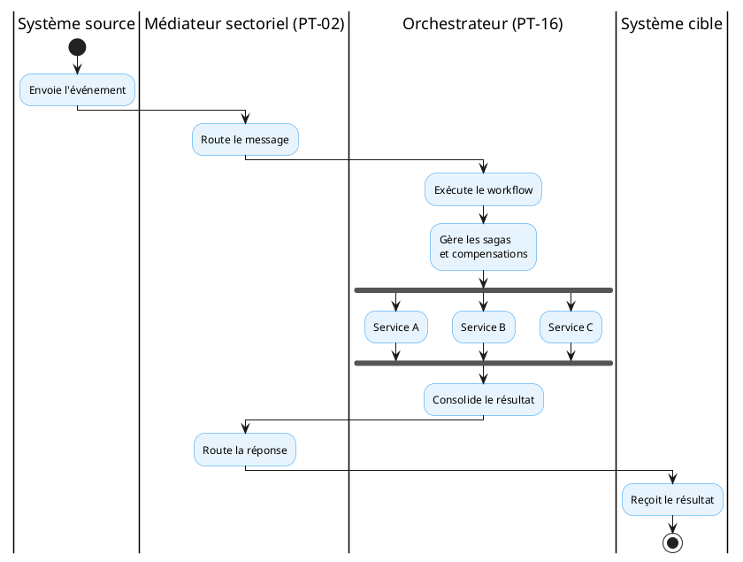

# Orchestration de processus bornés

<!-- BEGIN:GENERATED -->
<!-- Généré par scripts/build_wrappers.py : ne pas éditer à la main -->

## 1. Capacité CNISN

[CAP-INT-03: Échange et médiation inter-systèmes](../../referentiel/capacites/cap-int-03.md)

## 2. Chapitres ART applicables

- ART-8a — orchestration de processus borné ;
- [ART-7: sécurité.](../../referentiel/chapitres/art-7.md)

## 3. Service national

**Service d'orchestration de parcours et de workflows sectoriels**

Ce service assure la coordination des flux inter-systèmes en gérant les transactions distribuées (Sagas), les compensations en cas d'anomalie et la cohérence des parcours patient à travers les institutions et systèmes.

## 4. Fonctions

- orchestration de processus métier bornés ;
- gestion de transactions longues (Sagas) ;
- compensation et annulation en cas d'échec ;
- coordination de flux inter-établissements et inter-systèmes ;
- traçabilité complète du parcours ;
- résilience des workflows critiques ;
- déclenchement événementiel (event-driven) ;
- gestion de l'état des processus.

## 5. Produit candidat

| Élément | Décision |
|----|----|
| Produit candidat de référence | OpenFN |
| Statut | Recommandé pour évaluation et pilotes |
| Caractère obligatoire | Non |
| Alternatives | Autorisées si les contrats ART sont satisfaits |
| Périmètre | Orchestration de processus bornés dans le secteur santé |

OpenFN est une plateforme d'intégration open-source orientée workflow, spécialisée dans l'automatisation des flux de données de santé. Elle supporte HL7 FHIR, DHIS2 et moteurs de règles métier. Son déploiement est flexible avec connecteurs standards.

## 6. Exigences

Une solution alternative doit au minimum supporter :

- orchestration de processus multi-étapes ;
- gestion de transactions distribuées (Sagas) ;
- compensations en cas d'échec d'une étape ;
- interfaces synchrones et asynchrones ;
- connecteurs HL7 FHIR ;
- connecteurs DHIS2 ;
- moteur de règles métier ;
- journalisation et traçabilité des parcours ;
- observabilité des processus en cours ;
- reprise en cas de défaillance ;
- déploiement de workflows indépendants ;
- intégration avec le médiateur sectoriel ([PT-02: Profil technique national](../../referentiel/profils/pt-02.md)).

## 7. Articulation avec la médiation

Le médiateur ([PT-02: Profil technique national](../../referentiel/profils/pt-02.md)) assure le routage et la transformation des messages.

L'orchestrateur ([PT-16: Orchestration de processus bornés](../../referentiel/profils/pt-16.md)) coordonne les processus métier multi-étapes et garantit la cohérence des parcours.

------------------------------------------------------------------------

*Rattachement : CMP-07, CMP-06, CAP-INT-03, ART-8A, ART-7 · fiche PT-16*

<!-- END:GENERATED -->
