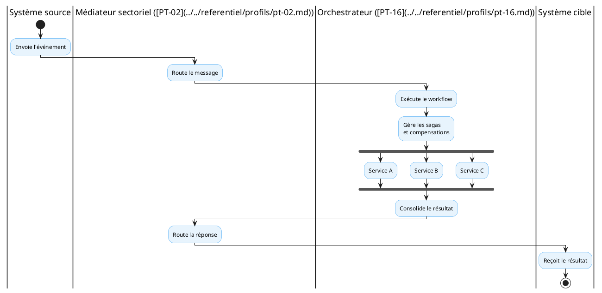

# Orchestration de processus bornés

<!-- BEGIN:GENERATED -->
<!-- Généré par scripts/build_wrappers.py : ne pas éditer à la main -->

## 1. Objet et périmètre

Le **profil PT-16 — Orchestration de processus bornés** définit le service d’orchestration de parcours et de workflows sectoriels. Il assure la coordination des flux inter-systèmes en gérant les transactions distribuées (Sagas), les compensations en cas d’anomalie et la cohérence des parcours patient.

Périmètre : orchestration de processus métier bornés au secteur santé. Hors périmètre : la médiation pure (voir PT-02) et l’échange interinstitutionnel (voir PT-01).

## 2. Capacité CNISN

[CAP-INT-03: Échange et médiation inter-systèmes](../../referentiel/capacites/cap-int-03.md)

## 3. Chapitres ART applicables

- ART-8A — orchestration de processus borné
- [ART-7: sécurité](../../referentiel/chapitres/art-7.md)

## 4. Acteurs (Actors)

- **Initiateur de processus (Workflow Initiator)** — système source émettant l’événement de déclenchement.
- **Orchestrateur sectoriel (Orchestrator)** — exécute le workflow, gère les Sagas et les compensations.
- **Médiateur sectoriel (PT-02)** — assure le routage et la transformation des messages entre participants.
- **Services participants (Service A/B/C)** — systèmes métier sollicités par le workflow.

*Référence — capacité CNISN mise en œuvre : [CAP-INT-03](../../referentiel/capacites/cap-int-03.md).
## 5. Transactions

| Transaction | Acteurs | R/O | Standard |
|----|----|----|----|
| T1 — Déclenchement de workflow | Initiateur → Orchestrateur | R | Événement métier |
| T2 — Routage de message | Orchestrateur → Médiateur (PT-02) | R | REST/asynchrone |
| T3 — Exécution d’étape (Saga) | Orchestrateur → Service participant | R | FHIR / interface du service |
| T4 — Compensation/annulation | Orchestrateur → Service participant | R | Compensation de l’étape |

R = requis ; O = optionnel (à définir si le dépôt ne précise pas).

*Référence — capacité CNISN mise en œuvre : [CAP-INT-03](../../referentiel/capacites/cap-int-03.md).
## 6. Content Modules

- **HL7 FHIR** : ressources et événements échangés entre participants.
- **Événement de déclenchement** : payload déclenchant le workflow (event-driven).
- **État de processus** : suivi et journalisation des étapes et Sagas.

## 7. Options

- **O1 — Produit** : OpenFN (référence) ou solution alternative satisfaisant les contrats ART.
- **O2 — Transport** : interfaces synchrones et asynchrones, déclenchement événementiel.
- **O3 — Connecteurs** : HL7 FHIR, DHIS2, moteurs de règles métier.

## 8. Service national

**Service d’orchestration de parcours et de workflows sectoriels** — implémentation retenue :

| Élément | Décision |
|----|----|
| Produit candidat de référence | OpenFN |
| Statut | Recommandé pour évaluation et pilotes |
| Caractère obligatoire | Non |
| Alternatives | Autorisées si les contrats ART sont satisfaits |
| Périmètre | Orchestration de processus bornés dans le secteur santé |

OpenFN est une plateforme d’intégration open-source orientée workflow, spécialisée dans l’automatisation des flux de données de santé. Elle supporte HL7 FHIR, DHIS2 et moteurs de règles métier. Son déploiement est flexible avec connecteurs standards.

## 9. Formats et standards recommandés

- HL7 FHIR (ressources et événements) ;
- DHIS2 (connecteurs) ;
- moteurs de règles métier ;
- interfaces synchrones et asynchrones ;
- déclenchement événementiel (event-driven).

*Référence — normes et standards CNISN : [01_cnisn/05_standards](../../01_cnisn/05_standards/index.md).
## 10. Exigences

Une solution alternative doit au minimum supporter :

- orchestration de processus multi-étapes ;
- gestion de transactions distribuées (Sagas) ;
- compensations en cas d’échec d’une étape ;
- interfaces synchrones et asynchrones ;
- connecteurs HL7 FHIR ;
- connecteurs DHIS2 ;
- moteur de règles métier ;
- journalisation et traçabilité des parcours ;
- observabilité des processus en cours ;
- reprise en cas de défaillance ;
- déploiement de workflows indépendants ;
- intégration avec le médiateur sectoriel ([PT-02: médiation intra-secteur](../../referentiel/profils/pt-02.md)).

## 11. Déclaration de conformité (Integration Statement)

Conformité attestée par l’intégration avec le médiateur sectoriel (PT-02), la journalisation et la traçabilité des parcours, et l’observabilité des processus en cours.

## 12. Articulation avec les autres profils

Le médiateur ([PT-02](../../referentiel/profils/pt-02.md)) assure le routage et la transformation des messages. L’orchestrateur ([PT-16](../../referentiel/profils/pt-16.md)) coordonne les processus métier multi-étapes et garantit la cohérence des parcours.

## 13. Limites et dépendances

L’orchestration dépend du médiateur sectoriel (PT-02) pour le routage et la transformation. Les Sagas et compensations sont bornées au secteur santé ; les parcours interinstitutionnels s’appuient sur PT-01.

<!-- END:GENERATED -->
