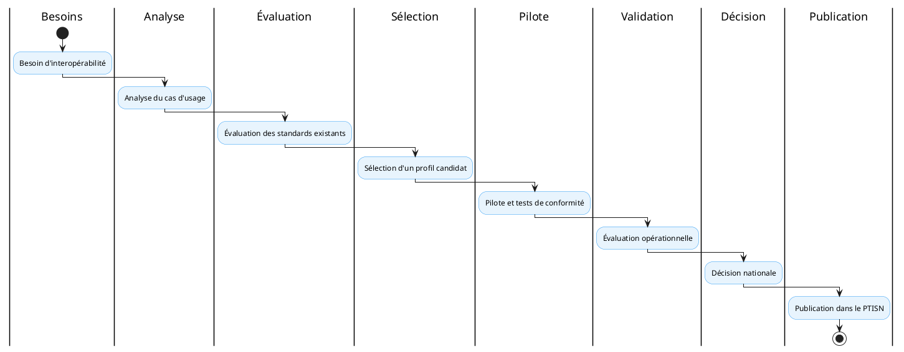

# Partie VI : Gouvernance du PTISN

La gouvernance du Profil Technique d'Implémentation par Initiative (PTISN) organise les processus de décision, d'évaluation et de validation qui conditionnent l'adoption des profils techniques et des produits dans le secteur santé numérique de Madagascar. Elle définit les instances compétentes, les critères d'évaluation et les procédures d'homologation qui garantissent la cohérence, la qualité et la pérennité du cadre d'interopérabilité national.

## 1. Instance porteuse

Le PTISN est gouverné par l'instance d'architecture sectorielle de santé, en coordination avec l'Unité de Gouvernance Digitale, la direction des systèmes d'information du secteur, les directions métier, les responsables des registres, les autorités de cybersécurité, l'autorité de protection des données et les équipes d'exploitation. Cette instance assure la coordination transversale des décisions architecturales, veille à l'alignement des initiatives avec les orientations stratégiques nationales et arbitre les conflits de priorité entre les différents acteurs du secteur.

## 2. Processus d'adoption d'un profil

Le processus d'adoption d'un profil technique suit un cycle structuré en huit étapes. Il débute par l'expression d'un besoin d'interopérabilité formulé par une initiative ou une direction métier. L'analyse du cas d'usage permet de formaliser les exigences fonctionnelles et techniques. L'évaluation des standards existants identifie les candidats potentiels parmi les référentiels internationaux et nationaux. La sélection d'un profil candidat établit la correspondance entre les exigences et les solutions disponibles. Le pilote et les tests de conformité vérifient la faisabilité technique en conditions réelles. L'évaluation opérationnelle mesure les résultats du pilote au regard des critères de performance. La décision nationale valide le profil pour adoption officielle. Enfin, la publication dans le PTISN intègre le profil au cadre de référence.

## 3. Critères d'évaluation

Tout standard, profil ou produit soumis à adoption fait l'objet d'une évaluation multicritère. L'adéquation fonctionnelle mesure la correspondance entre les capacités du candidat et les exigences du cas d'usage. La maturité évalue le degré de stabilisation et de recul d'implémentation. L'adoption quantifie l'usage effectif sur le territoire ou dans des contextes comparables. L'ouverture vérifie la disponibilité des spécifications et l'absence de lock-in propriétaire. L'interopérabilité teste la capacité d'échange avec d'autres systèmes. La sécurité évalue la robustesse des mécanismes de protection. La souveraineté prend en compte les enjeux de maîtrise technologique nationale. La capacité hors ligne évalue le fonctionnement en absence de connectivité. La performance mesure les temps de réponse et le débit. L'exploitabilité évalue la facilité de déploiement et de maintenance. Les compétences disponibles prennent en compte l'existence d'un vivier de développeurs formés. Le coût total de possession intègre les coûts d'acquisition, de déploiement, de maintenance et de sortie. La réversibilité évalue la facilité de migration vers une solution alternative. Enfin, la conformité au cadre national vérifie l'alignement avec les textes réglementaires en vigueur.

## 4. Homologation d'un produit

Un produit n'est pas homologué uniquement parce qu'il implémente un standard reconnu. L'homologation constitue un processus distinct qui vérifie la conformité effective du produit dans son contexte d'utilisation. Elle examine la version réellement supportée, les options activées, les extensions nationales implémentées, les résultats des tests de conformité, les mécanismes de sécurité, les conditions d'exploitation, la continuité de service, la portabilité des données, l'export des données, la documentation fournie, les coûts d'exploitation et la stratégie de sortie. Cette vérification exhaustive garantit que le produit répond aux exigences du cadre national au-delà de la simple conformité déclarative.

## 5. Gestion des versions

Chaque nouvelle version du PTISN doit faire l'objet d'une publication formalisée précisant les profils ajoutés, les profils modifiés, les profils dépréciés, les produits concernés par les changements, les impacts sur les initiatives en cours, les périodes de transition accordées et la date d'entrée en vigueur. Cette gestion rigoureuse des versions assure la traçabilité des évolutions du cadre et permet aux équipes techniques d'anticiper les migrations et les mises à jour requises.
