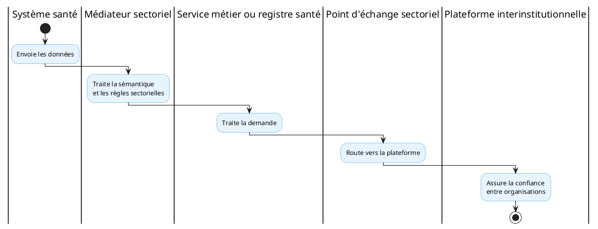

## 1. Objet et périmètre

Le **profil PT-02 — Médiation intra-secteur** définit le service sectoriel de médiation et d’intégration sanitaire. Il couvre les échanges internes au secteur santé (entre systèmes et registres santé), à la différence de PT-01 qui concerne l’échange interinstitutionnel.

Périmètre : médiation intra-secteur santé (transformation sémantique, routage, orchestration légère entre services santé).

## 2. Capacité CNISN

[CAP-INT-03: Échange et médiation inter-systèmes](../capacites/cap-int-03.md)

## 3. Chapitres ART applicables

- [ART-1: intégration](../chapitres/art-1.md)
- [ART-2: médiation](../chapitres/art-2.md)
- [ART-5: qualité et réconciliation](../chapitres/art-5.md)
- [ART-7: sécurité](../chapitres/art-7.md)
- [ART-8: coordination lorsque applicable](../chapitres/art-8.md)
- [ART-8C](../chapitres/art-8c.md), [ART-8D](../chapitres/art-8d.md)

## 4. Acteurs (Actors)

- **Système source (Source System)** — système santé émettant une requête ou un événement.
- **Médiateur sectoriel (Mediation Service)** — point d’entrée unique du secteur ; authentifie, route, transforme et journalise.
- **Service métier / registre santé (Target Service)** — système traitant la demande (identité, professionnels, terminologie…).
- **Point d’échange sectoriel** — route vers la plateforme interinstitutionnelle le cas échéant.
- **Plateforme interinstitutionnelle (PT-01)** — assure la confiance entre organisations hors secteur santé.

*Référence — capacité CNISN mise en œuvre : [CAP-INT-03](../capacites/cap-int-03.md).
## 5. Transactions

| Transaction | Acteurs | R/O | Standard |
|----|----|----|----|
| T1 — Soumission de requête/événement | Source → Médiateur sectoriel | R | REST synchrone / messagerie asynchrone |
| T2 — Routage et transformation sémantique | Médiateur → Service métier | R | FHIR R4 / terminologies métier |
| T3 — Journalisation et observabilité | Médiateur → observabilité | R | Métriques et journaux du médiateur |
| T4 — Route vers la plateforme interinstitutionnelle | Médiateur → Point d’échange → PT-01 | O | X-Road (voir PT-01) |

R = requis ; O = optionnel.

*Référence — capacité CNISN mise en œuvre : [CAP-INT-03](../capacites/cap-int-03.md).
## 6. Content Modules

- **Ressources FHIR R4** : payloads normalisés par les profils métier (patient, practitioner, terminology…).
- **Messages asynchrones** : conformes aux contrats AsyncAPI publiés (voir PT-03).
- **En-têtes de corrélation** : identifiant de transaction, métadonnées de source, contexte d’appel.

## 7. Options

- **O1 — Produit** : OpenHIM (référence) ou solution alternative satisfaisant les contrats ART.
- **O2 — Transport** : REST synchrone, messagerie asynchrone, ou les deux.
- **O3 — Médiateurs indépendants** : déploiement et extension par médiateurs découplés.

## 8. Service national

**Service sectoriel de médiation et d’intégration sanitaire** — implémentation retenue :

| Élément | Décision |
|----|----|
| Produit candidat de référence | OpenHIM |
| Statut | Recommandé pour évaluation et pilotes |
| Caractère obligatoire | Non |
| Alternatives | Autorisées si les contrats ART sont satisfaits |
| Périmètre | Médiation intra-secteur santé |

OpenHIM fournit un point d’entrée pour les services, journalise les requêtes et permet d’étendre les traitements à travers des médiateurs indépendants. Il est présenté par sa documentation comme une implémentation de référence de la couche d’interopérabilité OpenHIE.

## 9. Formats et standards recommandés

- Aucun format imposé en soi : la médiation s’appuie sur les profils FHIR et terminologies définis par les profils métier (PT-04, PT-05, PT-07…).
- Les contrats d’interface sont décrites selon les recommandations de PT-03 (OpenAPI, FHIR, AsyncAPI).
- Transport : REST synchrone et messagerie asynchrone.

*Référence — normes et standards CNISN : [01_cnisn/05_standards](../../01_cnisn/05_standards/index.md).
## 10. Exigences

Une solution alternative doit au minimum supporter :

- interfaces synchrones et asynchrones ;
- routage configurable ;
- authentification des sources ;
- transformation ;
- gestion des erreurs ;
- corrélation ;
- métriques ;
- journalisation ;
- reprise ;
- déploiement de médiateurs indépendants ;
- intégration avec les services nationaux.

## 11. Déclaration de conformité (Integration Statement)

La conformité est attestée par : validation des profils consommés/exposés, journalisation des requêtes, métriques d’observabilité, et respect des contrats ART (notamment ART-2). Un test de validation des médiateurs doit être fourni.

## 12. Articulation avec les autres profils

Le médiateur traite la sémantique et les règles sectorielles, puis route vers le point d’échange sectoriel et, le cas échéant, vers la plateforme interinstitutionnelle ([PT-01](pt-01.md)).

Il s’appuie sur les services nationaux [PT-04](pt-04.md) (identité), [PT-05](pt-05.md) (professionnels), [PT-07](pt-07.md) (terminologie), [PT-10](pt-10.md) (autorisation), [PT-11](pt-11.md) (consentement).

## 13. Limites et dépendances

Limites : la médiation intra-secteur ne remplace pas le service d’échange interinstitutionnel (PT-01) ; elle ne définit pas les formats métier (ce rôle revient aux profils concernés).

Dépendances : services nationaux santé, point d’échange sectoriel, et éventuellement la plateforme interinstitutionnelle.
