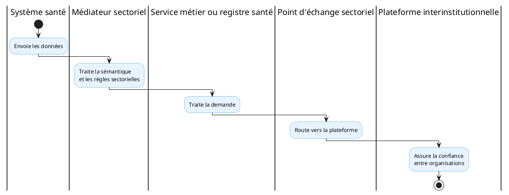

<!-- BEGIN:GENERATED -->
<!-- Généré par scripts/build_wrappers.py — ne pas éditer à la main -->

## 1. Capacité CNISN

**CAP-INT-03 — Échange et médiation inter-systèmes**

## 2. Chapitres ART applicables

- ART-1 — intégration ;
- ART-2 — médiation ;
- ART-5 — qualité et réconciliation ;
- ART-7 — sécurité ;
- ART-8 — coordination lorsque applicable.

## 3. Service national

**Service sectoriel de médiation et d'intégration sanitaire**

## 4. Fonctions

- exposition des interfaces santé ;
- authentification des systèmes ;
- routage ;
- transformation ;
- validation des profils ;
- enrichissement ;
- résolution des métadonnées ;
- corrélation ;
- gestion des erreurs ;
- observabilité ;
- réconciliation.

## 5. Produit candidat

| Élément | Décision |
|----|----|
| Produit candidat de référence | OpenHIM |
| Statut | Recommandé pour évaluation et pilotes |
| Caractère obligatoire | Non |
| Alternatives | Autorisées si les contrats ART sont satisfaits |
| Périmètre | Médiation intra-secteur santé |

OpenHIM fournit un point d'entrée pour les services, journalise les requêtes et permet d'étendre les traitements à travers des médiateurs indépendants. Il est présenté par sa documentation comme une implémentation de référence de la couche d'interopérabilité OpenHIE.

## 6. Exigences

Une solution alternative doit au minimum supporter :

- interfaces synchrones et asynchrones ;
- routage configurable ;
- authentification des sources ;
- transformation ;
- gestion des erreurs ;
- corrélation ;
- métriques ;
- journalisation ;
- reprise ;
- déploiement de médiateurs indépendants ;
- intégration avec les services nationaux.

## 7. Articulation avec l'échange interinstitutionnel

Le médiateur traite la sémantique et les règles sectorielles.

La plateforme interinstitutionnelle assure la confiance entre organisations.

------------------------------------------------------------------------

*Rattachement : CMP-06, CAP-INT-03, ART-1, ART-2, ART-5, ART-7, ART-8 · fiche PT-02*

<!-- END:GENERATED -->
