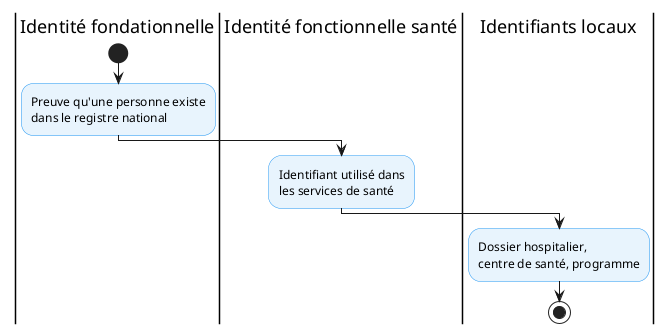

<!-- BEGIN:GENERATED -->
<!-- Généré par scripts/build_wrappers.py : ne pas éditer à la main -->

## 1. Objet et périmètre

Le **profil PT-04 — Résolution d’identité du bénéficiaire** définit le service national de résolution d’identité santé du bénéficiaire. Il permet de relier de façon fiable les dossiers d’un patient à travers les systèmes santé.

Périmètre : recherche démographique, résolution et rapprochement d’identifiants, gestion des doublons et de la provenance. Hors périmètre : l’identité fondationnelle (CNIE), qui reste sous gouvernance interinstitutionnelle.

## 2. Capacité CNISN

CAP-INT-01: Résolution d'identité du bénéficiaire

## 3. Chapitres ART applicables

- ART-4: référentiels
- ART-4A — Résolution d’identité
- ART-4B — bases d’autorisation
- ART-7: sécurité

## 4. Acteurs (Actors)

- **Consommateur d’identité (Patient Identity Consumer)** — système demandant la résolution ou la recherche d’un patient.
- **Source d’identité (Patient Identity Source)** — système déclarant/mettant à jour les identifiants d’un patient.
- **Gestionnaire de correspondance (Patient Identifier Cross-reference Manager)** — tient le golden record et la correspondance des identifiants.
- **Fournisseur démographique (Patient Demographics Supplier)** — répond aux recherches démographiques.

*Référence — capacité CNISN mise en œuvre : CAP-INT-01.
## 5. Transactions

| Transaction | Acteurs | R/O | Standard |
|----|----|----|----|
| T1 — Résolution d’identifiants (PIXm) | Consommateur → Gestionnaire | R | IHE PIXm (ITI-83) |
| T2 — Mise à jour des identifiants (PIXm) | Source → Gestionnaire | R | IHE PIXm (ITI-78) |
| T3 — Recherche démographique (PDQm) | Consommateur → Fournisseur | R | IHE PDQm (ITI-78) |
| T4 — Autorisation d’accès | Consommateur → PDP | O | IHE IUA |

R = requis ; O = optionnel.

*Référence — capacité CNISN mise en œuvre : CAP-INT-01.
## 6. Content Modules

- **HL7 FHIR Patient** : ressource de données démographiques et d’identifiants.
- **HL7 FHIR Provenance** : historique et origine des identifiants (ou profil national équivalent).
- **Réponse PIXm** : Bundle contenant la correspondance des identifiants entre domaines.

## 7. Options

- **O1 — Profil d’échange** : PIXm/PDQm (REST, recommandés) ou PIX/PDQ historiques v2 (compatibilité transitoire si nécessaire).
- **O2 — Algorithme national de rapprochement** : à instruire (seuils, golden record, procédures de fusion).
- **O3 — Lien avec la CNIE** : soumis à accord et architecture interinstitutionnelle.

## 8. Service national

**Service national de résolution d’identité santé du bénéficiaire**

| Élément | Statut |
|----|----|
| PIXm | Recommandé pour les nouveaux services |
| PDQm | Recommandé pour les nouveaux services |
| PIX/PDQ historiques | Compatibilité transitoire si nécessaire |
| Produit de registre client | À sélectionner |
| Algorithme national de rapprochement | À instruire |
| Lien avec la CNIE | Soumis à accord et architecture interinstitutionnelle |

## 9. Formats et standards recommandés

| Fonction | Profil recommandé |
|----|----|
| Recherche démographique | IHE PDQm |
| Résolution d’identifiants | IHE PIXm |
| Modèle de données | HL7 FHIR Patient |
| Historique et origine | HL7 FHIR Provenance ou profil national équivalent |
| Autorisation REST/FHIR | IHE IUA ou mécanisme national équivalent |

PIXm fournit des transactions REST permettant de gérer et rechercher les identifiants d’un patient entre domaines. PDQm définit une interface REST légère permettant la recherche de patients à partir de données démographiques.

*Référence — normes et standards CNISN : [01_cnisn/05_standards](/cnisn/standards/index).
## 10. Exigences

Les profils PIXm et PDQm ne définissent pas à eux seuls :

- les seuils de rapprochement ;
- la stratégie de golden record ;
- les procédures de fusion ;
- les contrôles humains ;
- le traitement des identités temporaires ;
- le lien juridique avec la CNIE ;
- la gestion d’un faux rapprochement.

Ces règles doivent être définies dans un profil national d’identité santé.

## 11. Déclaration de conformité (Integration Statement)

Conformité attestée par l’adoption de PIXm/PDQm pour les nouveaux services, la conservation de la provenance (FHIR Provenance), et la fourniture d’un mécanisme d’autorisation (IUA ou équivalent). Le golden record et l’algorithme national restent à instruire.

## 12. Articulation avec les autres profils

- PT-05: registre des professionnels
- PT-07: terminologie et codification
- PT-10: confiance, authentification, autorisation
- PT-11: consentement et bases d’autorisation

Le service s’appuie sur l’identité fondationnelle (CNIE) selon une architecture interinstitutionnelle à définir.

## 13. Limites et dépendances

Principe de séparation des identités : le PTISN distingue l’identité fondationnelle (preuve qu’une personne existe dans le registre national), l’identité fonctionnelle santé (identifiant utilisé dans les services de santé), et les identifiants locaux (dossier hospitalier, centre, programme).

L’identifiant santé ne doit pas nécessairement être identique à l’identifiant fondationnel. Le lien entre les deux doit être gouverné, sécurisé et limité à une finalité.

<!-- END:GENERATED -->
