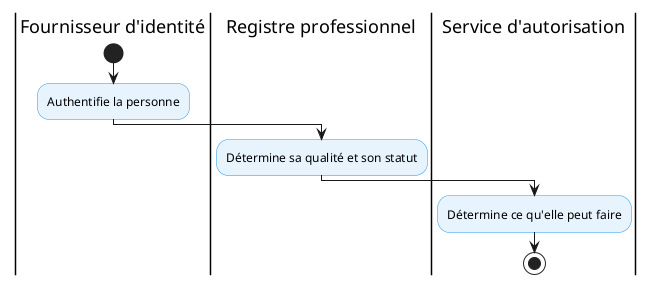

# Profil technique national

## 1. Capacité CNISN

Déclinaison de [CAP-INT-02: Registre et résolution des professionnels de santé](../capacites/cap-int-02.md), complétée par les capacités relatives à la gouvernance des professionnels.

## 2. Chapitres ART applicables

- [ART-4: Référentiels de métadonnées de gestion](../chapitres/art-4.md) ;
- ART-4a — Résolution d'identité ;
- [ART-7: Sécurité, contrôle d'accès et résidence de la donnée](../chapitres/art-7.md).

## 3. Service national

**Registre national des professionnels et travailleurs de santé**

## 4. Responsabilités

Le service doit gérer :

- l'identité du professionnel ;
- la profession ;
- la qualification ;
- la spécialité ;
- la licence ;
- l'ordre ou l'autorité professionnelle ;
- l'employeur ;
- l'affectation ;
- l'établissement ;
- la période d'exercice ;
- le statut ;
- les habilitations métier.

## 5. Profil cible

Le profil mCSD peut être utilisé pour exposer les informations de découverte relatives aux organisations, localisations, services et professionnels, selon le périmètre national retenu. mCSD fournit des interfaces REST adaptées à des environnements fédérés et permet la recherche de ressources liées aux services de santé.

## 6. Décisions

| Élément                             | Statut           |
|-------------------------------------|------------------|
| Service national HWR                | Requis           |
| Profil d'exposition mCSD            | Recommandé       |
| Produit de registre                 | À sélectionner   |
| Modèle métier national              | À définir        |
| Lien avec l'identité fondationnelle | À définir        |
| Authentification des professionnels | Service distinct |

## 7. Principe de séparation

Le registre professionnel ne constitue pas le fournisseur d'authentification.

Un utilisateur authentifié ne doit pas être considéré comme professionnel habilité sans vérification de son statut dans le registre approprié.

------------------------------------------------------------------------
