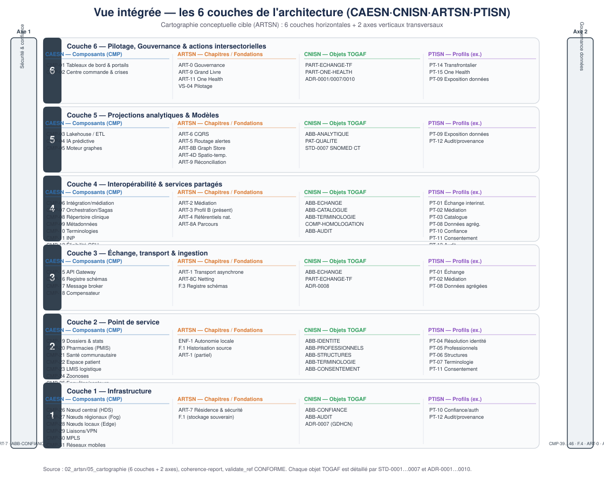

# Vue intégrée — les 6 couches de l'architecture

Seconde vue intégrée, structurée cette fois par les **6 couches horizontales** de la
cartographie conceptuelle cible (ARTSN), traversées par **2 axes verticaux** transversaux.
Chaque couche aligne les réalisations des quatre familles.

## Les 6 couches (haut → bas)

| Couche | Rôle | Réalisation (ex.) |
|--------|------|------------------|
| 6 | Pilotage, Gouvernance & actions intersectorielles | CMP-01/02 · ART-0/9/11 · CAP-INT-13/14 |
| 5 | Projections analytiques & Modèles | CMP-03/04/05 · ART-6/5/8B/4D · CAP-INT-07/11 |
| 4 | Interopérabilité & services partagés | CMP-06…14 · ART-2/3/4/8A · CAP-INT-03/06/05/12/10 |
| 3 | Échange, transport & ingestion | CMP-15…18 · ART-1/8C · CAP-INT-03/13 |
| 2 | Point de service | CMP-19…25 · ENF-1/F.1 · CAP-INT-01/02/04/05/09 |
| 1 | Infrastructure | CMP-26…31 · ART-7 · CAP-INT-08/10 |

## Les 2 axes verticaux (transversaux)

- **Axe 1 — Sécurité & confiance numérique** : CMP-32…38 · ART-7 · CAP-INT-08/10 · GDHCN (ADR-0007).
- **Axe 2 — Gouvernance de données** : CMP-39…46 · F.4 · ART-0 · ADR d'homologation.

## Alignement inter-familles

- **CAESN → ARTSN** : les CMP réalisent les chapitres/fondations (ex. CMP-11 = ART-4A, CMP-12 = ART-4C).
- **CNISN → ARTSN** : chaque `CAP-INT` est détaillée par les `STD-0001…0007` et `ADR-0001…0010` qui nourrissent les chapitres.
- **ARTSN → PTISN** : chaque chapitre est implémenté par un ou plusieurs profils (`PT-xx`).

## Source

Généré depuis `02_artsn/05_cartographie/index.md`, le `coherence-report.md` et l'état
`validate_ref.py` (CONFORME). Voir aussi la [vue par familles](vue-integree.md).
