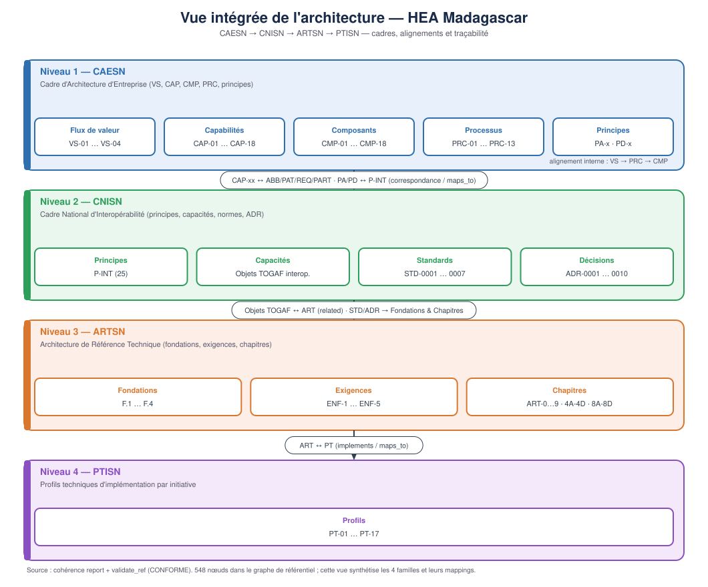

# Vue intégrée de l'architecture — HEA Madagascar

Schéma synthétique reliant les quatre familles documentaires du dépôt et leurs
alignements trans-niveaux.

## Les quatre niveaux

| Niveau | Cadre | Contenu clé |
|--------|-------|-------------|
| 1 | **CAESN** | Flux de valeur (VS-01…04), capabilités (CAP-01…18), composants (CMP-01…18), processus (PRC-01…13), principes (PA/PD) |
| 2 | **CNISN** | Principes (P-INT, 25), capacités (CAP-INT-01…14), standards (STD-0001…0007), décisions (ADR-0001…0010) |
| 3 | **ARTSN** | Fondations (F.1…F.4), exigences (ENF-1…ENF-5), chapitres (ART-0…9, ART-4A…4D, ART-8A…8D) |
| 4 | **PTISN** | Profils d'implémentation (PT-01…17) |

## Alignements (traçabilité)

- **CAESN ↔ CNISN** : correspondance `CAP-xx ↔ CAP-INT-xx` (`maps_to`) et `PA/PD ↔ P-INT`.
- **CNISN ↔ ARTSN** : `CAP-INT ↔ ART` (`related`) ; `STD`/`ADR` alimentent fondations et chapitres.
- **ARTSN ↔ PTISN** : `ART ↔ PT` (`implements` / `maps_to`).
- **Interne CAESN** : `VS → PRC → CMP`.

## Source

Généré à partir de l'état du dépôt validé par `scripts/validate_ref.py` (CONFORME) et du
`graphify-out/graph.json` (548 nœuds). La vue complète du graphe de connaissances est
disponible via le skill graphify (`graphify-out/GRAPH_REPORT.md`).

## Vues complémentaires

- [Vue intégrée — les 6 couches](vue-integree-couches.md) : la même architecture structurée par les 6 couches horizontales (ARTSN) + 2 axes verticaux.
